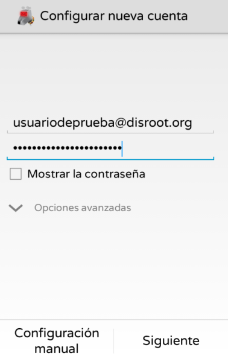
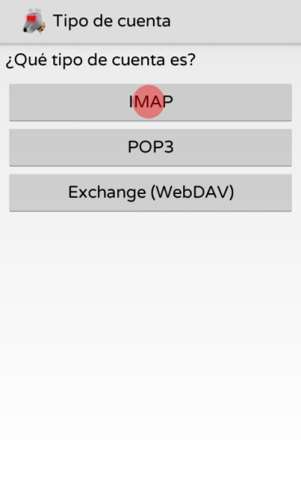
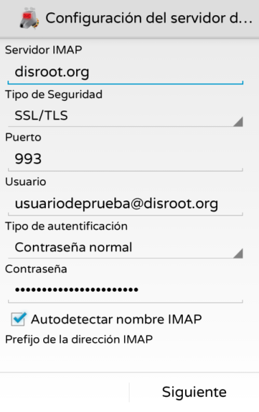
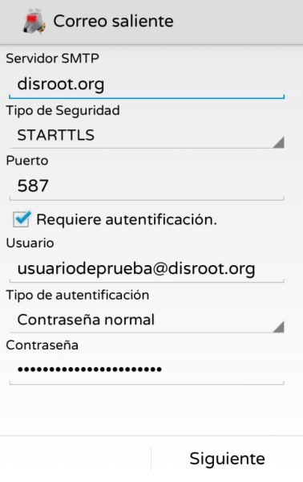
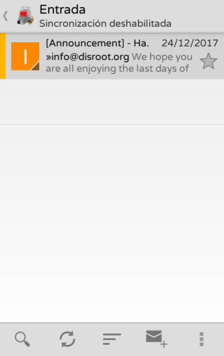
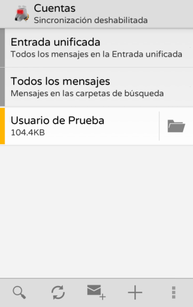

[K9](https://en.wikipedia.org/wiki/K-9_Mail) es un cliente de correo libre y de código abierto independiente, lleno de características, para Android. Supera a cualquiera de los que hay por ahí, incluso tal vez a muchas aplicaciones de escritorio. Recomendamos mucho probarlo. Algunas características:
- Funciona con cuentas IMAP, POP3 y Exchange 2003/2007 (con WebDAV)
- Sincronización de carpetas
- Encriptado con soporte para APG/OpenKeychain
- Firmas
- Tarjeta de almacenamiento SD

Aquí está cómo configurar tu cuenta de disroot en K9.

# Consíguelo
Primero, **instala K9 en tu teléfono**. Te animamos a usar la tienda [F-Droid](https://f-droid.org/) (es una tienda que aloja sólo aplicaciones libres y de código abierto), pero también puedes conseguirla desde la tienda de G----- (además puedes obtener la versión **Matrial K9** o **P=9** que soportan GPG por defecto).

# Configúralo
Una vez que inicias la aplicación por primera vez, necesitas crear **una nueva cuenta**.

**1.-** **Completa tu dirección de correo y contraseña de Disroot**

**2.-** **Elige** qué **protocolo** quieres usar. Recomendamos utilizar **IMAP**

**3.-** **Configuración de correo Entrante** 
Mira las configuraciones de correo y modifícalas según corresponda (lo único que deberías cambiar es imap.disroot.org* a **disroot.org**). 
Observa la captura o sigue la información de [configuración general del servidor](/tutorials/email/settings).

**4.-** **Configuración de correo Saliente**
Lo mismo que en correo entrante. Por favor, asegúrate que:
- El servidor SMTP sea **disroot.org**
- Seguridad sea **STARTTLS**
- El Puerto sea 587. 
Observa la captura como referencia o verifica la información de [configuración general del servidor](/tutorials/email/settings).

**5.-** **Configuración de la cuenta** 
Ajusta la frecuencia con la que K9 verificará nuevos correos y cómo te notificará sobre ellos.

**6.-** Finalmente dale a tu **cuenta** un **nombre**.

**7.-** **¡Hecho!**
Disfruta tu genial correo de código abierto de Disroot en tu dispositivo con Android.

