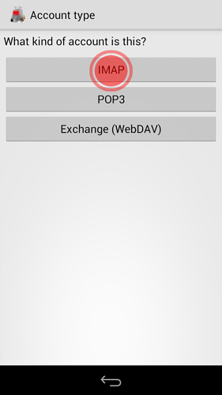

# K9 pour Android

[K9](https://en.wikipedia.org/wiki/K-9_Mail) est un client de messagerie indépendant et riche en fonctionnalités pour Android. Il bat n'importe quoi, y compris les applications de bureau (avis personnel). Nous vous conseillons vivement d'essayer. Quelques fonctionnalités:
- Fonctionne avec les comptes IMAP, POP3 et Exchange 2003/2007 (avec WebDAV)
- Synchronisation de dossiers
- Chiffrement avec la prise en charge de SGA/OpenKeychain
- Signatures
- Stockage sur carte SD

Voici comment configurer le compte de disroot sur K9.

# Obtenez-le
D'abord, **récupérez K9 sur votre téléphone**. Nous vous encourageons à utiliser le magasin [F-Droid](https://f-droid.org/) (c'est un magasin hébergeant uniquement des applications libres et open source), mais vous pouvez aussi l'obtenir via g*** store. (en plus vous pouvez obtenir la version **Material K9** ou **P=P** qui supporte GPG par défaut)

# Le régler
Une fois que vous lancez l'application pour la première fois, vous devez **créer un nouveau compte**.
1. Remplissez l'adresse email et le mot de passe Disroot.

2. **Choisissez** quel **protocole** vous voulez utiliser. Nous vous recommandons d'utiliser **IMAP**

3. **Configuration de l' e-mail entrant ***
Regardez les paramètres de messagerie et ajustez-les en conséquence. (la seule chose que vous devez changer est *imap.disroot.org* en **disroot.org**). Vérifiez la capture d'écran ou suivez les [informations générales de configuration du serveur](/tutorials/email/settings)

4. **Configuration du courrier électronique sortant**
Comme pour le courrier entrant. S'il vous plaît, assurez-vous que:
 - Le serveur SMTP est **disroot.org**
 - La sécurité, c'est **STARTTLS**
 - Le port est **587*****.
Vérifier la capture d'écran comme référence ou vérifier [les informations générales sur la configuration du serveur](/tutorials/email/settings)

5. **Paramétrage du compte.**
Ajustez la fréquence avec laquelle K9 vérifiera les nouveaux courriels et comment il vous avisera à leur sujet.

6. Enfin, donnez à votre **compte** un **nom**.

7. **Terminé!**
Profitez de votre e-mail Disroot open source sur votre appareil Android.

 
