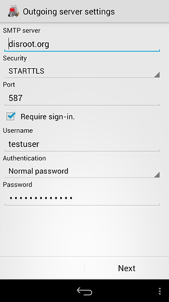

# K9 per Android

**[K9](https://en.wikipedia.org/wiki/K-9_Mail)** è un client di posta gratuito/Open Source indipendente e ricco di funzionalità per Android. Per quanto riguarda **FLOSS**, **K-9 Mail**, proprio come [**FairEmail**](/tutorials/email/clients/mobile/fairemail), è sicuramente uno dei client di posta elettronica più popolari per **Android**. Alcune caratteristiche:

- Funziona con account IMAP, POP3 ed Exchange 2003/2007 (con WebDAV).
- Sincronizzazione cartelle
- Crittografia con supporto APG/OpenKeychain
- Firme
- Archiviazione su scheda SD

Ecco come configurare l'account disroot su K9.

# Ottieni K9
Prima di tutto, **ottieni  K9 sul tuo telefono**. Ti invitiamo a utilizzare [F-Droid](https://f-droid.org/) store (è uno spazio che ospita solo applicazioni gratuite e open source), ma puoi ottenerlo anche tramite g*** store. (inoltre puoi ottenere la versione **Material K9** o **P=P** che supporta GPG per impostazione predefinita)

# Configurazione

Dopo aver avviato l'applicazione per la prima volta, devi **creare un nuovo account**.

1. **Inserisci il tuo indirizzo di posta e la tua password di  disroot**

2. **Scegli** quale **protocollo** desideri utilizzare. Ti consigliamo di utilizzare **IMAP**

3. **Configurazione e-mail in arrivo**
Guarda le impostazioni della posta e regolalo di conseguenza. (l'unica cosa che dovresti cambiare è *imap.disroot.org* in **disroot.org**). Controlla lo screenshot o segui le [informazioni generali sulla configurazione del server.](/tutorials/email/settings)

4. **Configurazione e-mail in uscita**
Come per la posta in arrivo. Assicurati che:
  - Il server SMTP sia **disroot.org**
  - La sicurezza sia **STARTTLS**
  - Il porto sia **587**
Controlla lo screenshot per riferimento o controlla [informazioni generali sulla configurazione del server](/tutorials/email/settings)

5. **Impostazione dell'account.**
Regola la frequenza con cui K9 verificherà la presenza di nuove e-mail e come ti avviserà di esse.

6. Infine, dai al tuo **account** un **nome**.

7. **Fatto!**
Goditi la tua fantastica posta disroot sul tuo dispositivo Android.
 
