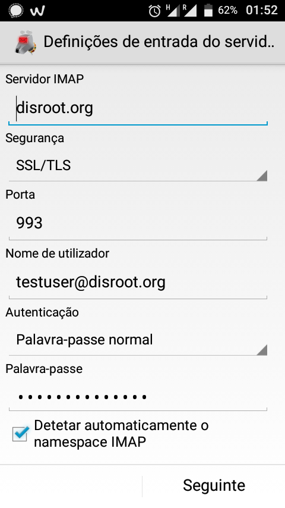

[K9](https://en.wikipedia.org/wiki/K-9_Mail) é um cliente de email Free/Open Source para android e sistemas baseados em android, independente, bastante rico em funcionalidades. É superior tudo o resto que anda por aí (opinião pessoal). Nós gostaríamos muito de aconselhar a experimentá-lo. Estas são algumas das suas funcionalidades:
 - Funciona com contas IMAP, POP3 e Exchange 2003/2007 (com WebDAV)
 - Sincronização de pastas
 - Encriptação de emails, com suporte para a aplicação aplicação OpenKeychain
 - Assinatura digital dos emails
 - Armazenamento no cartão SD

Pode configurar a sua conta de e-mail Disroot no seu telemovel através do K-9 do seguinte modo.

# Obter o K-9
Antes de mais, **instale o K-9 no seu telefone**. Nós recomendamos que use a loja de aplicações [F-Droid](https://f-droid.org/) (é uma loja que tem apenas aplicações Free e Open Source), mas também pode obter o K-9 através da Play Store da G-----.
# Configurar
Quando abre a aplicação pela primeira vez terá que carregar em "seguinte" e depois carregar em **Criar uma nova conta**.
1. **Escreva o seu endereço de email Disroot e a sua palavra-passe** e carregue em "Seguinte".

2. **Escolha** qual o **protocolo** que quer utilizar. Nós recomendamos utilizar o **IMAP**

3. **Definições de entrada do servidor**
Veja as suas definições de email e faça os ajustes necessários, (a única coisa que deve alterar é *mail.disroot.org* para **disroot.org**). Veja a captura de ecrã neste tutorial ou então as [informações gerais de configuração do email.](/tutorials/email/settings)

4. **Deinições de saída do servidor**
Tal como nas definições de entrada do servidor. Por favor certifique-se que:
 - Servidor SMTP é **disroot.org**
 - Segurança é **STARTTLS**
 - Porta **587**
Veja a captura de ecrã deste tutorial ou então as [informações gerais de configuração do email](/tutorials/email/settings)

5. **Definições de conta.**
Ajuste a frequência com que o k-9 irá descarregar novos emails, quantos emails quer ter na sua caixa de entrada 25 ou mais (ex: 100) e se será notificado acerca de novos emails.

6. Por fim dê à sua **conta** um **nome**.

7. **Feito!**
Desfrute do seu email do Disroot no seu dispositivo android.

