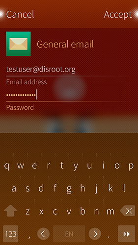

# Email in SailfishOS

Deine **Disroot**-E-Mail in SailfishOS einzurichten ist sehr einfach. Folge einfach diesen simplen Schritten. (Es hat länger gedauert, diese fantastischen Screenshots zu erstellen :P)

1. Öffne die App **Einstellungen** 

2. Gehe bis ganz nach unten (Sailfish2.0) zum **Konten**-Tab

3. Wähle **E-Mail allgemein**

4. Trage Deine **Disroot**-E-Mailadresse und Dein Passwort ein und wische über "Annehmen".

5. Server-Einstellungen.

 - **Eingehender Mailserver:**
    - Korrigiere den Benutzernamen, indem Du **die Domain entfernstund nur den Benutzernamen übrig lässt**
    - Füge die Serveradresse hinzu: **disroot.org**
    - **Aktiviere die SSL-Verbindung**

 - **Ausgehender Mailserver:**
    - Serveradresse: **disroot.org**
    - Sichere Verbindung: **StartTLS**
    - Port: **587**
    - **Authentifizierung erforderlich**

6. Wische über **Annehmen**

7. Ändere Details wie **Beschreibung** und **Dein Name** und wische über **Annehmen**

**Du bist fertig!** \o/
