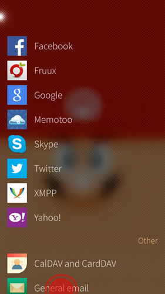

La mise en place du courrier Disroot sur SailfishOS est très facile. Suivez ces simples étapes. (il a fallu plus de temps pour faire ces captures d'écran sophistiquées :P )

1. Ouvrir l'application **Paramètres**

2. Allez jusqu'en bas (Sailfish2.0) jusqu' à l'onglet **Comptes**.

3. Sélectionnez **Courriel général**

4. Entrez votre adresse e-mail et votre mot de passe, puis cliquez sur "Accepter".

5. Paramètres du serveur.

 - **Serveur de courrier entrant:**
    - Modifier le nom d'utilisateur et **supprimer le domaine en ne laissant que le nom d'utilisateur**.
    - Ajouter l'adresse du serveur: **disroot.org**
    - **Activer la connexion SSL**

- **Serveur de courrier sortant**
   - Adresse du serveur: **disroot.org**
   - Connexion sécurisée: **StartTLS**
   - Port: **587**
   - **Authentification requise**

6. Glisser "**Accepter**"

7. Modifiez des détails tels que **description** et "**Votre nom**", et glissez "**Accepter**".

**Vous avez fini!** \o/
