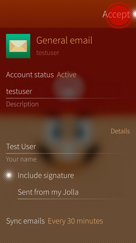

# Email con SailfishOS

Configurare la tua posta **Disroot** su SailfishOS è molto semplice. Basta seguire questi semplici passaggi. (ci è voluto più tempo per fare quegli screenshot fantasiosi :P)

1. Apri le **Impostazioni**

2. Vai fino in fondo (Sailfish2.0) alla scheda **Account**

3. Seleziona **Email generale**

4. Inserisci il tuo indirizzo e-mail **disroot** e la password e clicca su "Accetta".

5. Impostazioni del server.

  - **Server di posta in arrivo:**
     - Modifica il nome utente e **rimuovi il dominio lasciando solo il nome utente**
     - Aggiungi l'indirizzo del server: **disroot.org**
     - **Abilita connessione SSL**
	 

- **Server di posta in uscita:**
     - Indirizzo del server: **disroot.org**
     - Connessione sicura: **StartTLS**
     - Porto: **587**
     - **Autenticazione richiesta**
	 

6. Clicca su "**Accetta**"

7. Modifica dettagli come **descrizione** e "**Il tuo nome**" e clicca su "**Accetta**"

**Fatto!** \o/
