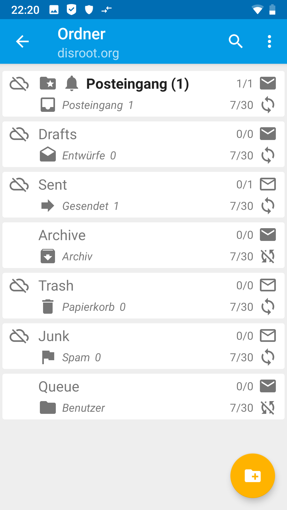

# Über FairEmail

**[FairEmail](https://email.faircode.eu/)**, aus der Feder von Marcel Bokhorst, dem Entwickler von NetGuard und XPrivacyLua, ist ein freier, quelloffener und funktionenreicher Mail-Client für Android. Mittlerweile hat FairEmail sogar dem Klassiker [K-9 Mail](/tutorials/email/clients/k9) den Rang abgelaufen (persönliche Meinung). Das ist natürlich Geschmackssache, ohne Zweifel gehört **FairEmail** jedoch zu den besten **FOSS**-Clients, die es gibt. Wir raten Dir auf jeden Fall, ihn mal auszuprobieren. Einige Funktionen und Vorteile:

 - Funktioniert mit IMAP und POP3
 - Ordner-Synchronisation
 - Privacy by Design
 - GPG/PGP-Verschlüsselung mit OpenKeyChain-Unterstützung (und damit Autocrypt-fähig)
 - Plaintext-Anzeige, entfernt HTML, Scripts, Styles und Tracking-Pixel bereits vor dem Lesen einer E-Mail
 - Niedriger Speicher- und Akkuverbrauch
 - Material Design (inkl. dunklem & schwarzem Design)
 - Senden von Fehlerberichten nur nach Opt-in
 - Kein Tracking, keine Analytics
 - Öffnen von Links, Bildern und Anhängen nur nach Bestätigung (Sicherheitsüberprüfung)
 - Regelmäßige Updates und aktiver Support

Wie Du Deinen **Disroot**-Account in **FairEmail** einrichtest, erfährst Du in diesem Tutorial.

# FairEmail installieren

Als erstes musst Du Dir **FairEmail** auf Deinem Smartphone installieren. Wir empfehlen Dir ausdrücklich, den [F-Droid](https://f-droid.org/)-Store dafür zu benutzen. F-Droid ist ein Store, der ausschließlich freie und quelloffene Apps hostet. Natürlich kannst Du **FairEmail** auch über den G'*****'-Playstore bekommen.

# FairEmail einrichten

Wenn Du die App zu ersten Mal startest, musst Du zunächst die Nutzungsbedingungen akzeptieren.

1. **Schnelleinrichtungs-Assistent starten** 
**FairEmail** hat einen Schnelleinrichtungs-Assistenten, der Dich durch die Prozedur leitet. Wähle den Assistent an ...

... und gehe auf *Anderer Anbieter*

2. **Basis-Informationen** 
Gib Deinen **Namen**, Deine **Disroot-Email-Adresse** und Dein **Passwort** ein.

Bestätige Deine Angaben, indem Du auf *Prüfen* tippst.

Die korrekten Einstellungen sollten nun automatisch erkannt werden (Du benötigst hierfür eine funktionierende Verbindung zum Internet). Sieh Dir zur Überprüfung die Screenshots oder die [Allgemeinen Informationen zu den Email-Einstellungen](/tutorials/email/settings) an. Sollten wider Erwarten die Einstellungen nicht stimmen, kannst Du den Assistenten abbrechen und das Email-Konto manuell einrichten oder die Einstellungen später in der Kontoverwaltung korrigieren. Bestätige mit *Speichern*.

Du erhältst nun die Bestätigung, dass das Konto eingerichtet wurde

3. **Fertig! (Im Prinzip)** 
Wenn Du in der Einrichtungsbestätigung auf *OK* tippst, gelangst Du wieder in die Haupteinstellungen. Wenn Du willst, dass Dein Email-Konto im Hintergrund regelmäßig aktualisiert wird, solltest Du unter Punkt 4 noch die **Akku-Optimierung** für **FairEmail** ausstellen.

Wenn Du nun unter Punkt 5 auf *Los* tippst, kommst Du zu Deinen Emails, die nun zum ersten Mal abgerufen werden.

Beim ersten Besuch Deines Posteingangs erhältst Du noch einige Informationen, die Du durch Tippen auf das *X* entfernen kannst.

4. **(Optional) Startansicht ändern** 
Standardmäßig wird Dir beim Start von **FairEmail** ein Sammeleingang angezeigt, der die Eingangspostfächer aller Email-Konten zusammengefasst anzeigt. Wenn Du stattdessen zunächst die klassische Kontenübersicht sehen möchtest, weil Du zum Beispiel mehrere Email-Konten mit **FairEmail** verwaltest, kannst Du das folgendermaßen einstellen:

Öffne das Menü, indem Du oben links auf die drei Striche tippst und wähle *Einstellungen*

 

Du gelangst nun wieder in die Haupteinstellungen. Die Menüleiste kannst Du durch wischen nach links und rechts scrollen. Im Reiter *Ansicht* findest Du die Einstellung *Zum Start anzeigen* und darunter ein Dropdown-Menü. Wähle hier *Konten*.

Wenn Du nun über die Haupteinstellungen unter Punkt 5 zu Deinen Emails zurückkehrst, siehst Du die Kontenansicht.

Wählst Du Dein Email-Konto an, gelangst Du in die Ordner-Ansicht.

.

5. **(Optional) Weitere Einstellungen** 
**FairEmail** hat sehr viele Möglichkeiten zur Anpassung. Zu viele, um sie hier alle darzustellen. Spiele einfach ein bisschen damit und finde heraus, was Dir gefällt. Du wirst schnell feststellen, dass die Bedienung von **FairEmail** sehr intuitiv ist.

Falls sich Anfragen zu einzelnen Funktionen in **FairEmail** häufen, werden wir dieses Tutorial in Zukunft sicherlich noch um weitere Erläuterungen ergänzen.
