# About FairEmail

**[FairEmail](https://email.faircode.eu/)**, created by Marcel Bokhorst, the developer of NetGuard and XPrivacyLua, is a free, open source and feature rich mail client for android. Concerning **FLOSS*, **FairEmail**, just like [**K-9 Mail**](/tutorials/email/clients/mobile/k9), surely is one of the most popular email clients for **Android**. Some features and advantages:

 - works with IMAP and POP3
 - folder synchronisation
 - privacy by design
 - GPG/PGP encryption with OpenKeyChain support (thus autocrypt capable)
 - Plaintext diplay, removes HTML, scripts, styles and tracking pixel already before reading the email
 - low memory and battery consumption
 - material design (incl. dark & black design)
 - sending bug reports only after opt-in
 - no tracking, no analytics
 - opening links, images and attachments only after confirmation (with security check)
 - regular updates and maintenance, active support

In this tutorial you will learn, how to setup your **Disroot** Account in **FairEmail**.

# Installing FairEmail

At first you need to install **FairEmail** on your Smartphone. We highly recommend you to use [F-Droid](https://f-droid.org/) store. F-Droid is a store that hosts only free and open source apps. Of course you can also download **FairEmail** via G'*****'-Playstore.

# Set up FairEmail

When you start the app for the first time, you need to accept the license agreement.

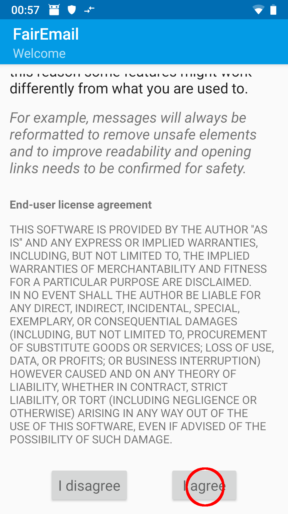

1. **Starting the wizard** 
**FairEmail** has a setup wizard integrated, that will lead you through the process. Choose the wizard ...

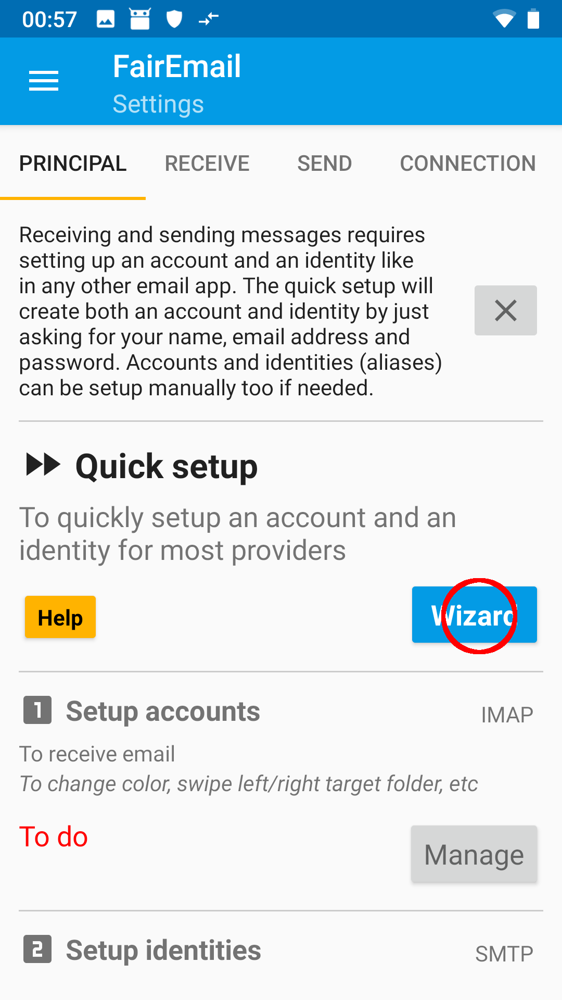

... and choose *Other provider*

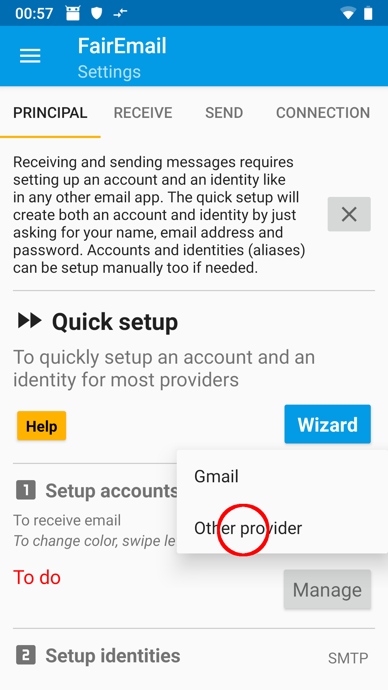

2. **Fill in credentials** 
Fill in your **screen name**, your **Disroot mail address** and your **password**.

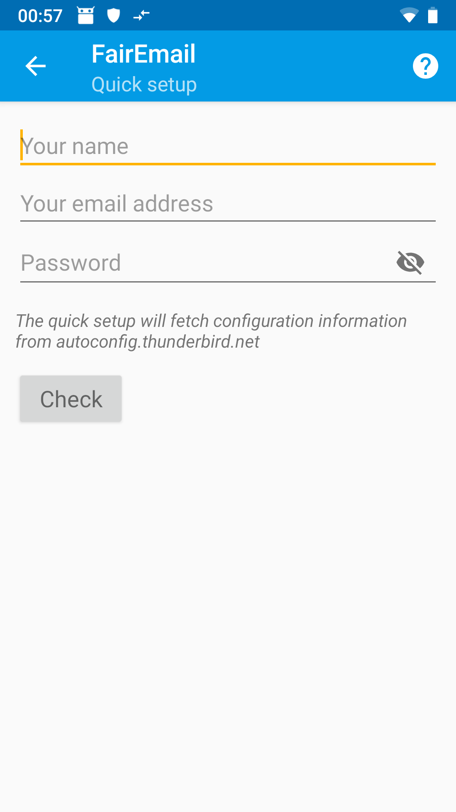

Confirm your input by tapping on *Check*.

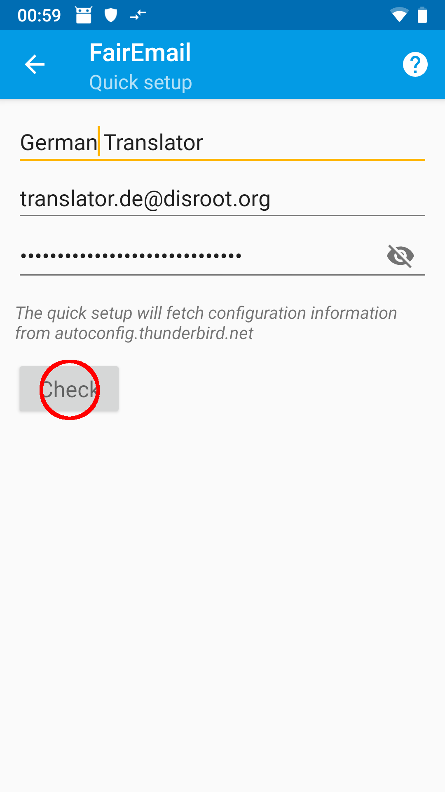

The correct settings should now be automatically detected (you need a working internet connection). For verification take a look at the screenshots or the [general server setup information](/tutorials/email/settings). If, contrary to expectations, the settings aren't correct, you could either cancel the wizard and setup the mail account manually or change the settings later in the account management. Confirm with *Save*.

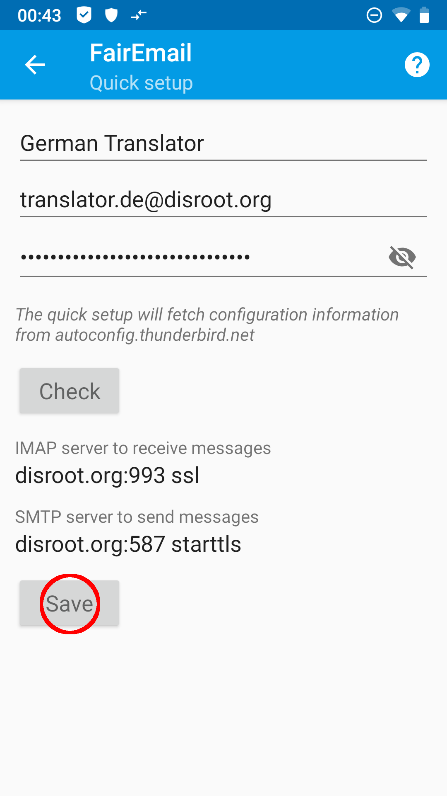

You will receive a confirmation message for the set up account.

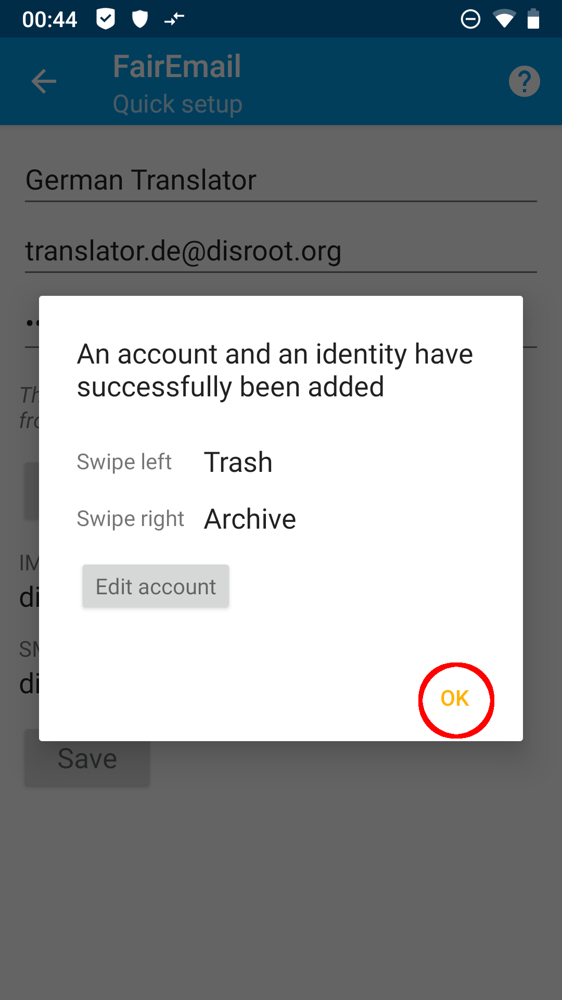

3. **Done! (principally)** 
By tapping *OK* in the confirmation message you get back to the main settings. If you want your email to be synchronized in the background you need to adjust the battery optimization for **FairEmail** under point 4 in the menue.

By tapping on *Go* under menue point 5 you get to your emails, which will now be retrieved for the first time.

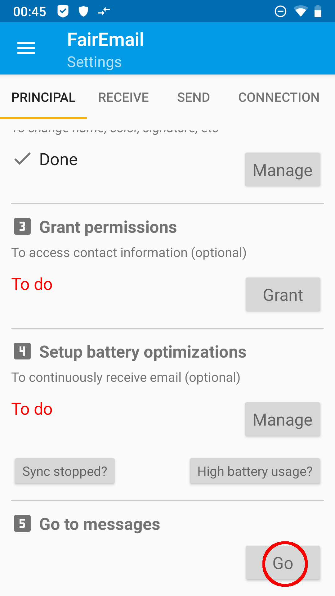

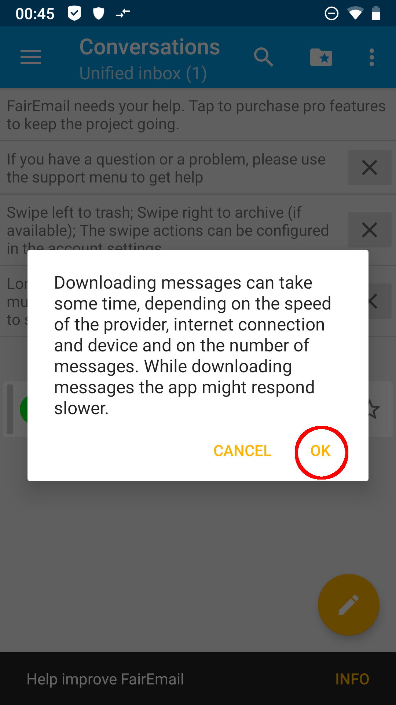

With your first visit to your inbox you get some informations about the usage of **FairEmail**, which you can dismiss by tapping the *X*.

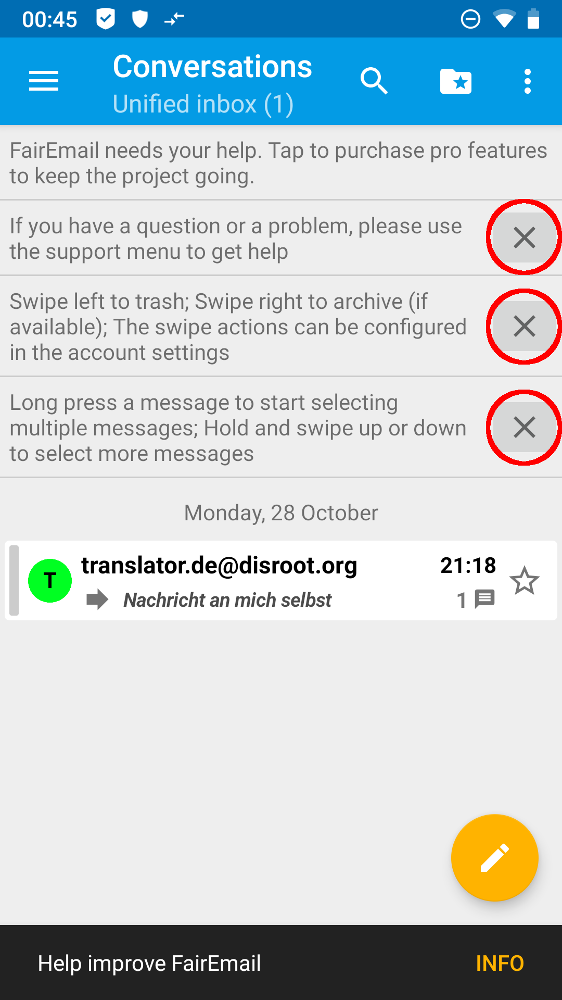

4. **(optional) Changing start screen** 
By default you will see a unified inbox on your start screen, which will summarize the inboxes of all your mail accounts in **FairEmail**. If you prefer to have a classic account view on start, maybe because you manage a greater number of email accounts with **FairEmail**, you can do this as follows:

Open the menue by tapping the three dashes in the top left corner and choosing *Settings*.

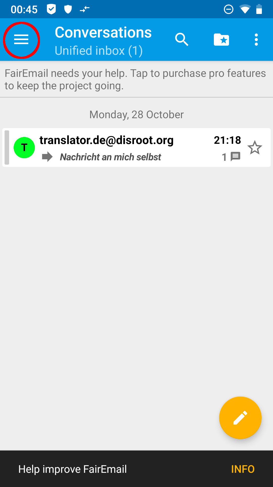 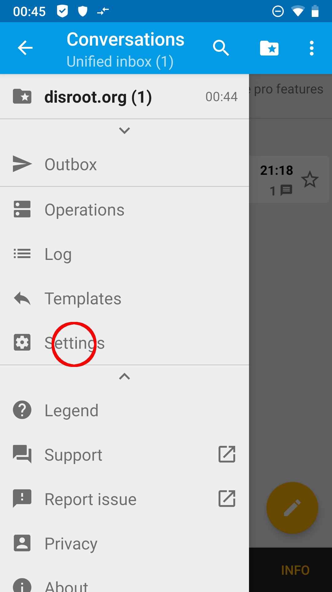

By doing so you get back to the main settings. You can now scroll through the menu bar by swiping left and right. Under the menu tab *Display* you will find the option *Show on start screen* with a dropdown menu. Choose *Accounts* in this menu.

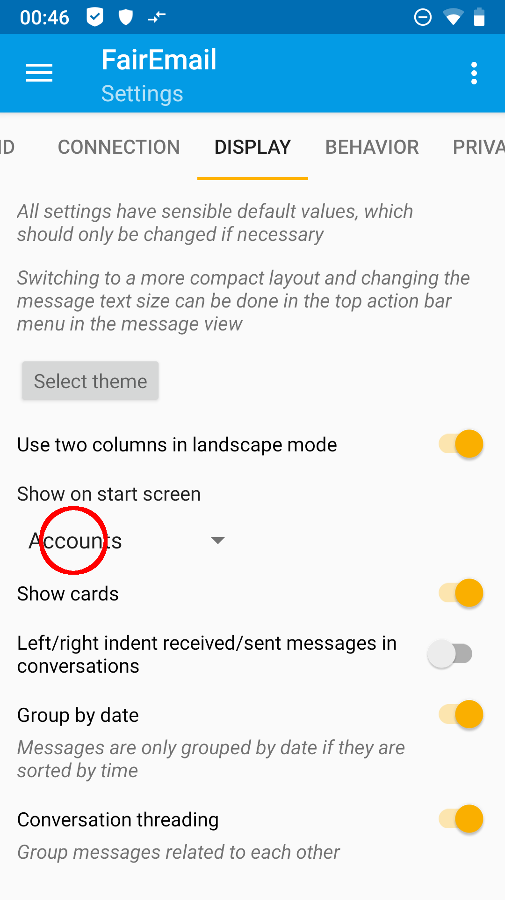

Heading back to your emails via point 5 of the principal settings you will now see the account view.

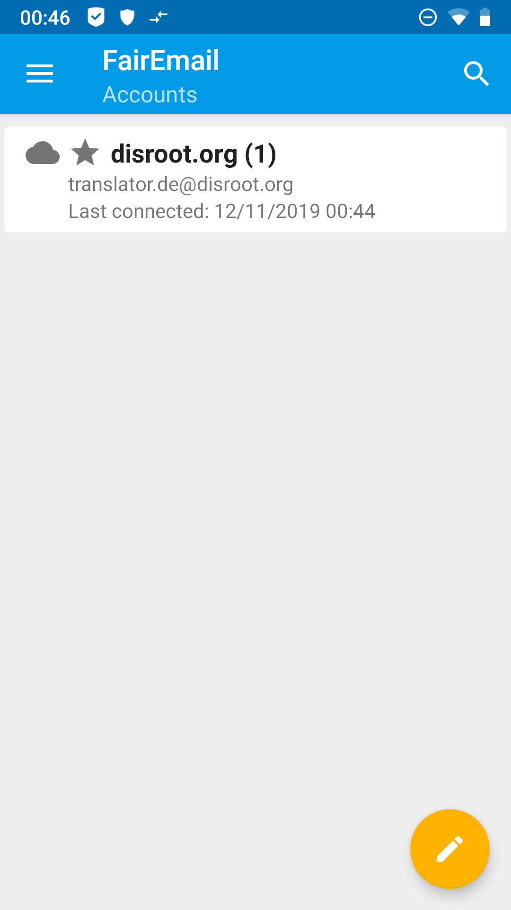

By tapping on your account you will get to the folder view.

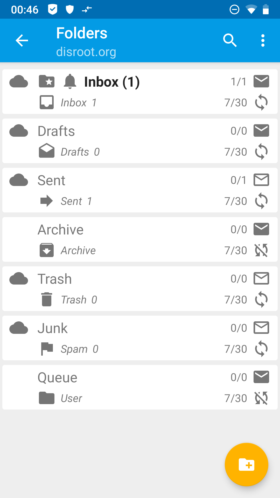.

5. **(optional) More settings** 
**FairEmail** has a lot of customization options. Too much to explain them all here. Just play around a bit and find out what fits your taste. You will find out quickly, that the user interface of **FairEmail** is very intuitive.

If questions about some features of **FairEmail** will pile up, we may of course add some explanation to this tutorial in the future.
