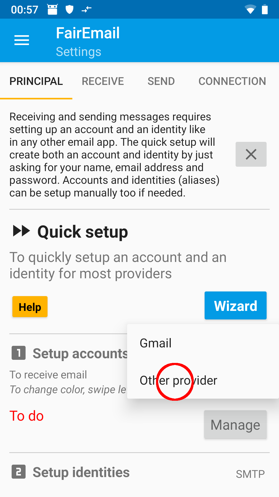
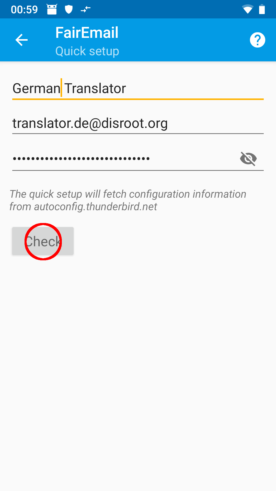
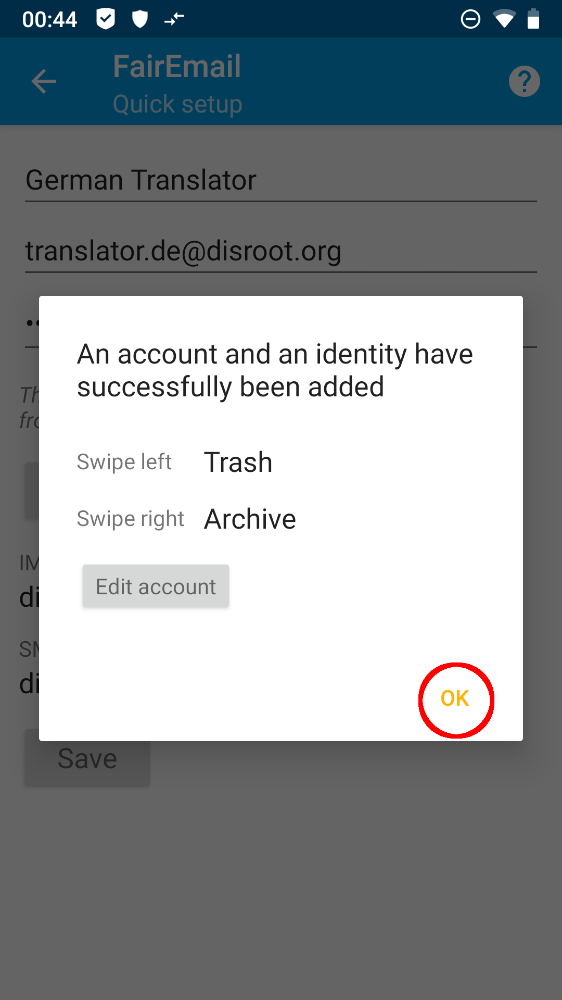
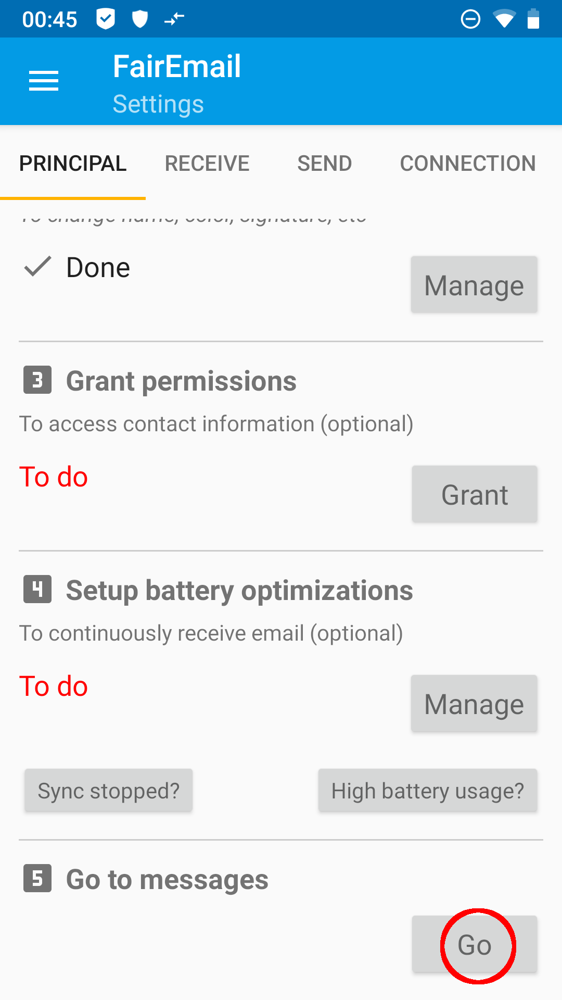
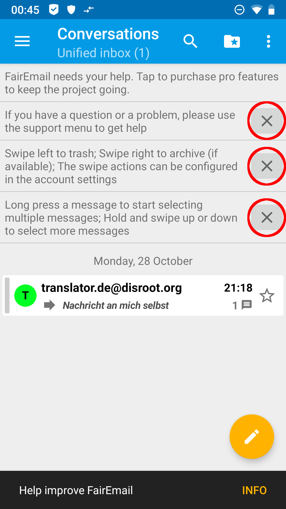
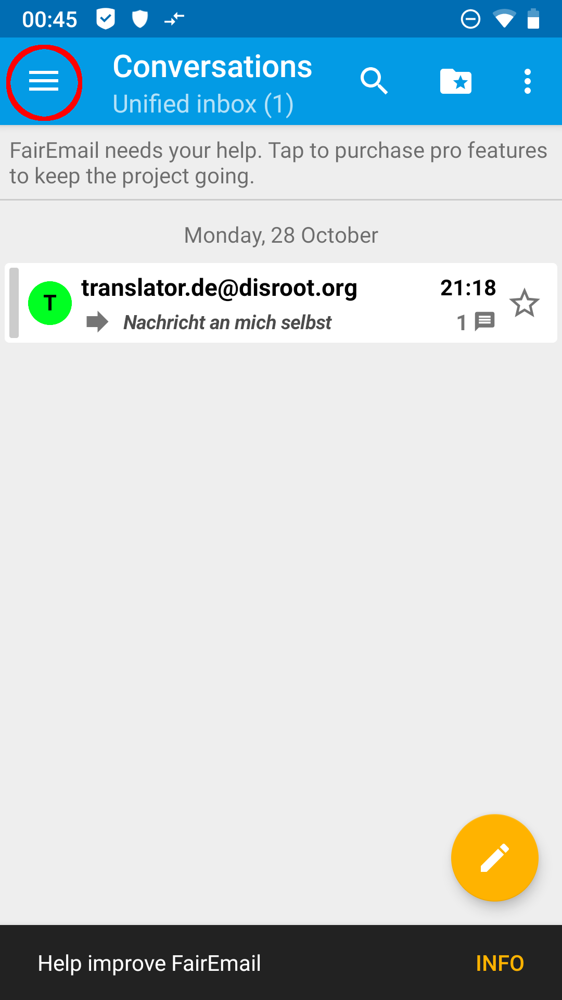
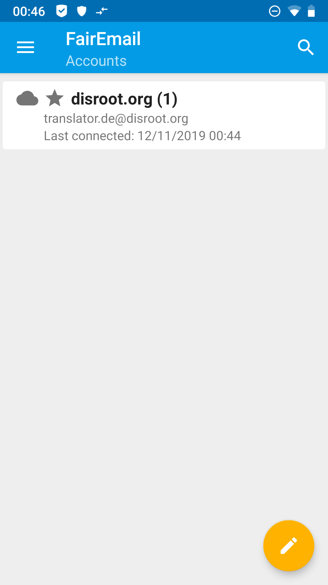

# À propos de FairEmail

**[FairEmail](https://email.faircode.eu/)**, créé par Marcel Bokhorst, le développeur de NetGuard et XPrivacyLua, est un client mail gratuit, open source et riche en fonctionnalités pour android. En ce qui concerne **FLOSS*, **FairEmail**, tout comme [**K-9 Mail**](/tutorials/email/clients/mobile/k9), est certainement l'un des clients de messagerie les plus populaires pour **Android**. Quelques caractéristiques et avantages :

 - fonctionne avec IMAP et POP3
 - synchronisation des dossiers
 - confidentialité dès la conception
- Chiffrement GPG/PGP avec support OpenKeyChain (donc possibilité d'autocrypt)
 - affichage en texte brut, supprime le HTML, les scripts, les styles et le pixel de suivi déjà avant de lire l'e-mail
 - faible consommation de mémoire et de batterie
 - conception matérielle (y compris la conception sombre et noire)
 - envoi de rapports de bogue uniquement après acceptation
 - pas de suivi, pas d'analyse
 - ouverture des liens, images et pièces jointes uniquement après confirmation (avec contrôle de sécurité)
 - mises à jour et maintenance régulières, support actif

Dans ce tutoriel, vous apprendrez à configurer votre compte **Disroot** dans **FairEmail**.

# Installation de FairEmail

Tout d'abord, vous devez installer **FairEmail** sur votre Smartphone. Nous vous recommandons fortement d'utiliser le magasin [F-Droid] (https://f-droid.org/). F-Droid est un magasin qui héberge uniquement des applications gratuites et open source. Bien sûr, vous pouvez également télécharger **FairEmail** via G'*****'-Playstore.

# Configurer FairEmail

Lorsque vous démarrez l'application pour la première fois, vous devez accepter le contrat de licence.

1. **Démarrer l'assistant** 
**FairEmail** a un assistant d'installation intégré, qui vous guidera tout au long du processus. Choisissez l'assistant ...

... et choisissez *Autre fournisseur*.

2. **Renseignez les informations d'identification** 
Remplissez votre **nom d'écran**, votre **adresse mail disroot** et votre **mot de passe**.

Confirmer votre saisie en appuyant sur *Check*.

Les paramètres corrects devraient maintenant être détectés automatiquement (vous avez besoin d'une connexion Internet qui fonctionne). Pour vérifier, regardez les captures d'écran ou les [informations générales sur la configuration du serveur](/tutoriels/email/settings). Si, contre toute attente, les paramètres ne sont pas corrects, vous pouvez soit annuler l'assistant et configurer le compte de messagerie manuellement, soit modifier les paramètres ultérieurement dans la gestion du compte. Confirmer avec *Enregistrer*.

Vous recevrez un message de confirmation pour le compte configuré.

3. **Fait ! ( principalement)** 
En appuyant sur *OK* dans le message de confirmation, vous revenez aux paramètres principaux. Si vous souhaitez que vos e-mails soient synchronisés en arrière-plan, vous devez régler l'optimisation de la batterie pour **FairEmail** au point 4 du menu.

En appuyant sur *Go* au point 5 du menu, vous accédez à vos e-mails, qui seront alors récupérés pour la première fois.

Lors de votre première visite dans votre boîte de réception, vous recevez des informations sur l'utilisation de **FaireEmail**, que vous pouvez supprimer en appuyant sur le *X*.

4. **( facultatif) Changement de l'écran de démarrage** .
Par défaut, vous verrez une boîte de réception unifiée sur votre écran de démarrage, qui résumera les boîtes de réception de tous vos comptes de messagerie dans **FairEmail**. Si vous préférez avoir une vue classique des comptes au démarrage, peut-être parce que vous gérez un plus grand nombre de comptes de messagerie avec **FairEmail**, vous pouvez le faire comme suit :

Ouvrez le menu en appuyant sur les trois tirets dans le coin supérieur gauche et en choisissant *Paramètres*.

 

En faisant cela, vous revenez aux paramètres principaux. Vous pouvez maintenant faire défiler la barre de menu en glissant vers la gauche et la droite. Sous l'onglet *Affichage*, vous trouverez l'option *Afficher sur l'écran de démarrage* avec un menu déroulant. Choisissez *Comptes* dans ce menu.

En retournant à vos emails via le point 5 des paramètres principaux, vous verrez maintenant la vue des comptes.

En cliquant sur votre compte, vous arriverez à la vue des dossiers.

.

5. **( facultatif) Plus de paramètres** .
**FairEmail** a beaucoup d'options de personnalisation. Trop pour les expliquer toutes ici. Il suffit de jouer un peu et de trouver ce qui correspond à vos goûts. Vous constaterez rapidement que l'interface utilisateur de **FairEmail** est très intuitive.

Si les questions sur certaines fonctionnalités de **FairEmail** s'accumulent, nous pourrons bien sûr ajouter des explications à ce tutoriel à l'avenir.
