Converse ist ein freier und quelloffener XMPP-Chatclient, der im Webbrowser läuft und <br>**[webchat.disroot.org](https://webchat.disroot.org)** bietet eine Möglichkeit, Dich durch den Webchat mit Deinem XMPP-Konto zu verbinden.

# Verbinden
Öffne Deinen bevorzugten Webbrowser und gehe zu **[webchat.disroot.org](https://webchat.disroot.org)**

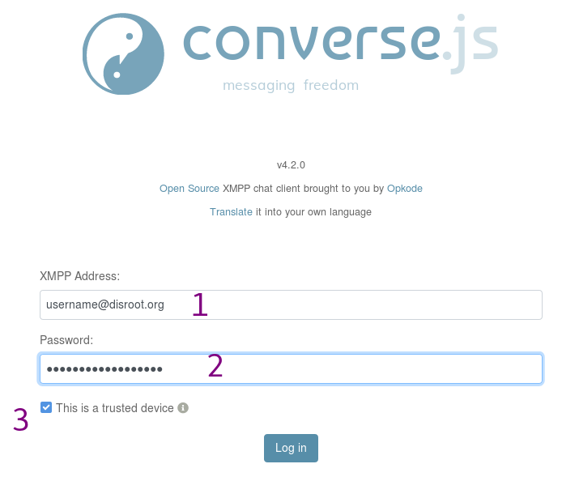
1. **XMPP Adresse:**: *Deine_Disroot_Email*
2. **Passwort:** *Dein_super-geheimes_Disroot_Passwort*
3. **Diesem Gerät wird vertraut**: Entferne das Häkchen in dieser Box, wenn Du nicht an Deinem eigenen Computer bist.

# Benutzeroberfläche
Nachdem Du Dich angemeldet hast, wirst Du in etwa folgendes sehen:


1. Deine persönlichen Details
2. Die Liste der Chaträume, in denen Du angemeldet bist, und die Räume, die Du als Lesezeichen gespeichert hast.
3. Die Informationen des aktuellen Raums
4. Die Teilnehmer des aktuellen Raums
5. Die Funktionen und Konfigurationen des aktuellen Raums
6. Die laufende Diskussion des aktuellen Raums
7. Der Nachrichten-Editor

# Räume
Du kannst an Gruppendiskussionen teilnehmen, auch Gruppenchats oder Räume genannt.

## Einen Raum betreten

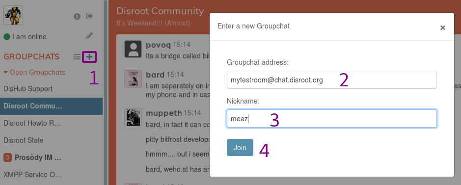
1. Klicke auf diesen Button, um einen Raum zu betreten oder zu erstellen.
2. **Gruppenchat-Adressen**: Gib die Adresse des Raums ein, dem Du beitreten möchtest. Es kann ein Raum eines beliebigen XMPP-Servers sein, der an der Föderation teilnimmt. Ein kleines Beispiel: Wenn Du einem Raum auf dem **Disroot**-Server beitreten möchtest, fügst Du ```chat.disroot.org``` hinter dem Namen des Raums an. In diesem Bild möchte der Nutzer einem Raum namens ```mytestroom``` auf dem *chat.disroot.org* XMPP-Server beitreten.
3. **Nickname**: Du kannst Deinen Namen, der im Chat angezeigt wird, frei wählen. Es muss nicht Dein tatsächlicher **Disroot**-Nutzername sein. Du kannst somit auch verschiedene Nutzernamen in den unterschiedlichen Chaträumen, in denen Du Mitglied bist, haben, wenn dU das möchtest.
4. Du kannst dem Raum **beitreten**, indem Du hier klickst.

## Nachrichten versenden

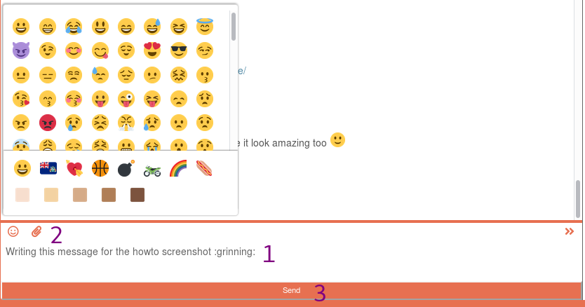
1. Schreibe hier Deine Nachricht.
2. Mit diesen zwei Buttons kannst Du Emojis hinzufügen oder Dateien teilen (das kann jeder Dateityp sein, die Maximalgröße beträgt 10 MB).
3. Klicke auf **Senden**, wenn Du Deine Nachricht fertig geschrieben hast.

!! 
!! WICHTIG: *Shift + Enter* ermöglicht es Dir, einen Zeilenumbruch innerhalb der Nachricht hinzuzufügen.

Du kannst andere Leute in Deiner Nachricht erwähnen, sodass sie eine Mitteilung über Deine Nachricht erhalten. Klicke einfach auf ihren Namen in der Teilnehmerliste oder füge den Namen per Hand hinzu, wenn Du ihn kennst. Du kannst auch die ersten Buchstaben eingeben und dann die Tabulatortaste drücken, um eine Liste mit Vorschlägen von Benutzernamen zu erhalten.

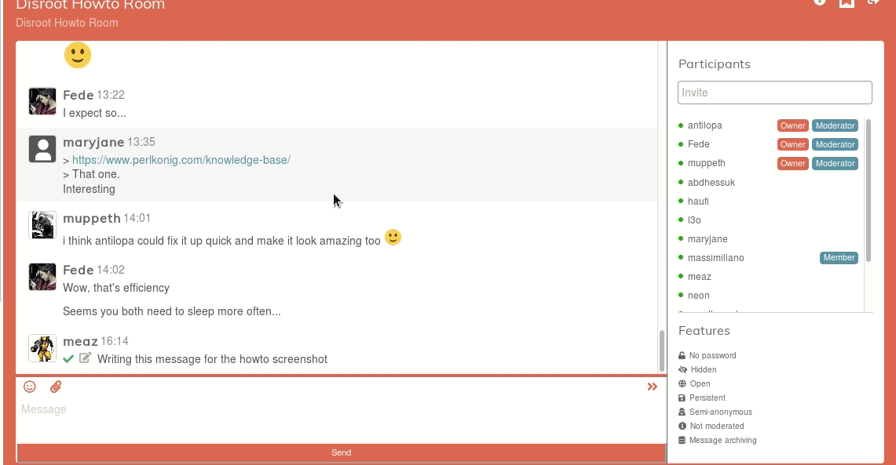

Hier sehen wir, wie der Nutzer derzeit Sachen im Prosody-Raum liest (blauer Hintergrund) und währenddessen eine Nachricht, die seinen Nutzernamen enthält, im **Disroot** Howto-Raum erhält.

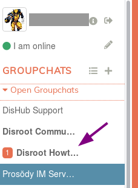


## Nachrichten bearbeiten
Wenn Du eine Nachricht, die Du bereits abgesandt hast, verbessern möchtest, bewege Deine Maus darüber, damit ein Stift auf der rechten Seite erscheint. Klicke darauf, verbesser Deine Nachricht und versende sie erneut.

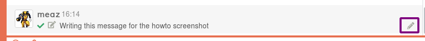

## Einen Raum verlassen
Um einen Raum zu verlassen, klickst Du einfach áuf das Pfeil-Icon in der oberen rechten Ecke der Raum-Anzeige. 

Du kannst auch Deine Maus über den Namen des Raums in der Gruppenchat-Liste im linken Paneel bewegen und auf das Pfeil-Icon klicken, das dort erscheint (3. Icon).


## Einen Raum als Lesezeichen speichern.
Du kannst einen Raum als Lesezeichen speichern, um ihn später leichter betreten zu können und ihn auch in verschiedenen, genutzten Chat-Clients zur Verfügung zu haben.

Dafür klickst Du einfach auf das Flaggen-Icon in der oberen rechten Ecke des Raum-Paneels. 

Du kannst Deine Maus auch über des Namen des Raums in der Gruppenchat-Liste im linken Paneel bewegen und auf das Flaggen-Icon klicken, dass dann erscheint.


Dein als Lesezeichen gespeicherten Räume findest Du im linken Menü.

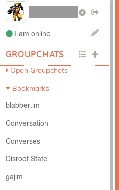

## Raumdetails
Wenn Du mehr Informationen über einen einen Raum erhalten möchtest, klicke einfach auf das "i" icon in der oberen rechten Ecke des Raum-Paneels.


## EInen öffentlichen Raum finden
Du kannst nach öffentlichen Räumen suchen (und nur für öffentliche):

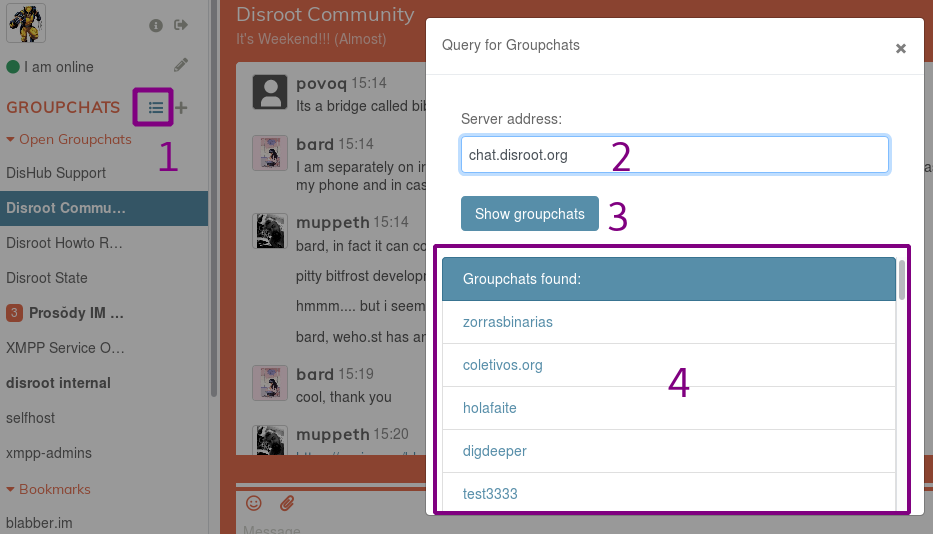
1. Klicke auf diesen Button, um das *Suchen*-Fenster zu öffnen.
2. Gib die Adresse des Servers ein, auf dem Du nach öffentlichen Räumen suchen möchtest. Zum Beispiel *chat.disroot.org*
3. Klicke auf *Gruppenchats anzeigen*.
4. Du erhältst nun eine Liste der öffentlichen Räume. Klicke einfach auf den Raum, dem Du beitreten möchtest.


## Einen Raum erstellen
Die Vorgehensweise ist hier eigentlich genau so wie beim Betreten eines existierenden Raums.


1. Klicke auf diesen Button, um einen Raum zu betreten oder zu erstellen.
2. **Gruppenchatp Adresse**: Gib die Adresse des Raums ein, den Du erstellen möchtest. Du kannst nur einen Raum auf dem **Disroot**-XMPP-Server erstellen. Die Adresse sieht dann zum Beispiel so aus: *meintestraum@chat.disroot.org*
3. **Nickname**: Du kannst jeden Benutzernamen eingeben, den Du möchtest, esmuss nicht Dein echter **Disroot**-Benutzername sein. Du kannst also verschiedene Benutzernamen in unterschiedlichen Räumen haben, wenn Du willst.
4. Du kannst den Raum **Betreten**, indem Du diesen Button klickst. Wenn der Raum bereits besteht und öffentlich ist, trittst Du ihm bei. Ist ein existierender Raum nicht öffentlich, musst Du Dir einen anderen Raumnamen überlegen.

Du erhältst eine Nachricht, dass Du erfolgreich einen Raum erstellt hast:
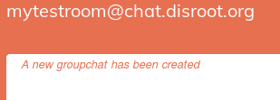

Hier sind einige Standardeinstellungen Deines Raums, wenn Du ihn frisch erstellt hast:


Da Du den Raum erstellt hast, bist Du sein Besitzer und Administrator. Das heißt, Du kannst diese Einstellungen verändern wie Du möchtest. Klick auf das *Werkzeug*-Icon in der rechten oberen Ecke des Raum-Paneels.


Du gelangst dann zu dieser Seite:


# Direkter Chat: 1 zu 1 Konversation
Du kannst auch mit jemandem privat schreiben, in einer 1 zu 1 Diskussion, an der nur die zwei Gesprächspartner teilnehmen.

## Kontakt hinzufügen
Als erstes musst Du einen Kontakt hinzufügen, bevor Du mit diesem Nutzer sprechen kannst.


1. Klicke auf diesen Button, um einen Kontakt hinzuzufügen.
2. **XMPP-Adresse**: *XMPP_Adresse_Deines_Kontakts* Es kann eine Adresse auf einem beliebigen XMPP-Server sein, solange dieser föderiert.
3. **Optionaler Nickname**: Du kannst Deinen Kontakt benennen wie Du möchtest.
4. **Hinzufügen**: Klicke auf diesen Button, wenn Du fertig bist.

Der Kontakt wird informiert, dass Du ihn/sie zu Deiner Kontaktliste hinzugefügt hast. Bis der Kontakt dies bestätigt, findest Du diesen Kontakt in Deiner *Schwebend*-Liste:

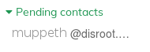

## Mit einem Kontakt schreiben
Sobald der Kontakt hinzugefügt wurde, brauchst Du einfach nur auf den Namen in der Kontaktliste klicken, um eine private Konversation zu beginnen.

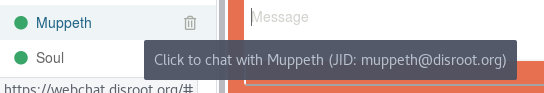

## Einen Kontakt entfernen
Um einen Kontakt von Deiner Kontaktliste zu entfernen, klicke auf das Mülleimer-Symbol neben dem Nutzernamen.
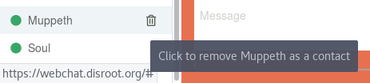

## Kontaktinformationen
Um mehr Informationen über Deinen Kontakt zu erhalten, klicke auf das ID-Card-Icon in der oberen rechten Ecke des Chat-Paneels.


## Eine Konversation verschlüsseln
Wenn Du möchtest, dass Eure Kommunikation wirklich sicher ist, achte darauf, dass **OMEMO** aktiviert ist. Hierfür überprüfst Du das *Vorhängeschloss*-Icon. Wenn das Schloss offen ist, ist auch die Konversation nicht verschlüsselt.  {.inline}<br>
Wenn der Chat verschlüsselt ist, ist das Schloss geschlossen und sollte so aussehen:  {.inline}


# Persönliche Angaben

## Name, Avatar etc. ändern
Um Deine persönlichen Angaben zu ändern, klicke auf Deinen Avatar in der oberen linken Ecke.<br>
Du kannst die folgenden Informationen hinzufügen:
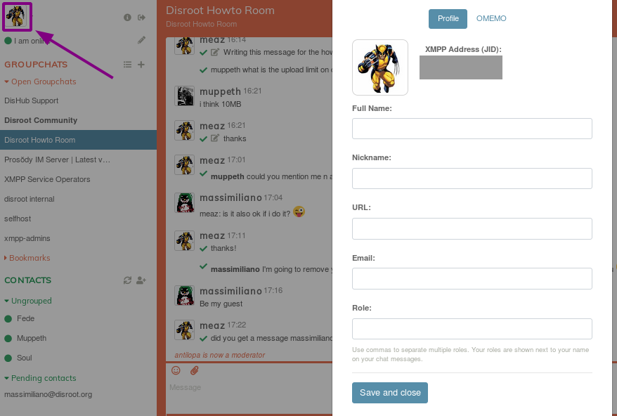

Wann immer Du etwas ändern möchtest, klicke einfach auf Deinen Avatar.

## Status ändern
Du kannst Deinen Status ändern, indem Du auf das *Stift*-Icon neben Deinem aktuellen Status klickst:
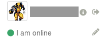


# Abmelden
Um Dich von [webchat.disroot.org](https://webchat.disroot.org) abzumelden, klicke einfach auf das *Pfeil*-Icon neben Deinem Nutzernamen in der oberen rechten Ecke.


# Converse.js
Wenn Du mehr über die benutzte Software erfahren möchtest, sieh Die einfach die Website von [converse.js](https://conversejs.org/) an.
