**Movim** is a free and open source software social and chat platform that acts as a frontend *(the part of an application that interacts with users, basically everything we see on the screen when we access a website or application)* for the **XMPP** network.

It is a complete communication solution that allows us to chat, create groups and communities, create and share posts, news, and even audio and video calls.

---

# Connecting
We open our favorite web browser and go to **[webchat.disroot.org](https://webchat.disroot.org)** and enter...

1. **My Address**: *Our Disroot username@disroot.org*
2. **Password:** *Our Disroot password*

# User Interface
Once we have logged in, we will see something like this:

1. **The side bar** where we have the shortcuts to
    - the **Publishing** editor
    - the **News** feed
    - the **Explore** option and
    - the **Chats** access to our rooms and conversations  

   In this same side bar, at the bottom, we find  

   - the **Notifications** section
   - the **Search** option to find contacts
   - the **Share your location** option (which is disabled) and
   - the **Subscriptions** manager  

  We will see them in detail later on.

2. The **main window** from where we can access publications, news and search and interact with our contacts and communities.

All right. Let's see the settings below.

# Configurations
To access the settings, we pass the mouse over our username to display the menu and click **Configuration**.

## Profile

Here we can
  - Change our **avatar** and profile **banner**
  - Enter our **Name**
  - Set our **Nickname**
  - Enter
    - an **Email**
    - our **Date of Birth**
    - a **Website**
  - Add information
    - **About** us
    - our **Locality** and
    - our **Country**

## Configuration

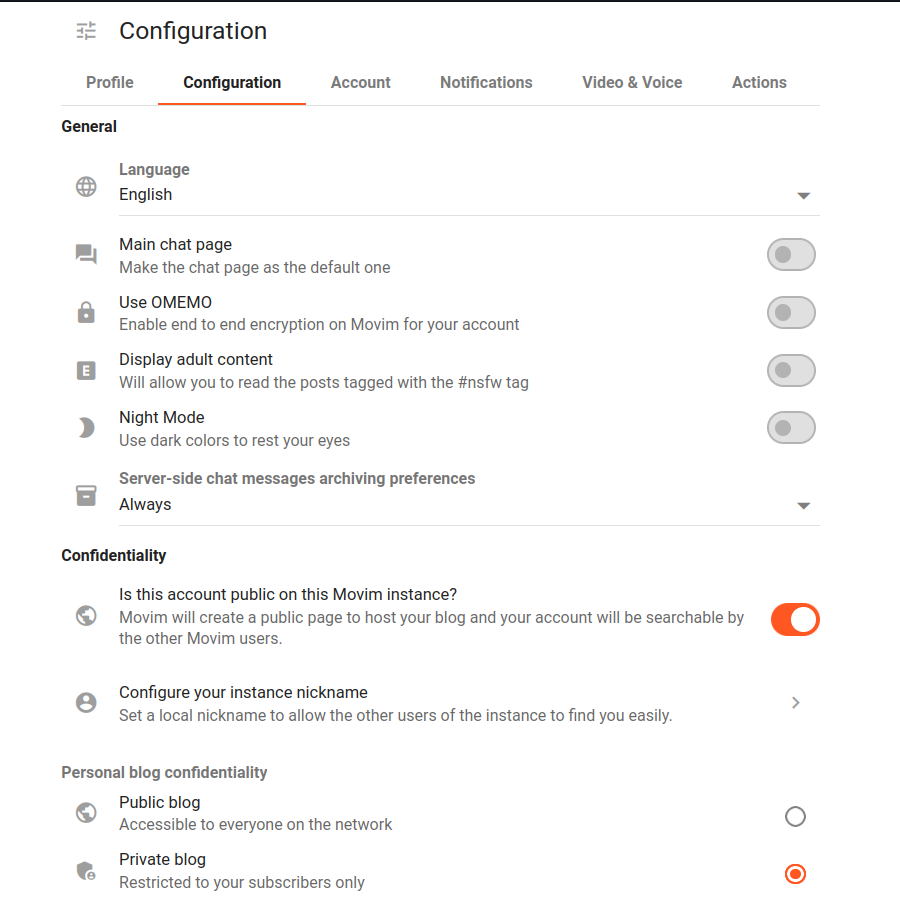

In this tab we can
  - change the **Language** of the interface (after selecting it we need to disconnect and log back in for it to have effect);
  - choose if we want the chat rooms to be our **main page** when we connect;
  - enable/disable the **OMEMO** encryption;
  - allow or not to **Display adult content**, those post tagged as #nsfw (not safe for work);
  - switch between light and **Night Mode** and
  - set the archiving preferences of the chat messages.

  Additionally, we can set whether our account will be public (so that other people can find it) or not; and configure our local nickname.

## Account

In this section we have
  - our **Clients information** that shows the devices from which we are connected; and
  - the **Account management**

!! ### THESE ACCOUNT MANAGEMENT OPTIONS SHOULD NOT BE USED/MODIFIED UNDER ANY CIRCUMSTANCE.
!! Our Disroot credentials must only be modified from the [User Self Service Center](https://user.disroot.org), doing it here may cause account access problems later.

## Notifications

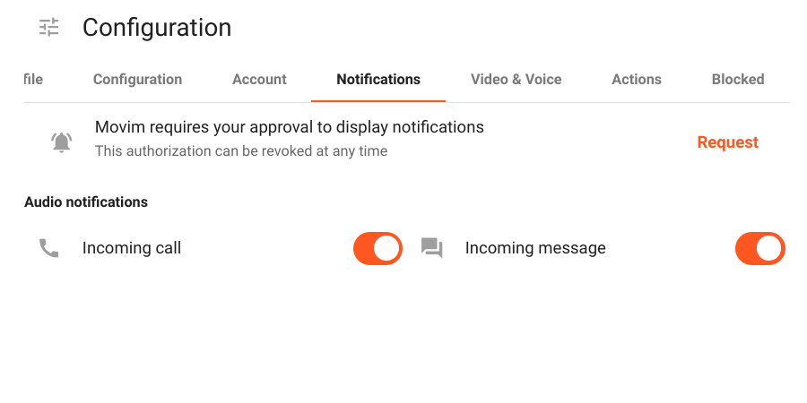

Here we can allow the notifications for **Incoming** calls and/or messages.

## Video & Voice

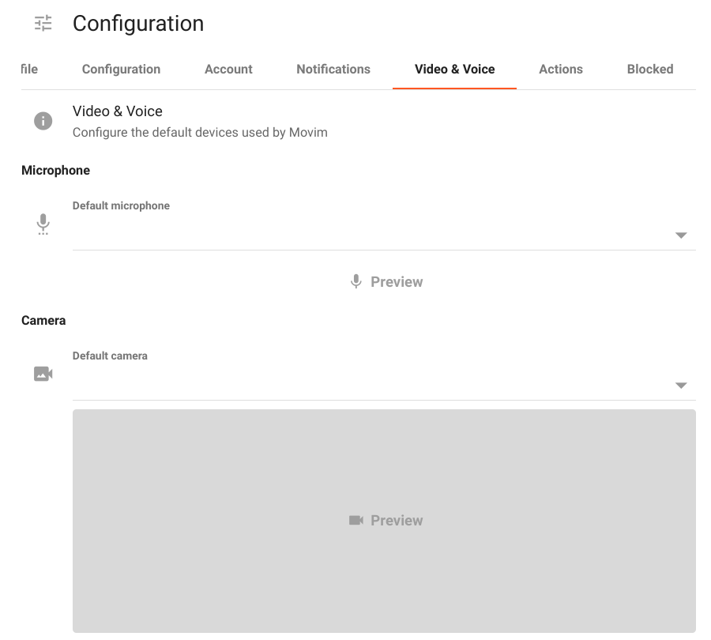

We can configure the default devices (if any) we want to be used by both the **Microphone** and the **Camera**.

## Actions

In this tab we can check the time the server has been running.

## Blocked

If we have blocked one or more users, they will appear in this section.

# Publishing
As we mentioned, **Movim** is a communication platform that can be used as a blog and a social network. We can create, compose and share posts as well as comment on other people publications and news.
By clicking on the **Publish** button in the side bar we access the **Rich text editor** to compose posts.

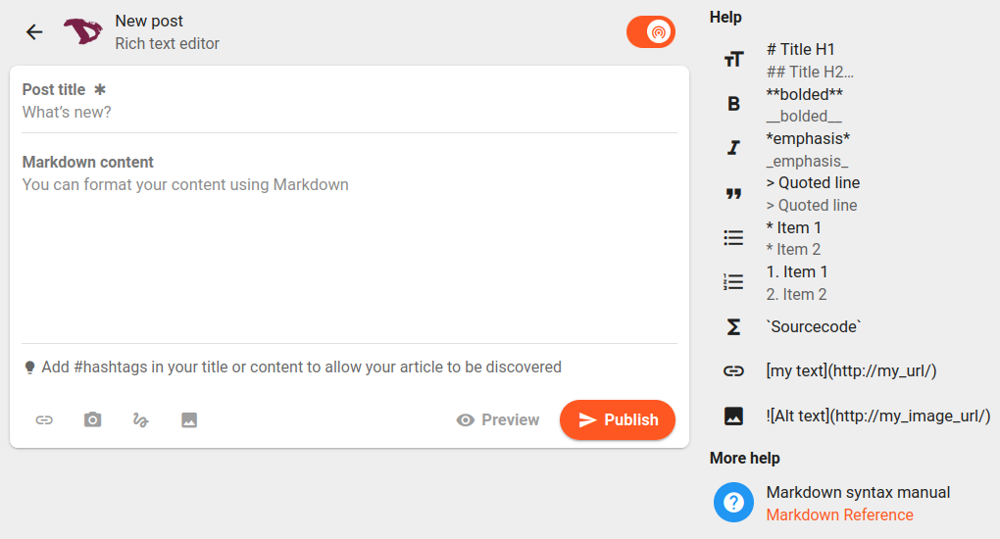

We can start by setting whether the post will be **public** (everyone can see it) or **private** (only our followers will see it).

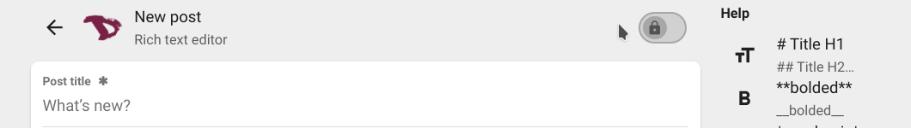

Then we can format the post content using Markdown, add links, pictures, files and even handmade drawings using the drawing editor.

We can preview our post before publish it by clicking the **Preview** option right next to the **Publish** button.

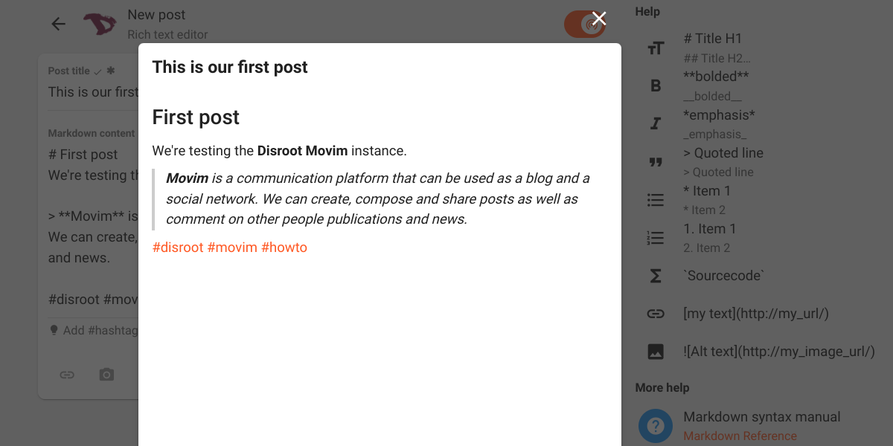

Once we think we are ready we can proceed to publish it by clicking the **Publish** button. Our post, and those of the people we follow, will appear in the **News** feed with interacting options similar to those of other social networking services.

# News

Here is where we can read and interact with other people's posts and news from the communities to which we are susbscribed. If we are using the browser on the computer or laptop, we will see on the right the public posts from other **Movim** users.

To find other people or communities and subscribe to their news, we can use the **Explore** or the **Chats** options both in the side bar.

# Explore

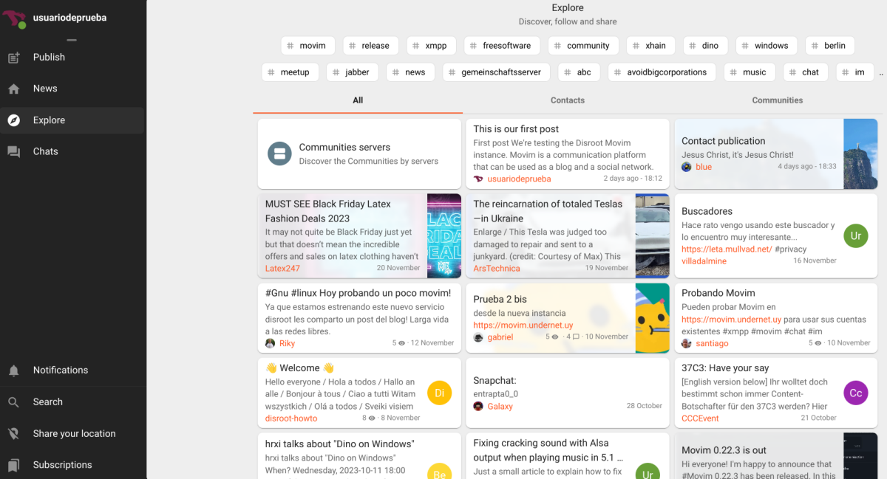

The **Explore** page displays a list of the current news, popular tags and other people's posts. We can click on any of them, access a news or post and follow the author by subscribing.

# Chats

The chat page will show our XMPP chatrooms and contacts (if any). We can click on a contact name or a bookmarked chatroom to start a chat or join one.

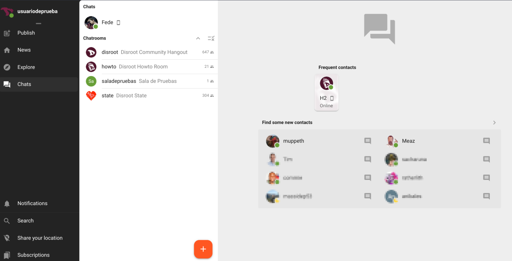

We can also join a chatroom we have not bookmarked or create a new one by clicking the orange **+ (plus)** icon at the bottom to access the chatrooms menu.

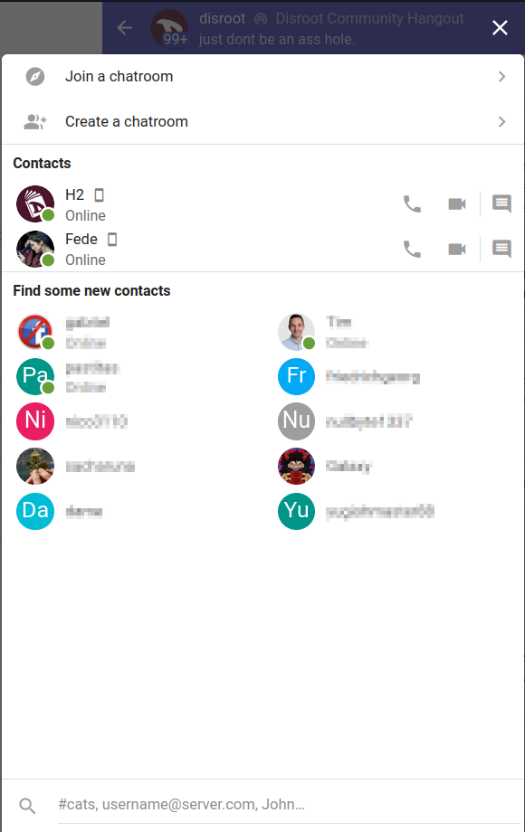

## Join a chatroom
Select this option to add a new chatroom from the global search or by entering its address via the *Join a custom chatroom* option.

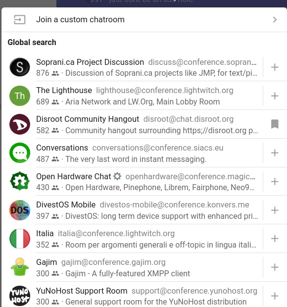

## Create a chatroom
If we want to create a new chatroom, then we have to select the *Create a chatroom* option from the previous menu.

We can select if the chatroom will be a private group chat or a public channel, the room name, the room ID (the XMPP address of the room), our nickname and the way we want to be notified regarding the room messages. Additionally, we can set to join the room automatically when we connect to **Movim** and pin it to our chatrooms list.

Now inside the chatroom we can interact with other people by typing or recording a message or even have an audio-video call.

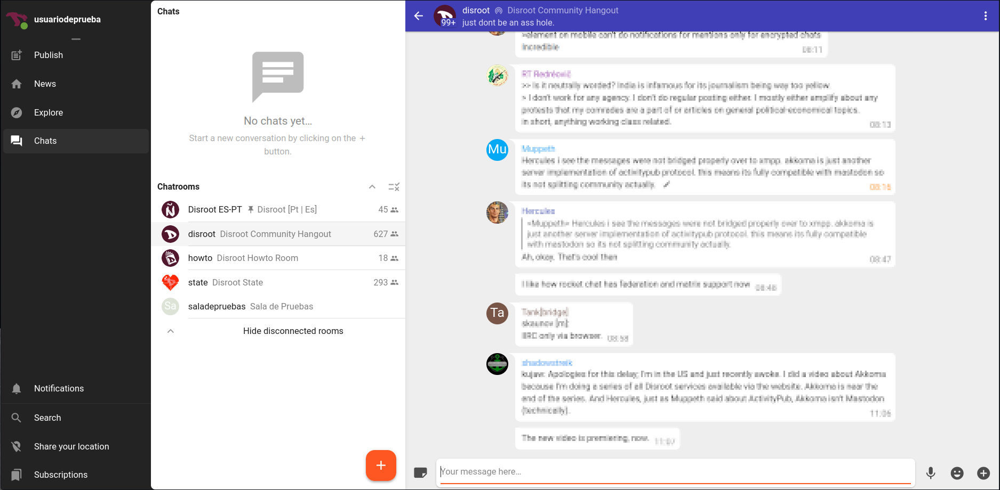

In the topbar of the room we can see
  - its name - on the left - and clicking on it will display information about the room;

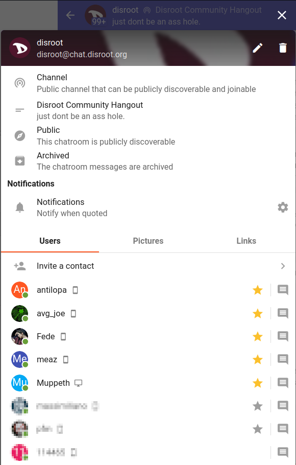

  - and a three-dot menu on the right with an option to report spam or abuse and to disconnect us from the room.

These are the basics of **Movim** and now we can communicate, create and share content over the XMPP protocol.