**Movim** es un software de plataforma social y chat libre y de código abierto que actúa como frontend *(la parte de una aplicación que interactúa con las personas usuarias; básicamente, todo lo que vemos en la pantalla cuando accedemos a un sitio web o una aplicación)* para la red **XMPP**.

Es una completa solución de comunicación que nos permite chatear, crear grupos y comunidades, crear y compartir publicaciones, noticias e incluso llamadas de audio y video.

---

# Conectándonos
Abrimos nuestro navegador preferido y vamos a **[webchat.disroot.org](https://webchat.disroot.org)** e ingresamos...

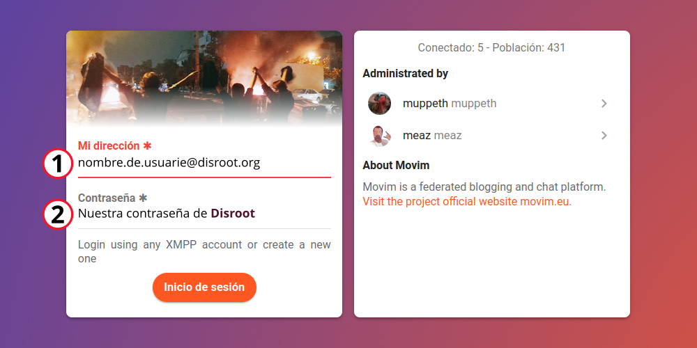

1. **Mi dirección**: *Nuestro nombre.de.usuarie@disroot.org de Disroot*
2. **Contraseña:** *Nuestra contraseña de Disroot*

# Interfaz de usuarie
Una vez que iniciamos sesión, veremos algo como esto:

1. **La barra lateral** donde tenemos los atajos a
    - el editor para **Publicar**
    - el feed (fuente/flujo) de **Novedades**
    - la opción **Explorar** y
    - a nuestras **Conversaciones** y salas de chat

   En esta misma barra lateral, en la parte inferior, encontramos

   - la sección de **Notificaciones**
   - la opción **Buscar** para encontrar contactos
   - la opción **Share your location (Compartir tu ubicación)** (que está deshabilitada) y
   - el gestor de **Suscripciones**

  Los veremos en detalle más adelante.

2. La **ventana principal** desde donde podemos acceder a publicaciones, novedades y buscar e interactuar con nuestros contactos y comunidades.

Muy bien. Veamos a continuación las configuraciones.

# Configuración
Para acceder a las configuraciones, pasamos el ratón sobre nuestro nombre de usuarie para desplegar el menú y hacemos click en **Configuration**.

Cuando accedemos a la **Configuración** lo primero que podríamos hacer es cambiar el idioma de la interfaz.

Para ello vamos a la pestaña **Configuration** y desde el menú **Language** seleccionamos **Español**. Debemos tener en cuenta que la interfaz puede no estar totalmente traducida.

*Si desean colaborar con su traducción pueden hacerlo aquí [https://explore.transifex.com/movim/movim/](https://explore.transifex.com/movim/movim/)*

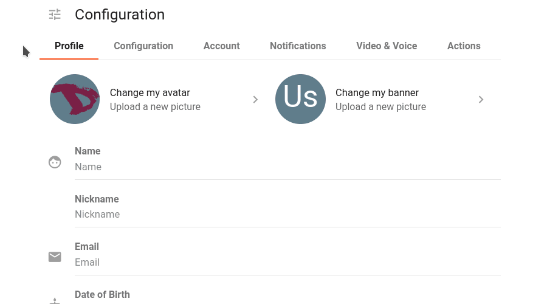

Luego de cambiar el idioma, necesitamos desconectarnos y volver a iniciar sesión para que surta efecto completamente.

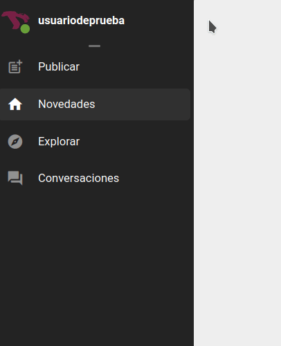

Ahora sí, podemos continuar con nuestras configuraciones.

## Perfil

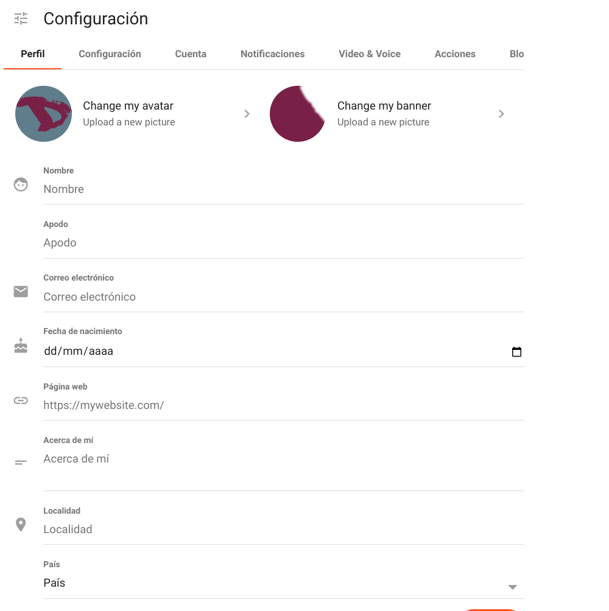

Aquí podemos
  - cambiar el **avatar** y el **banner** (la imagen de portada) de nuestro perfil;
  - establecer nuestro **Nombre**
  - y nuestro **Apodo**;
  - ingresar
    - un **Correo electrónico**,
    - nuestra **Fecha de nacimiento**,
    - una **Página web**; y
  - agregar información
    - **Acerca de** nuestra persona,
    - nuestra **Localidad** y
    - nuestro **País**.

## Configuración

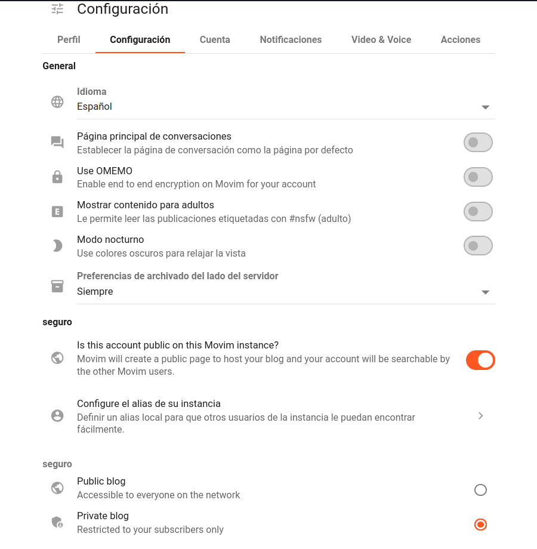

En esta pestaña podemos
  - cambiar el **Idioma** de la interfaz (como vimos en un paso previo);
  - elegir si queremos que la **Pagina principal de los chat** sea nuestra página inicial por defecto;
  - habilitar/deshabilitar el cifrado con **OMEMO**;
  - permitir o no **Mostrar contenido para adultos**, aquellas publicaciones etiquetadas como #nsfw ([NSFW](https://es.wikipedia.org/wiki/NSFW));
  - alternar entre el modo claro y el **Modo nocturno** y
  - configurar las preferencias de archivado de los mensajes de chat en el servidor.

También aquí podremos establecer
  - si queremos que nuestra cuenta sea **pública** en la instancia (visible para otras personas usuarias de Movim)
  - configurar un **alias local** (para que nos puedan encontrar con facilidad otras personas de nuestra instancia)
  - si nuestro blog será **Público** (accesible para cualquiera) o
  - **Privado** (accesible solo para suscriptores)

## Cuenta

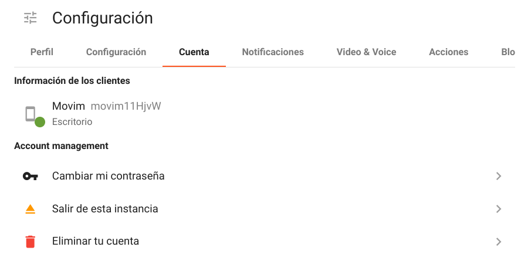

En esta sección tenemos
  - nuestra **Información de los clientes** que muestra los dispositivos desde los que estamos conectados; y
  - la **Gestión de la Cuenta (Account management)**

!! ### ESTAS OPCIONES DE GESTIÓN DE LA CUENTA NO DEBEN SER UTILIZADAS/MODIFICADAS BAJO NINGUNA CIRCUNSTANCIA.
!! Nuestras credenciales de Disroot solo deben ser modificadas desde el [Centro de Auto-gestión de Usuaries](https://user.disroot.org), hacerlo desde aquí podría generar problemas de acceso luego.

## Notificaciones

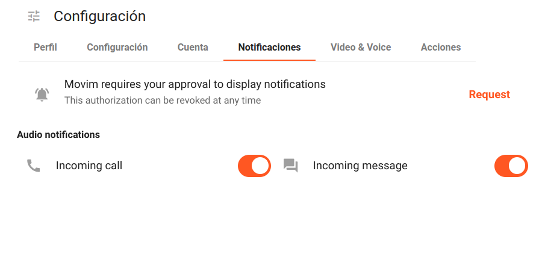

La primera vez que accedemos a esta pestaña, Movim nos solicitará permiso para mostrar las notificaciones. Aquí podremos habilitar también las notificaciones para las llamadas y/o mensajes **Entrantes**.

## Video & Voz

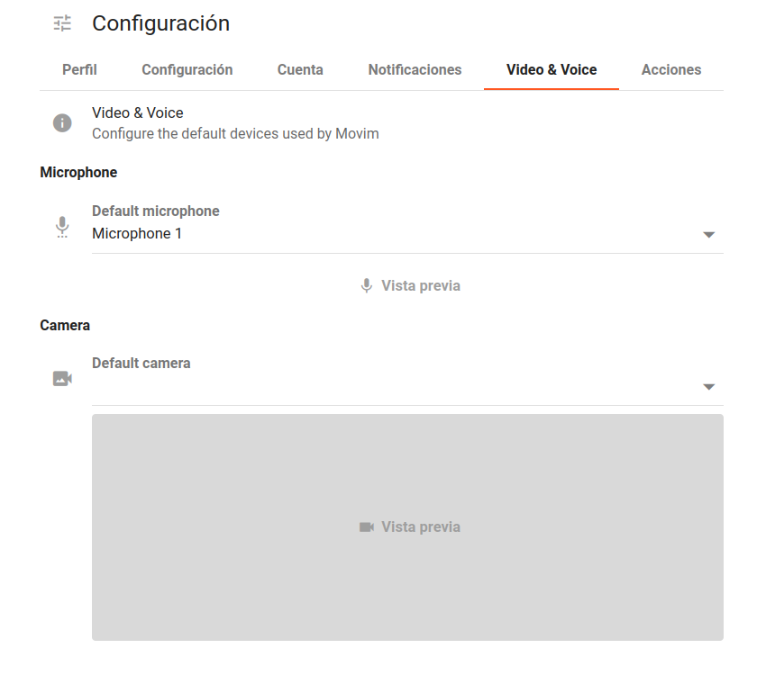

Podemos configurar los dispositivos (si los hubiera) que queremos que sean utilizados por defecto tanto por el **Micrófono** como por la **Cámara**.

## Acciones

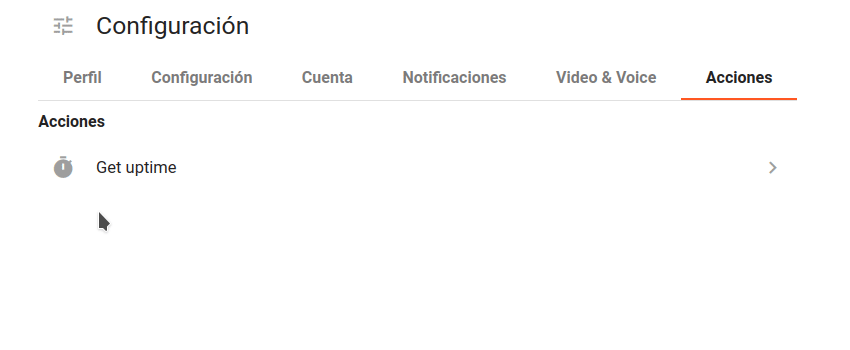

En esta pestaña podemos verificar el tiempo que el servidor ha estado funcionando.

## Bloqueados (Blocked)

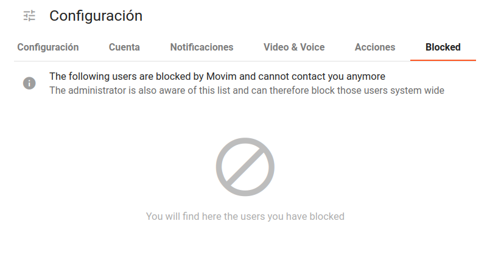

Si hemos bloqueado a una o más personas, aparecerán aquí.

# Publicando
Como ya mencionamos, **Movim** es una plataforma de comunicación que puede usarse como un blog y una red social. Podemos crear publicaciones, escribir y compartir posteos, así como también comentar en las publicaciones y noticias de otras personas.

Haciendo clic en el botón **Publicar**, en la barra lateral, accedemos al **Editor de texto enriquecido** para redactar una publicación.

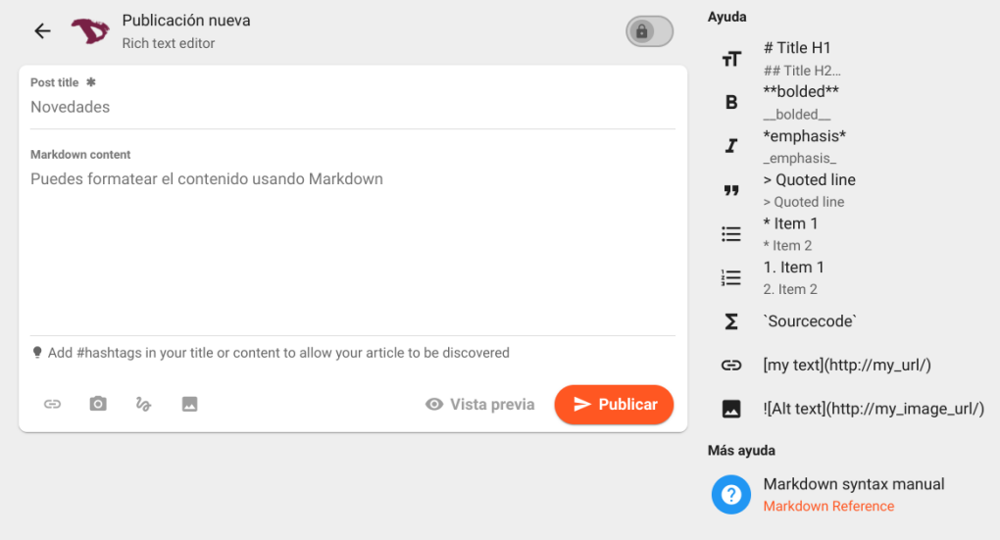

Podemos comenzar por establecer si la publicación será **pública** (cualquiera puede verla) o **privada** (solo será vista por quienes nos sigan).

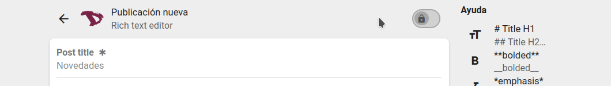

Luego podemos darle formato al contenido de la publicación utilizando Markdown, agregar vínculos, imágenes, archivos e incluso dibujos a mano hechos con el editor de dibujo.

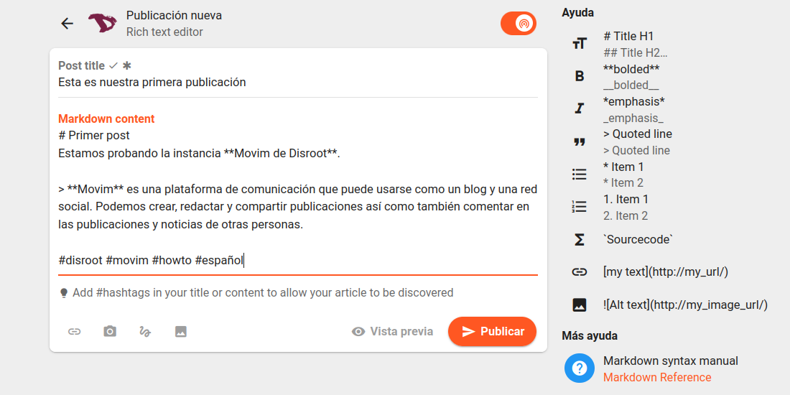

Podemos previsualizar nuestro posteo antes de publicarlo haciendo clic en la opción **Vista previa** justo al lado del botón **Publicar**.

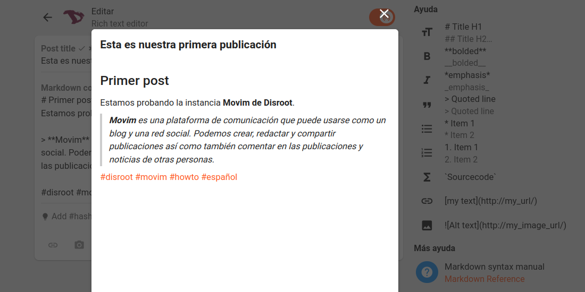

Una vez que pensemos que estamos listos, podemos proceder a publicar nuestro posteo haciendo clic en el botón **Publicar**. Nuestra publicación, y las de aquellas personas que seguimos, aparecerán en las **Novedades** con opciones de interacción similares a las de otros servicios de redes sociales.

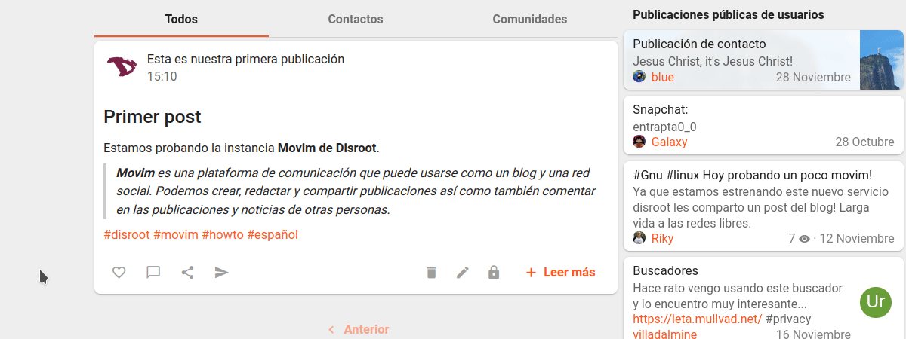

# Novedades

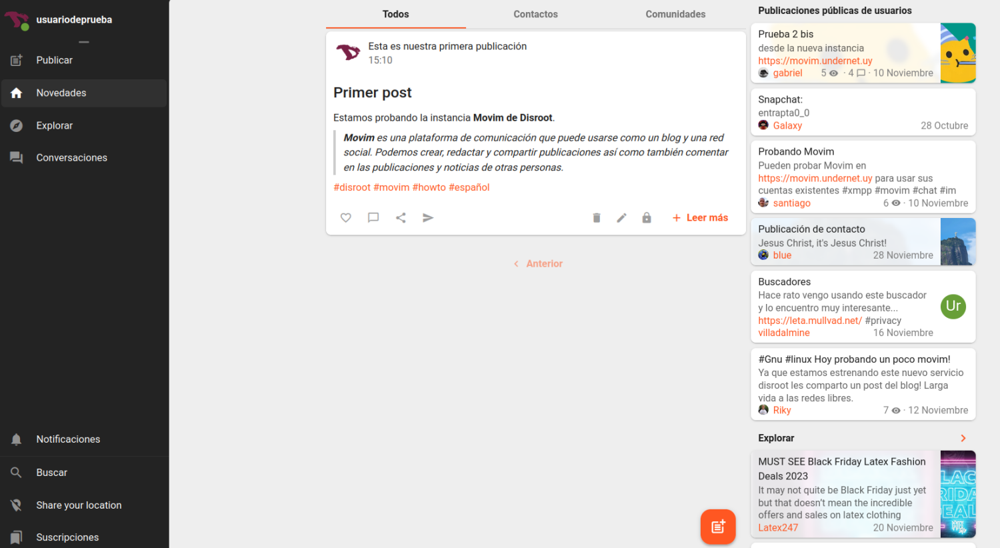

Aquí es donde podremos leer e interactuar con las publicaciones de otras personas y las novedades de las comunidades a las que estemos suscriptos. Si estamos utilizando el navegador en la computadora o laptop, veremos a la derecha las publicaciones públicas de otras usuarias y usuarios de **Movim**.

Para encontrar personas o comunidades y suscribirnos a sus novedades, podemos usar las opciones **Explorar** o **Conversaciones** en la barra lateral.

# Explorar

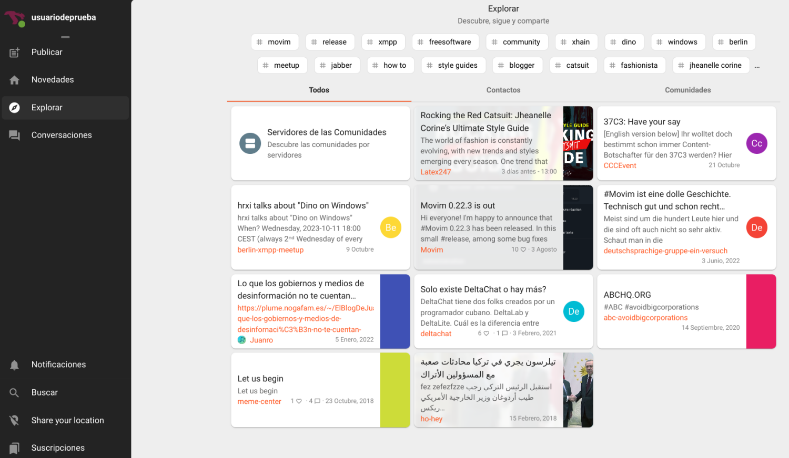

La página **Explorar** muestra una lista de las novedades actuales, etiquetas populares y publicaciones de otras personas. Podemos hacer clic en cualquiera de ellas, acceder a una noticia o posteo y seguir al autor o autora suscribiéndonos.

# Conversaciones
La página de **Conversaciones** mostrará nuestras salas de chat y contactos de XMPP (si los hubiera). Podemos hacer clic en el nombre de un contacto o una sala guardada para comenzar una conversación o unirnos a una.

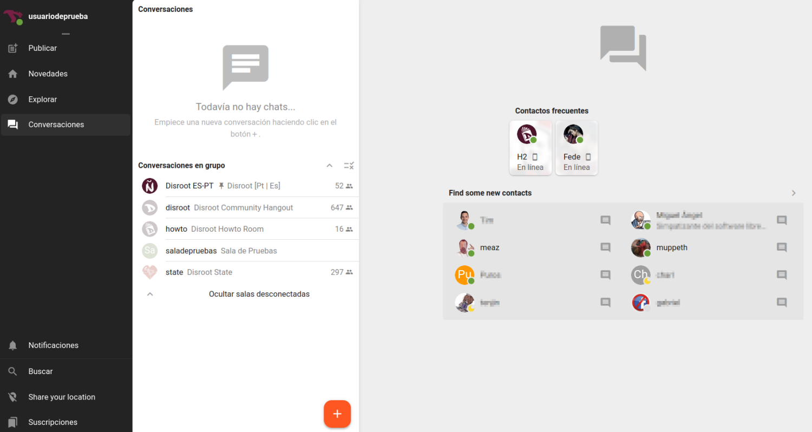

También podemos unirnos a una sala de chat que no tengamos guardada o crear una nueva haciendo clic en el ícono **+ (más)** que está abajo para acceder al menú de las salas.

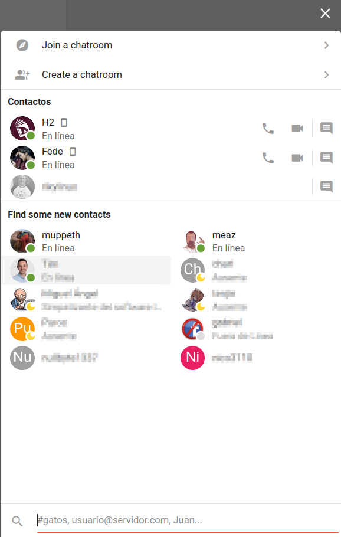

## Unirse a una sala
Seleccionamos esta opción para agregar una nueva sala desde la búsqueda global o ingresando su dirección a través de la opción *Unirse a una sala personalizada (Join a custom chatroom)*.

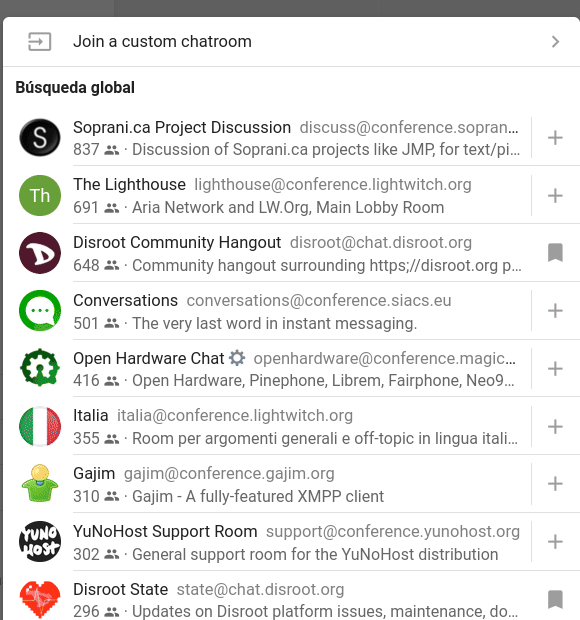

## Crear una sala
Si queremos crear una sala nueva, entonces tenemos que seleccionar la opción *Crear una sala (Create a chatroom)* del menú anterior.

Podemos seleccionar si la sala de chat será un grupo privado o un canal público, el nombre de la sala, su ID (la dirección XMPP de la sala), nuestro apodo y la manera que queremos ser notificados respecto a los mensajes que se envíen a ella. Además, podemos establecer unirnos automáticamente a la sala cuando nos conectamos a **Movim** y fijarla en nuestra lista de salas.

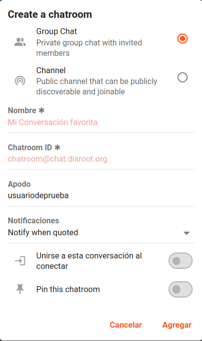

Ahora, dentro de la sala de chat podemos interactuar con otras personas escribiendo o grabando un mensaje e incluso mantener una llamada de audio-video.

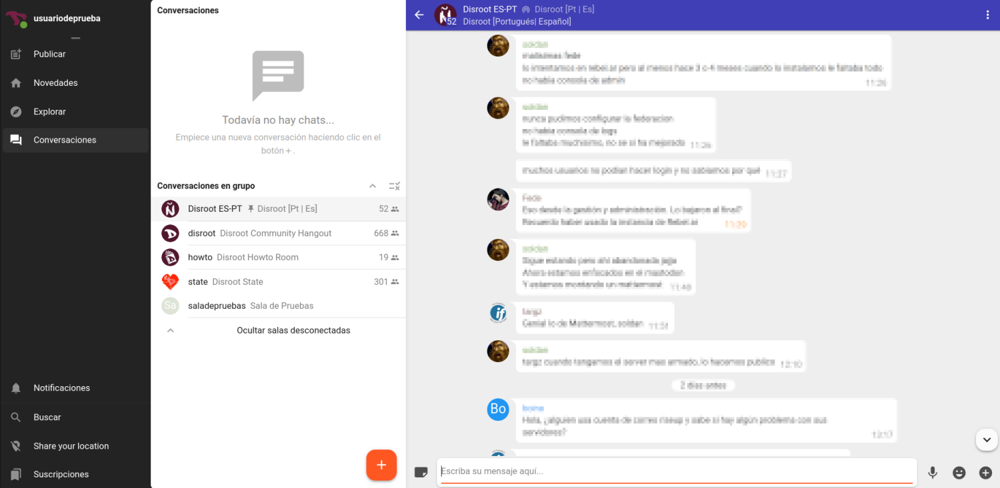

En la parte superior de la sala podemos ver
  - su nombre - a la izquierda - y haciendo clic en él nos mostrará información sobre la sala;

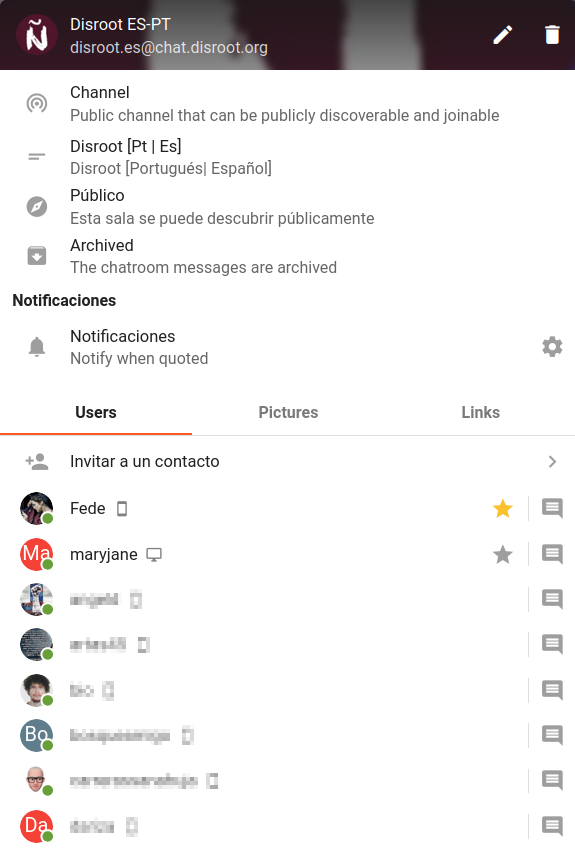

  - y un menú de tres puntos a la derecha con una opción para reportar spam o abusos y para desconectarnos de la sala.

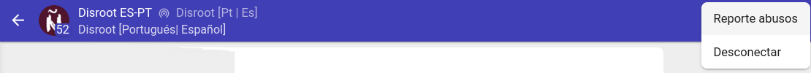

Estos son los fundamentos de **Movim** y ahora podemos comunicarnos, crear y compartir contenido sobre el protocolo XMPP.