Converse est un client de chat XMPP gratuit et open-source qui s'exécute dans un navigateur web et **[webchat.disroot.org](https:webchat.disroot.org)** fournit un moyen de se connecter à votre compte XMPP par son intermédiaire.

# Connexion
Ouvrez votre navigateur web préféré et allez à **[webchat.disroot.org](https://webchat.disroot.org)**

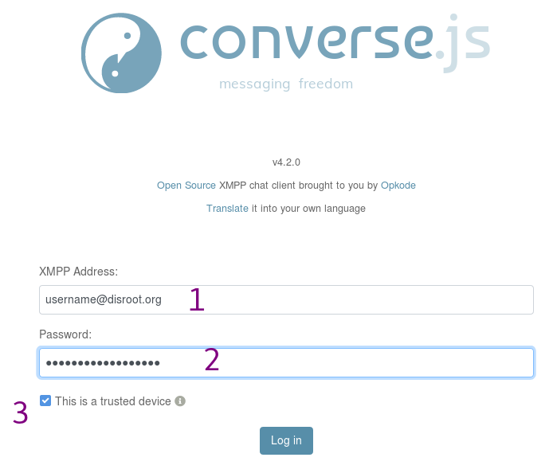
1. **Adresse XMPP** : *Votre_discrétion_email*.
2. **Mot de passe:** *Votre_super_secret_Mot_de_passe_désinstallé*.
3. **Ceci est un périphérique de confiance** : Décochez cette case si vous n'êtes pas sur votre propre ordinateur.

# Interface utilisateur
Une fois que vous vous êtes connecté, vous pouvez voir quelque chose comme ceci :

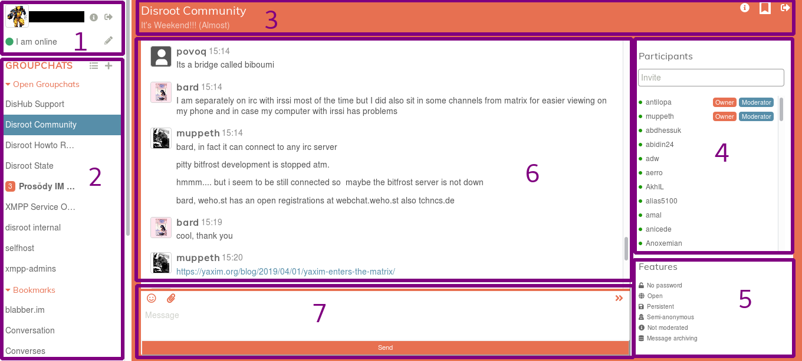
1. Vos coordonnées personnelles
2. La liste des salles de chat dans lesquelles vous êtes connecté et vos salles marquées d'un signet.
3. Les informations sur la salle actuelle
4. Les participants de la salle actuelle
5. Les caractéristiques/configurations actuelles de la salle
6. La discussion en cours dans la salle actuelle
7. L'éditeur du message

# Salles
Vous pouvez participer à des discussions de groupe, également appelées "groupchats" ou "rooms".

## Entrer dans une salle

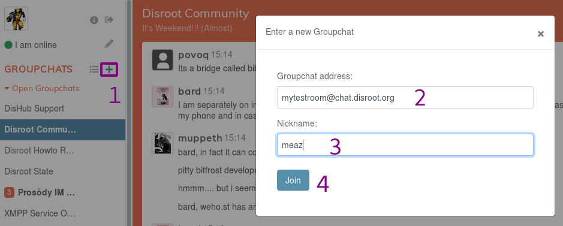
1. Cliquez sur ce bouton pour rejoindre ou créer une salle.
2. **Adresse du groupe de discussion** : Entrez l'adresse de la salle que vous voulez rejoindre. Il peut s'agir d'une salle de n'importe quel serveur XMPP qui se fédère. Par exemple, si vous voulez rejoindre un salon sur le serveur **Disroot**, ajoutez ``chat.disroot.org`` après le nom du salon. Dans cette image, l'utilisateur essaie de rejoindre le salon appelé "mytestroom" sur le serveur XMPP *chat.disroot.org*.
3. **Pseudo** : vous êtes libre d'entrer le pseudo que vous souhaitez, il n'est pas nécessaire que ce soit votre vrai pseudo **Disroot**. Vous pouvez ensuite avoir un pseudo différent pour chaque pièce dans laquelle vous vous trouvez si vous le souhaitez.
4. **Rejoignez** la salle en cliquant ici.

## Envoi de messages

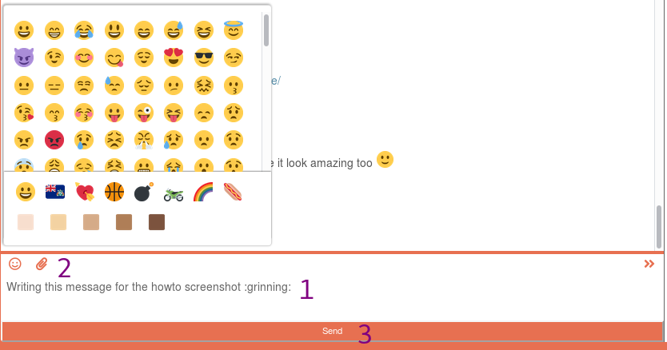
1. Tapez votre message ici.
2. Avec deux boutons, vous pouvez ajouter un emoji ou partager un fichier (il peut s'agir de n'importe quel type de fichier, la taille maximale étant de 10 Mo).
3. Cliquez sur **Envoyer** lorsque vous avez terminé de rédiger votre message.

!! 
!! REMARQUE : Shift + Entrée vous permettra d'ajouter un saut de ligne.

Vous pouvez mentionner des personnes dans votre message afin qu'elles reçoivent une notification. Il suffit de cliquer sur leur surnom dans la liste des participants, ou de l'ajouter manuellement si vous le connaissez. Vous pouvez également commencer à écrire ses premières lettres et appuyer sur la touche de tabulation de votre clavier pour avoir une liste de suggestions de surnoms.

Ici, nous pouvons voir que l'utilisateur est en train de lire des choses dans le salon Prosody (fond bleu) et reçoit un message avec son nom d'utilisateur dans le salon Disroot Howto.
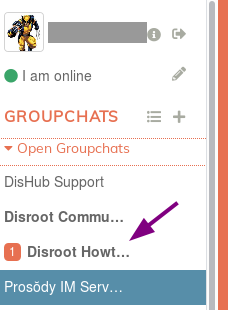

## Editing messages
Si vous souhaitez corriger un message que vous avez envoyé, passez la souris dessus et un crayon apparaîtra sur la droite. Cliquez dessus, corrigez votre message et envoyez-le à nouveau.

## Quitter une salle
Pour quitter une salle, il suffit de cliquer sur l'icône en forme de flèche dans le coin supérieur droit de la page de la salle.
 

Vous pouvez également passer la souris sur le nom de la salle dans la liste des chats de groupe sur le panneau de gauche et cliquer sur l'icône en forme de flèche qui apparaît (3ème icône).

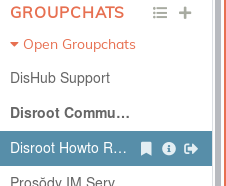

## Mise en signet d'une salle
Vous pouvez marquer les salles d'un signet afin de les rejoindre plus facilement par la suite et de les conserver d'un client à l'autre.

Pour ce faire, il suffit de cliquer sur l'icône du drapeau dans le coin supérieur droit de la page de la salle. 

Vous pouvez également passer la souris sur le nom de la salle dans la liste des chats de groupe sur le panneau de gauche et cliquer sur l'icône du drapeau qui apparaît (1ère icône).

Vous pouvez trouver vos salles marquées d'un signet dans le menu de gauche.

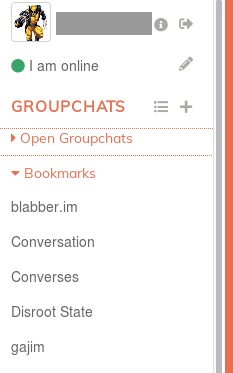

## Détails de la salle
Si vous souhaitez obtenir plus d'informations sur la salle, il suffit de cliquer sur l'icône "i" dans le coin supérieur droit de la page de la salle.

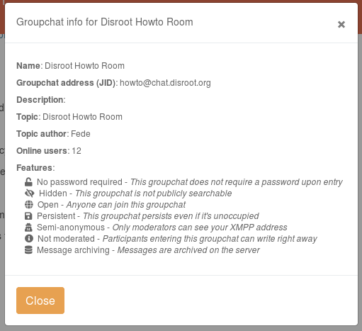

## Trouver une salle publique
Vous pouvez rechercher des salles publiques (et uniquement des salles publiques) :

1. Cliquez sur ce bouton pour ouvrir la fenêtre *Recherche*.
2. Saisissez l'adresse du serveur sur lequel vous voulez rechercher les salles publiques. Par exemple, ce pourrait être *chat.disroot.org*.
3. Cliquez sur "Afficher les discussions de groupe".
4. Vous obtiendrez alors une liste de salles publiques. Cliquez simplement sur celle que vous voulez rejoindre.

## Créer une salle
Le processus est assez similaire à celui de la création d'une salle existante.

1. Cliquez sur ce bouton pour rejoindre ou créer une salle.
2. **Adresse du groupe de discussion** : Entrez l'adresse de la salle que vous voulez créer. Il ne peut s'agir que d'une salle sur le serveur XMPP de **Disroot**. Par exemple, quelque chose comme *mytestroom@chat.disroot.org*.
3. **Nickname** : vous êtes libre d'entrer le nom d'utilisateur que vous souhaitez, il ne doit pas nécessairement être votre vrai nom d'utilisateur **Disroot**. Vous pouvez ensuite avoir des noms d'utilisateur différents pour chaque pièce dans laquelle vous vous trouvez si vous le souhaitez.
4. **Rejoignez** la salle en cliquant ici. Si la salle existe déjà, vous la rejoindrez si elle est publique. Sinon, vous devrez trouver un autre nom de salle.

Vous obtiendrez un message en haut de la salle indiquant que vous venez de réussir à créer votre salle :
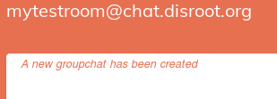

Voici les caractéristiques par défaut de votre salle lorsque vous la créez pour la première fois :

Comme vous avez créé la salle, vous en êtes le propriétaire et l'administrateur. Vous pouvez donc modifier ces fonctionnalités comme vous le souhaitez. Cliquez sur l'icône de l'outil dans le coin supérieur droit de la page de la salle.

Vous obtiendrez alors cette page :
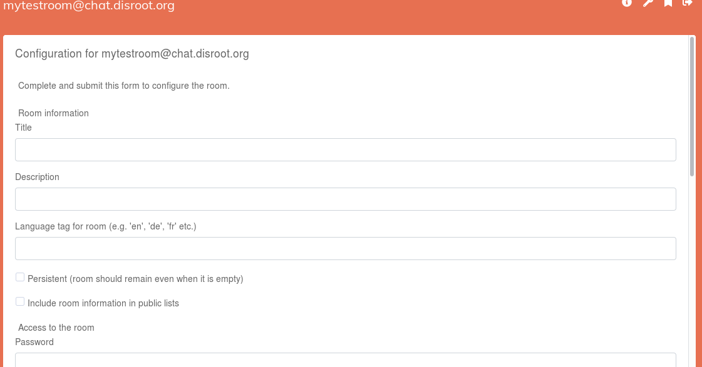

# Chat direct : Conversation 1 à 1
Vous pouvez également chatter avec quelqu'un en privé, dans le cadre d'une discussion 1:1 à laquelle vous ne participez que tous les deux.

## Ajout d'un contact
Vous devez d'abord ajouter un contact avant de pouvoir parler à l'utilisateur.

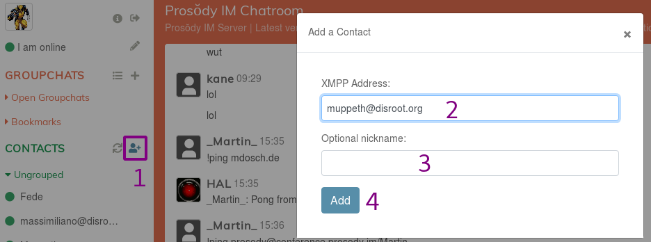
1. Cliquez sur ce bouton pour ajouter un contact.
2. **Adresse XMPP** : *Adresse XMPP_de_votre_contact*. Il peut s'agir de n'importe quelle adresse de serveur XMPP, à condition qu'elle soit fédérée.
3. **Surnom facultatif** : il peut être ce que vous voulez.
4. **Ajouter** : cliquez sur le bouton une fois que vous avez terminé.

Le contact sera informé que vous l'avez ajouté à votre liste de contacts. Jusqu'à ce que l'utilisateur l'approuve, ce contact peut être trouvé dans votre liste en attente :

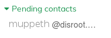

## Parler à un contact
Une fois le contact ajouté, vous pouvez simplement cliquer sur son nom dans la liste des contacts pour entamer une conversation privée.

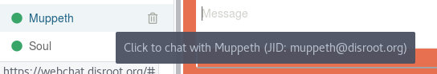

## Suppression d'un contact
Pour supprimer un contact de votre liste de contacts, cliquez sur l'icône de la corbeille à côté du nom de l'utilisateur.

## Détails du contact
Pour obtenir plus d'informations sur votre contact, cliquez sur l'icône de la carte d'identité dans le coin supérieur droit de la page de conversation.

## Crypter une conversation
Si vous voulez que votre conversation soit vraiment sécurisée, assurez-vous que **OMEMO** est activé. Pour ce faire, vérifiez l'icône du verrou. Si le cadenas semble ouvert, cela signifie que la conversation n'est pas cryptée.  {.inline} 
Si le chat est crypté, il doit ressembler à ceci :  {.inline}

# Détails personnels

## Changer de nom, d'avatar, etc.
Pour modifier vos détails personnels, cliquez sur votre avatar dans le coin supérieur gauche. 
Vous pouvez ajouter les informations suivantes :
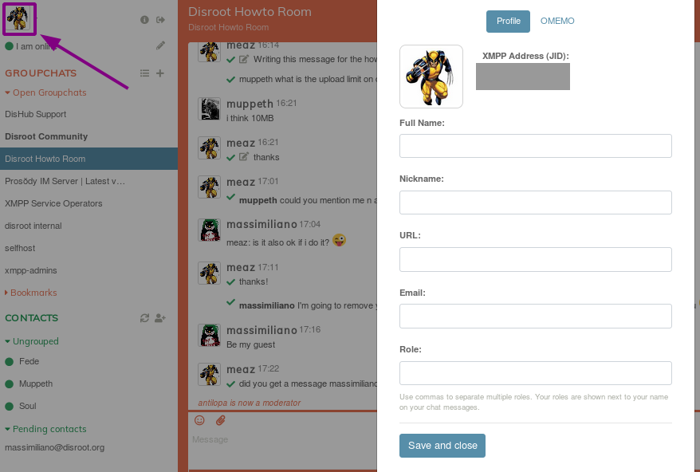

Lorsque vous souhaitez le modifier, il vous suffit de cliquer sur votre avatar et vous pourrez le faire.

## Changement de statut
Vous pouvez modifier votre statut en cliquant sur le crayon situé à côté de votre statut actuel :
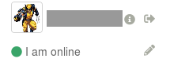

# Déconnexion
Pour vous déconnecter de [webchat.disroot.org](https://webchat.disroot.org), il suffit de cliquer sur l'icône en forme de flèche située à côté de votre nom d'utilisateur, dans le coin supérieur gauche.

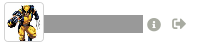

# Converse.js
Pour en savoir plus sur le logiciel utilisé, consultez le site web de [converse.js](https://conversejs.org/).
