**Movim** est un logiciel libre et gratuit de plateforme sociale et de chat qui agit comme un frontend *(la partie d'une application qui interagit avec les utilisateurs, en fait tout ce que nous voyons sur l'écran lorsque nous accédons à un site web ou à une application)* pour le réseau **XMPP**.

Il s'agit d'une solution de communication complète qui nous permet de discuter, de créer des groupes et des communautés, de créer et de partager des messages, des nouvelles et même des appels audio et vidéo.

---

# Connexion
Nous ouvrons notre navigateur web préféré et allons sur **[webchat.disroot.org](https://webchat.disroot.org)** et entrons...

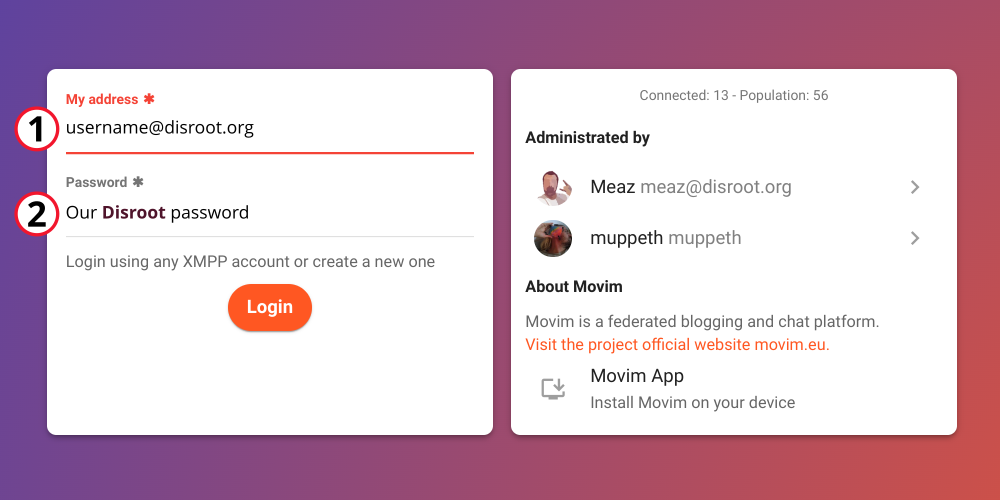

1. **Mon adresse**: *Notre Disroot username@disroot.org*
2. **Mot de passe:** *Notre mot de passe Disroot*

# Interface utilisateur
Une fois que nous nous sommes connectés, nous voyons quelque chose comme ceci :

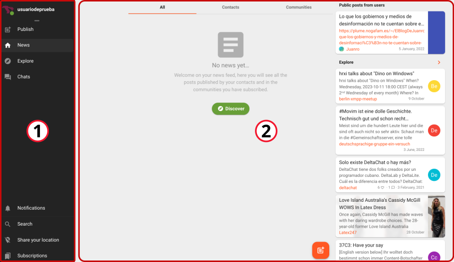

1. **La barre latérale** où se trouvent les raccourcis vers
    - l'éditeur **Publier**
    - le flux **Actualités**
    - l'option **Explorer** et
    - l'accès **Discussions** à nos salons et conversations  

   Dans cette même barre latérale, en bas, nous trouvons  

   - la section **Notifications**
   - l'option **Recherche** pour trouver des contacts
   - l'option **Partager votre position** (qui est désactivée) et
   - le gestionnaire des **abonnements**.  

  Nous les verrons en détail plus loin.

2. La **fenêtre principale** à partir de laquelle nous pouvons accéder aux publications, aux nouvelles et à la recherche et interagir avec nos contacts et nos communautés.

Très bien. Voyons les paramètres ci-dessous.

# Configurations
Pour accéder aux paramètres, nous passons la souris sur notre nom d'utilisateur pour afficher le menu et cliquer sur **Configuration**.

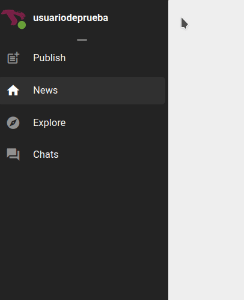

## Profil

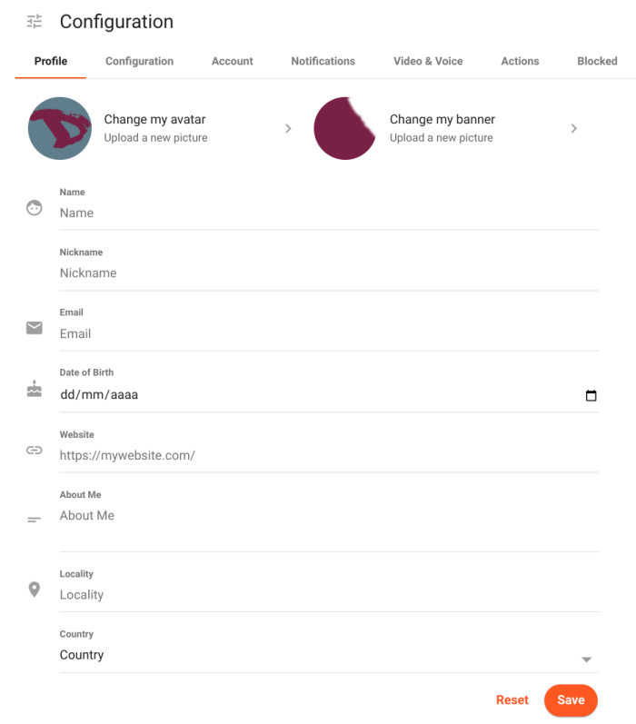

Ici, nous pouvons
  - Modifier notre **avatar** et notre **bannière** de profil
  - Entrer notre **nom**
  - Définir notre **Nom de famille**
  - Saisir
    - un **Email**
    - notre **date de naissance**
    - un **site web**
  - Ajouter des informations
    - sur nous
    - notre **Localité** et
    - notre **Pays**

## Configuration

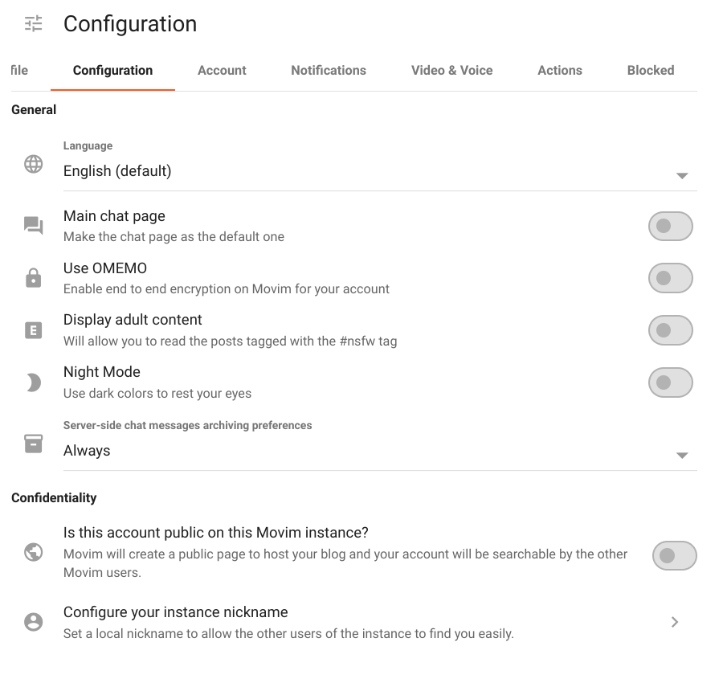

Dans cet onglet, nous pouvons
  - changer la **langue** de l'interface (après l'avoir sélectionnée, nous devons nous déconnecter et nous reconnecter pour qu'elle soit prise en compte) ;
  - choisir si nous voulons que les salles de chat soient notre **page principale** lorsque nous nous connectons ;
  - activer/désactiver le chiffrement **OMEMO** ;
  - autoriser ou non **l'affichage de contenu pour adultes**, les messages marqués comme #nsfw (not safe for work) ;
  - basculer entre le mode léger et le **mode nuit** et
  - définir les préférences d'archivage des messages de chat.

  En outre, nous pouvons définir si notre compte sera public (afin que d'autres personnes puissent le trouver) ou non ; et configurer notre surnom local.

## Compte

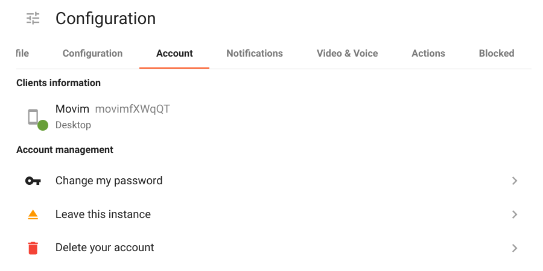

Dans cette section, nous avons
  - nos **Informations sur les clients** qui montrent les appareils à partir desquels nous sommes connectés ; et
  - la **Gestion des comptes**

!! ### CES OPTIONS DE GESTION DE COMPTE NE DOIVENT EN AUCUN CAS ÊTRE UTILISÉES/MODIFIÉES.
!! Nos informations d'identification Disroot ne doivent être modifiées qu'à partir du [Centre de libre-service pour les utilisateurs](https://user.disroot.org), le faire ici peut causer des problèmes d'accès au compte par la suite.

## Notifications

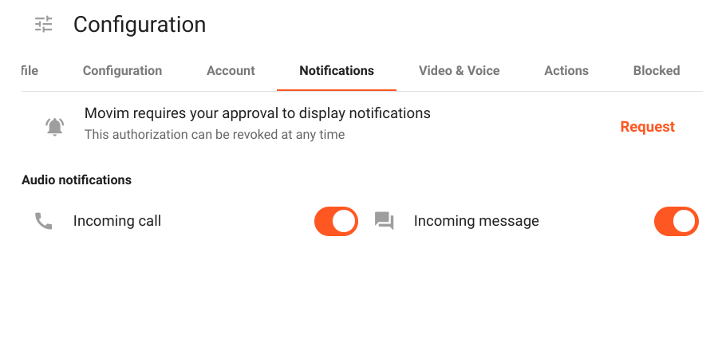

Ici, vous pouvez autoriser les notifications pour les appels et/ou les messages **entrant**.

## Vidéo & Voix

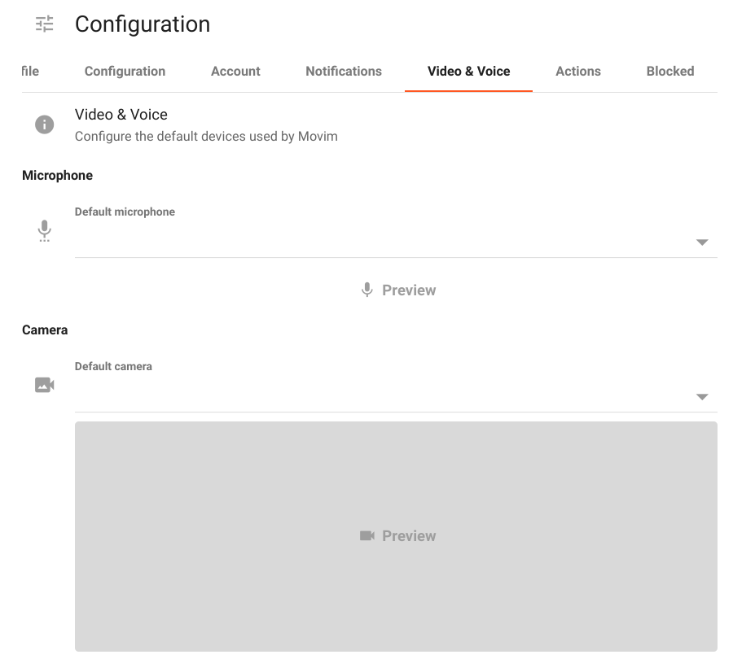

Nous pouvons configurer les dispositifs par défaut (s'il y en a) que nous voulons utiliser pour le **Microphone** et la **Caméra**.

## Actions

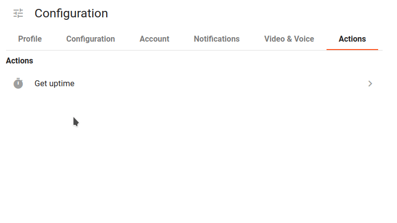

Dans cet onglet, nous pouvons vérifier la durée de fonctionnement du serveur.

## Bloqué

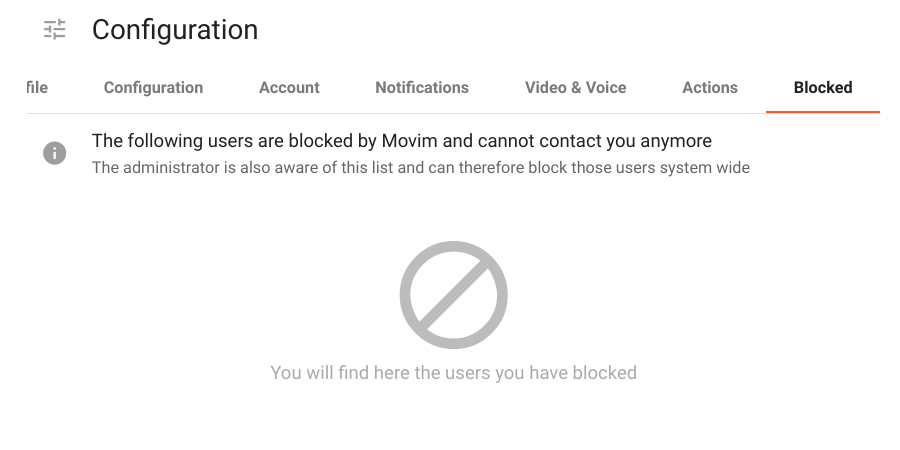

Si nous avons bloqué un ou plusieurs utilisateurs, ils apparaîtront dans cette section.

# Publier
Comme nous l'avons mentionné, **Movim** est une plateforme de communication qui peut être utilisée comme un blog et un réseau social. Nous pouvons créer, composer et partager des messages ainsi que commenter les publications et les nouvelles d'autres personnes.
En cliquant sur le bouton **Publier** dans la barre latérale, nous accédons à l'**Éditeur de texte riche** pour composer des messages.

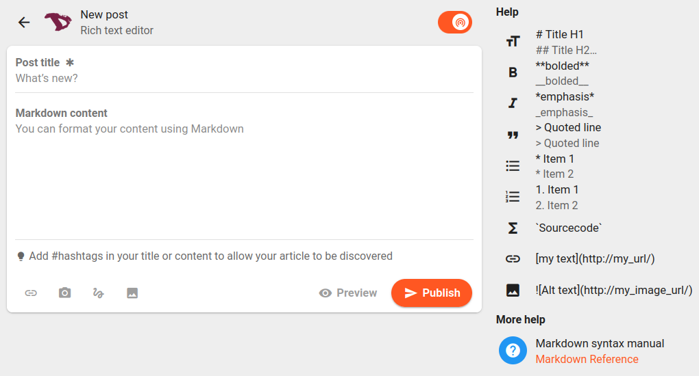

Nous pouvons commencer par déterminer si le message sera **public** (tout le monde peut le voir) ou **privé** (seuls les personnes qui nous suivent le verront).

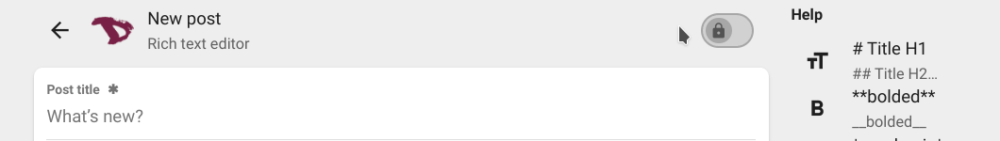

Nous pouvons ensuite formater le contenu de l'article à l'aide de Markdown, ajouter des liens, des images, des fichiers et même des dessins faits à la main à l'aide de l'éditeur de dessins.

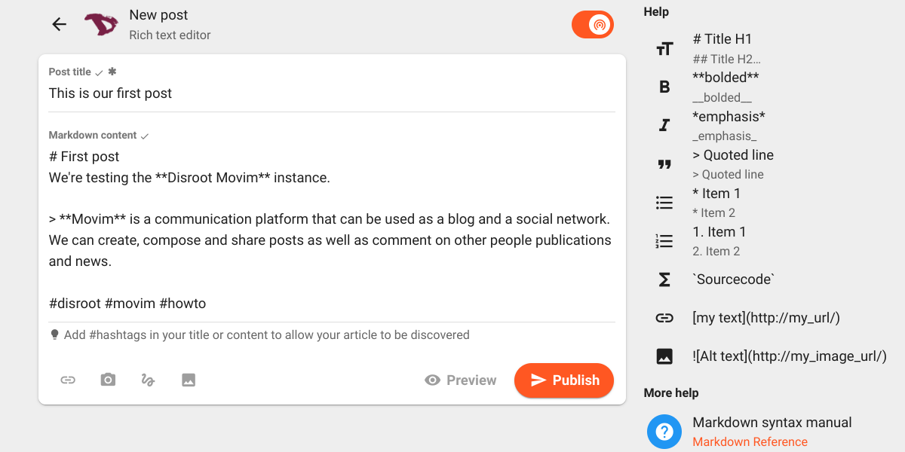

Nous pouvons prévisualiser notre message avant de le publier en cliquant sur l'option **Visualiser** juste à côté du bouton **Publier**.

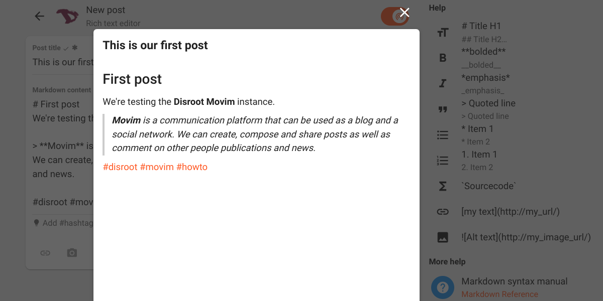

Une fois que nous pensons être prêts, nous pouvons le publier en cliquant sur le bouton **Publier**. Notre message, ainsi que ceux des personnes que nous suivons, apparaîtra dans le flux **Nouvelles** avec des options d'interaction similaires à celles d'autres services de réseaux sociaux.

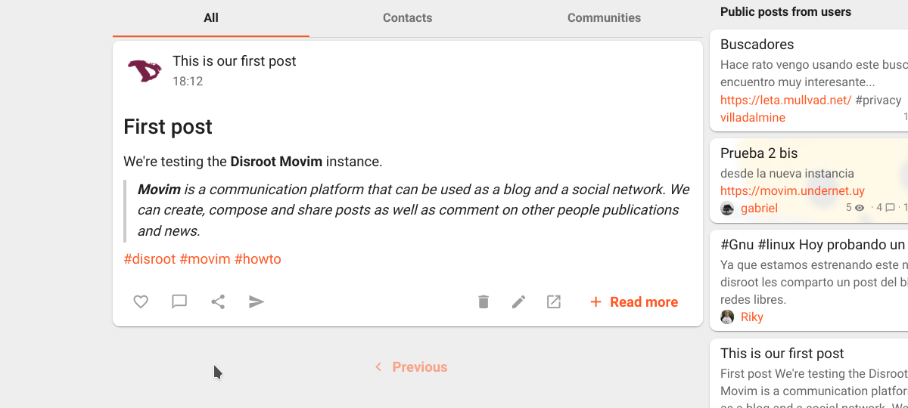

# Actualités

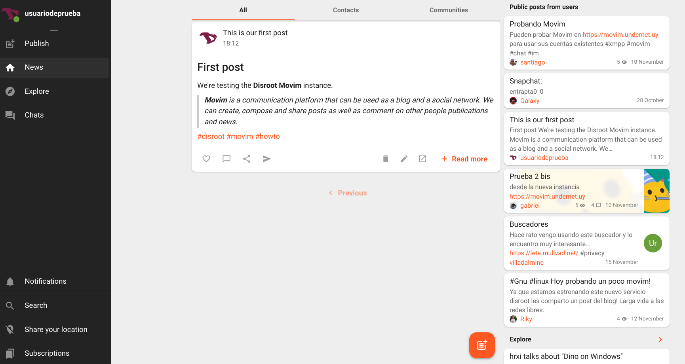

C'est ici que nous pouvons lire et interagir avec les messages d'autres personnes et les nouvelles des communautés auxquelles nous sommes inscrits. Si nous utilisons le navigateur sur l'ordinateur ou le portable, nous verrons à droite les messages publics des autres utilisateurs de **Movim**.

Pour trouver d'autres personnes ou communautés et s'abonner à leurs nouvelles, nous pouvons utiliser les options **Explorer** ou **Discussions** qui se trouvent toutes deux dans la barre latérale.

# Explorer

La page **Explore** affiche une liste des actualités, des tags populaires et des messages d'autres personnes. On peut cliquer sur n'importe lequel d'entre eux, accéder à une nouvelle ou à un message et suivre l'auteur en s'abonnant.

# Discussions

La page des discussions affiche nos salles de discussion XMPP et nos contacts (s'il y en a). Nous pouvons cliquer sur le nom d'un contact ou sur un salon de discussion marqué d'un signet pour commencer une discussion ou en rejoindre une.

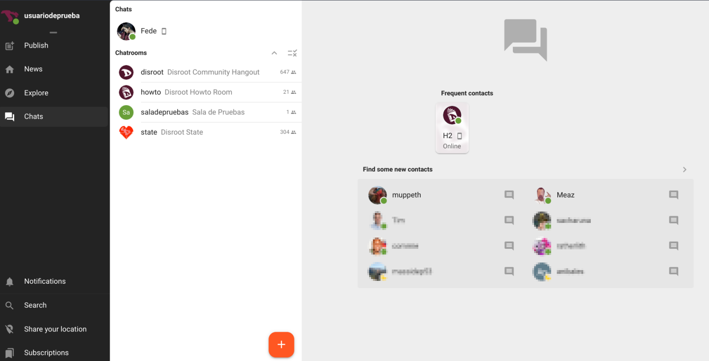

Nous pouvons également rejoindre un salon de discussion que nous n'avons pas mis en signet ou en créer un nouveau en cliquant sur l'icône orange **+ (plus)** en bas de page pour accéder au menu des salons de discussion.

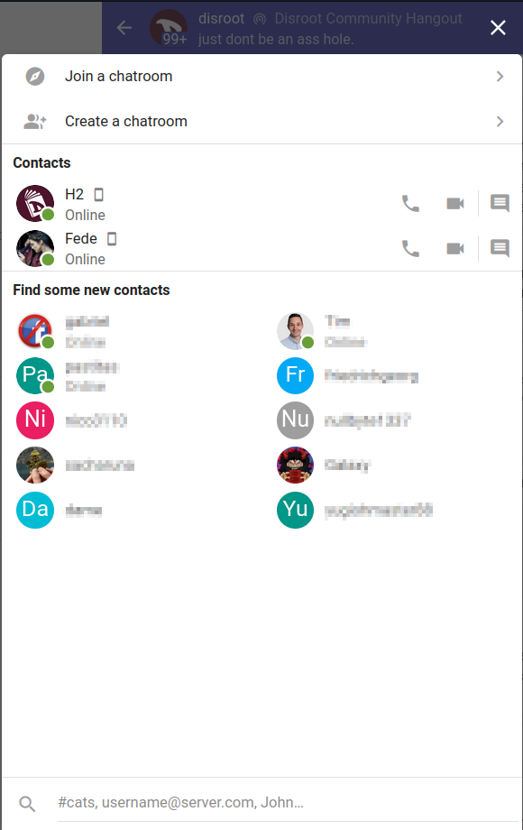

## Rejoindre un salon de discussion
Sélectionnez cette option pour ajouter une nouvelle salle de chat à partir de la recherche globale ou en saisissant son adresse via l'option *Joindre une salle de chat personnalisée*.

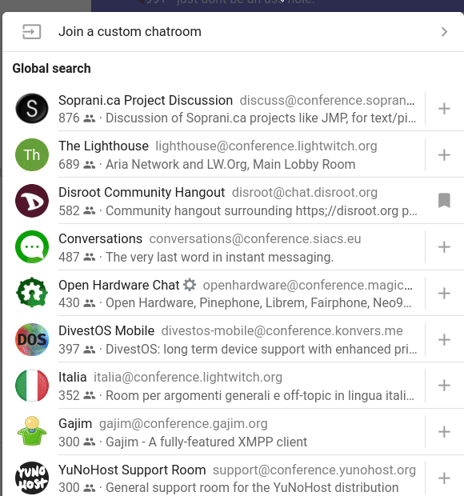

## Créer un salon de discussion
Si nous voulons créer une nouvelle salle de chat, nous devons sélectionner l'option *Créer une salle de chat* dans le menu précédent.

Nous pouvons choisir si la salle de discussion sera un groupe de discussion privé ou un canal public, le nom de la salle, l'ID de la salle (l'adresse XMPP de la salle), notre surnom et la façon dont nous voulons être informés des messages de la salle. En outre, nous pouvons choisir de rejoindre la salle automatiquement lorsque nous nous connectons à **Movim** et de l'épingler à notre liste de salles de discussion.

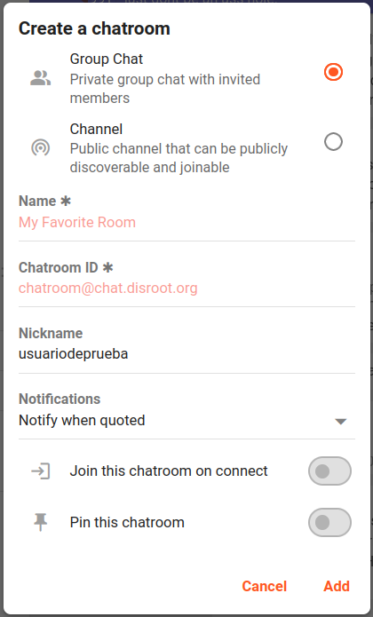

À l'intérieur du salon de discussion, nous pouvons interagir avec d'autres personnes en tapant ou en enregistrant un message ou même en passant un appel audio-vidéo.

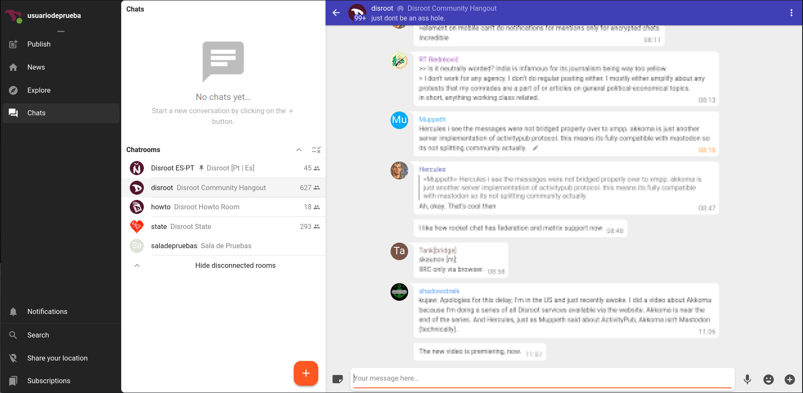

Dans la barre supérieure de la salle, on peut voir
  - son nom - à gauche - et en cliquant dessus, vous obtiendrez des informations sur la pièce ;

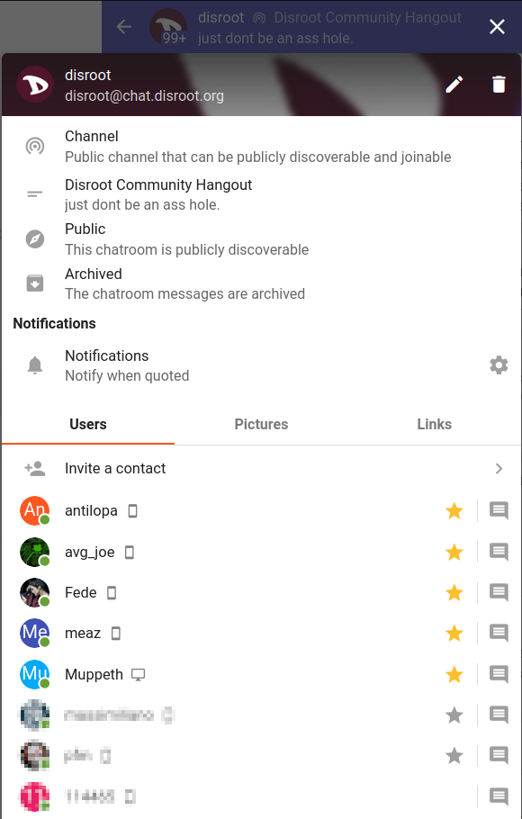

- et un menu à trois points sur la droite avec une option pour signaler le spam ou l'abus et pour nous déconnecter de la salle.

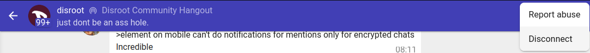

Ce sont les bases de **Movim** et maintenant nous pouvons communiquer, créer et partager du contenu via le protocole XMPP.