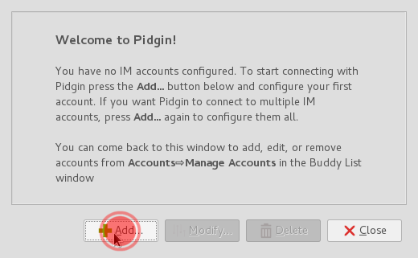

Pidgin is multi-platform (runs on most operating systems) and multi-protocol messaging application. It supports a lot of different messaging protocols such as: XMPP, Skype, AIM, TOX, Whatsapp, Facebook, etc, so you can have all your messaging done with just one app.

# Installing Pidgin
**MS Windows** / **MacOS** users can check [Pidgin's website](http://pidgin.im/download/) and download the version they need. 
**GNU/Linux** users can check the package repository of their distribution and get it (*while you're on it, you could check for some additional plugins*).

# Setting Pidgin up
Once you've installed it, first time you run **Pidgin**, it will show a welcome message like this:

For start, we need to **Add an account**. If it's not the first time you run **Pidgin** you should use this menu:

## Setting an account
First of, choose the **XMPP** protocol from the drop-down list:

Next, fill in the information needed:

!! 
!! NOTE: If you want to use an avatar (optional) you can select it by checking the "Use this buddy icon for this account" option and browsing your local filesystem (computer) for the picture you want to use.

Click the "**Add**" button and you're done!

**All your contacts are synced between all the clients, so you can use Disroot chat on all the devices at the same time.**
