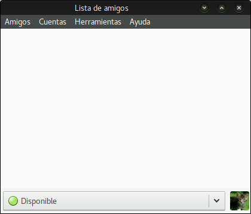

Pidgin es un programa de mensajería multi-plataforma (funciona en la mayoría de los sistemas operativos) y multi-protocolo. Soporta un montón de protocolos de mensajería diferentes como: XMPP, Skype, AIM, TOX, Whatsapp, Facebook, etc. Así que puedes tener toda tu mensajería en una sola aplicación.

# Instala Pigdin
Lxs usuarixs de **MS Windows** / **MacOS** pueden revisar en el [sitio de Pidgin](http://pidgin.im/download/) y descargar la versión que necesiten. 
Lxs usuarixs de **GNU/Linux** pueden revisar en los repositorios de sus distribuciones y descargarlo (*mientras buscas, podrías mirar si hay algunos plugins adicionales*).

# Iniciando Pidgin
Una vez que lo hayas instalado, la primera vez que lo inicies **Pidgin** serás recibido con un mensaje de bienvenida como este:

Para empezar, necesitamos **Añadir una cuenta**.
Si no es la primera vez que usas **Pidgin** deberías usar este menú:

# Configura una cuenta
Lo primero de todo, elige el protocolo **XMPP** de la lista desplegable:

Después completa la información necesaria:

!! 
!! AVISO: Si deseas usar un avatar (opcional) puedes seleccionar "Usar este icono de amigo para esta cuenta", navegar por tu sistema local de archivos (ordenador) y escoger la foto que quieras usar.

Dale a **Añadir** y ¡está hecho!

**Todos tus contactos se sincronizarán entre todos los clientes, por lo que puedes usar el chat de Disroot en todos los dispositivos al mismo tiempo.**
