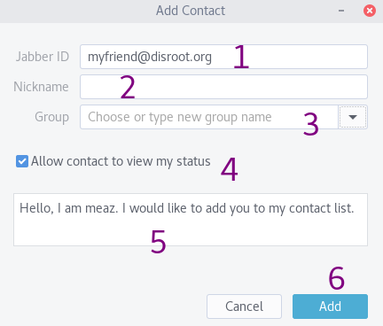

Gajim es una aplicación de mensajería multi-platforma (funciona en la mayoría de los sistemas operativos).

Para configurar el chat de **Disroot** en **Gajim**, sigue estos sencillos pasos:

# Instalar Gajim
**Gajim** está disponible en los repositorios de la mayoría de las distribuciones GNU/Linux más utilizadas. Si no es tu caso, o eres usuarix de **MS Windows**, puedes revisar el [sitio de Gajim](https://gajim.org/download/) y descargar la versión que estás buscando.

# Primer inicio
Inicia **Gajim**. Serás recibidx por un mensaje de bienvenida como este:

- Si quieres utilizar tu cuenta de **Disroot** entonces elige **"Ya tengo una cuenta y quiero usarla"**.
- Si quieres crear una nueva cuenta, entonces selecciona **"Quiero registrar una nueva cuenta de Jabber"**

# Creando o agregando una nueva cuenta
El próximo paso es completar con la información necesaria:

- **Jabber ID**: introduce tu **nombre de usuarix** de **Disroot**, o el que ya hayas creado en otro servidor XMPP. En el campo que sigue a **@** , escribe el nombre de tu servidor, en nuestro caso: **disroot.org** si estamos usando la cuenta de **Disroot**. Recuerda que tu cuenta de XMPP se verá como: `nombredeusuarix_@_disroot.org`
- **Contraseña**: tu contraseña de **Disroot**, o la que hayas establecido en otro servidor XMPP.
- Haz click en **Adelante**.

- Listo. Haz click en **Finalizar**.

**Todos tus contactos y salas se sincronizan entre todos tus clientes, así que puedes usar el chat de Disroot en todos tus dispositivos a la vez.**

# Organizar Gajim en una sola ventana
Si prefieres no tener un montón de ventanas (una para contactos, otra para las conversaciones, etc.), puedes tener todo unificado en una sola ventana.

Ve a las **Preferencias**. Puedes encontrarlas en el menú de la barra superior. O puedes hacer click derecho sobre el ícono de **Gajim** en la lista de aplicaciones.

La ventana de **Preferencias** está divida en pestañas. En la primera, **General**, verás **Apariencia de la conversación**, selecciona en **Comportamiento de la ventana** la opción **“Ventana única para todo”**.

# Extensiones
Necesitarás configurar dos extensiones. Dependiendo de tu sistema operativo, tal vez tendrías que instalarlas primero. [Mira esta página](https://dev.gajim.org/gajim/gajim-plugins).

En el mismo menú donde se encuentran las **Preferencias**, deberías encontrar las **Extensiones**.

Verifica si tienes instalado el **Plugin Installer** (Instalador de Extensiones)(1), si no lo está, puedes encontrarlo [aquí](https://dev.gajim.org/gajim/gajim-plugins/wikis/plugininstallerplugin) para descargar. Luego de hacerlo, puedes instalarlo haciendo click en el botón *Instalar extensión desde archivo* (2) en el cuadro de las **Extensiones**, para hacer visible la pestaña **Available** (Disponible) (3).

Las extensiones que necesitas son:
- OMEMO
- URL image preview

Ve a la pestaña **Available**, busca esas dos extensiones y luego marca la casilla en **Install/Upgrade** cuando estes listx.

Finalmente, ve a la pestaña **Instalado** y selecciona las extensiones para activarlas. Ya puedes cerrar esta ventana.

# Interfaz de Usuarix
Así es cómo se vería **Gajim** ahora:

1. Esta es la ventana de la sala de chat: aquí puedes ver los mensajes de cada unx de lxs participantes de la sala actual. En la imagen el usuario está en la sala *howto@chat.disroot.org*
2. La caja de envío de mensajes: desde aquí escribes un mensaje, envías archivos, etc.
3. El **roster** o la lista de contactos y salas de la o el usuarix (Grupos de charla)
4. Aquí seleccionas tu disponibilidad
5. Estas pestañas representan las salas abiertas y puedes cambiar entre ellas seleccionando una con un click.
6. Aquí están lxs participantes de la sala. También puedes ver a sus propietarixs y moderadorxs.

# Envío y edición de mensajes
Para escribir/enviar un mensaje a un contacto o sala, utiliza la caja de envío de mensajes:

1. Aquí escribes tus mensajes. **Consejo:** con Shift + Enter puedes agregar un salto de línea.
2. Acceso a emoticonos.
3. En **Gajim** tienes algunas opciones de formato. Pero es poco probable que funcionen en otros clientes. Así que si formateas un texto como negrita, lxs demás podrían no verlo como negrita en sus clientes si estos son diferentes de **Gajim**.
4. Puedes adjuntar/enviar cualquier tipo de archivo. El límite de subida en el servidor XMPP de **Disroot** es actualmente de 10MB.
5. Puedes cifrar los mensajes con **OMEMO** (la extensión que permite el cifrado de extremo-a-extremo). No puedes cifrar las conversaciones en las salas de chat abiertas.

Presiona *Enter* para enviar tu mensaje.

En **Gajim** solo puedes editar tu último mensaje enviado. Para hacerlo, ingresa en la caja de envío de mensajes, presiona la tecla *ctrl* y la flecha arriba en tu teclado.

Al final del mensaje modificado aparece ahora un ícono de lápiz que lo denota.

# Salas
## Ingresar o crear una sala
A las salas también se las conoce como conversaciones grupales o MUC (Multiple User Chats: Conversaciones de Múltiples Usuarixs).

Para unirte a una, ve al menú **Cuentas**, posiciónate sobre tu nombre de usuarix y ve a la opción **Entrar en un salón de chat**. Si alguna vez te uniste a una sala antes, probablemente aparezca aquí.

Si la sala a la que quieres entrar no aparece, selecciona **Entrar a un salón de chat**:

- **Nickname**: you can set whatever you want, it doesn't have to be your username.
- **Room**: the name of the room you want to join. If the room doesn't exist, it will be created, and you will be its admin/owner.
- **Server**: enter **chat.disroot.org** if you want to join or create a room on **Disroot** XMPP server. But you can choose another XMPP server if you want.
- **Password**: useful only if the room you're trying to join is password protected.
- **Bookmark**: it allows to remember rooms you have joined, so that you can easily and quickly find them again. And it allows also to keep them from one device to another one.
- **Autojoin**: if enabled, then on startup, **Gajim** will automatically join/open the room.

### Room creation options
When you create your room, you may want to configure it. Click on three dots in the send message box:  and choose **Manage Room** and then **Configure room**.

There are a lot of features! Some of the important ones are:
- **Persistent**: if the room is not set to be persistent, it will be deleted automatically when the last participant disconnects from it.
- **Include room information in public list**: uncheck this box if you don't want your room to be listed.
- **Only allow members to join**: if you want your room to be members-only. Then, you can add members a little further, in this section: 

You can also invite a contact in a members-only room: this contact then become a member of this room. Right click on the contact you want to invite, choose **Invite to** and choose the room you want to invite him/her in.

## Leaving a room
When you want to leave a room, you need to *disconnect*. To do so there are two ways:
1. If the room is opened, click on the three dots in the send message box  and choose **Diconnect**.
2. In the list of your room on the left panel, right click on the desired room, and choose **Diconnect**.

## Bookmarking a room
You can bookmark rooms in order to join them in later easily and to keep them from one client to another.

When you first join a room or create on, you get this box:

If you later want to bookmark or unbookmark a room, click on three dots in the send message box:  and choose **Bookmark**.

## Room history
As soon as you close **Gajim**, the rooms windows are cleaned of messages that you've already read. However, you can still access the group conversation history.

Click on the three vertical dots  in the send message box and choose **History**.
You can navigate through history by date.

## Finding a public room
You can search for public rooms on XMPP servers.
Click on **Accounts**, then **Discover Services**.

In **Address** you can choose any public XMPP server. For example, add **disroot.org** to find a public room on **Disroot** XMPP server. Click on **Go**.

Then, search the **Conference** section and choose something that looks like *room server*. Click on **Browse**.

# Direct chat: 1 to 1 conversation
You can also chat with someone in private, in a 1:1 discussion with only the two of you participating.

## Adding a contact
Click on **Accounts** and choose **Add contact**.

1. **Jabber ID**: the XMPP address of the the contact you want to add. If this contact his on **Disroot**, his/her XMPP address is like this: **username@disroot.org**
2. **Nickname**: it can be different of the address.
3. **Group**: you can create groups to organize your contact.
4. **Allow contact to view my status**: if checked, that means your contact will be warned you're online/offline.
5. This is the message your contact will receive. You can change it.
6. **Add**

When you click on **Add**, a message is send to the person. When the person accepts your subscription, the he/she is added in your contact list.

## Talking to a contact
Simply double-click on the contact name in your contacts list.

## Removing a contact
To remove a contact, right-click on his/her name in your contact list. Choose **Manage contact** then **Remove**

# Personnal details
You can change your personal details, your avatar, etc.
Cick on **Accounts** then **Profile**. There are a lot of options there. Probably the two most important ones are:
- **Avatar**: Click on the avatar to change it.
- **Nickname**: if you want to change your default nickname. By default this is your **Disroot** username.

Click on **OK** when you're done.

**Be careful** as everyone will be allowed to see what you set in your profile.

# Final note on Gajim
We have just presented what we think to be the most important features to start using your XMPP account on **Gajim**. But **Gajim** is full of features, so explore them!

If you have any question regarding the use of **Gajim**, join the gajim XMPP room: gajim@conference.gajim.org or check the [gitlab repo](https://dev.gajim.org/gajim/gajim)
