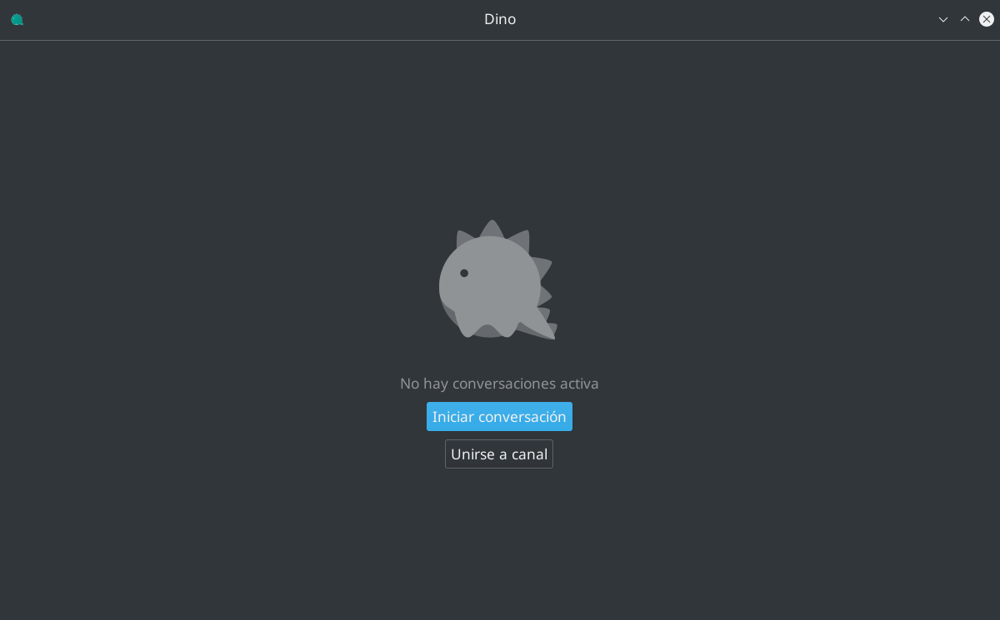
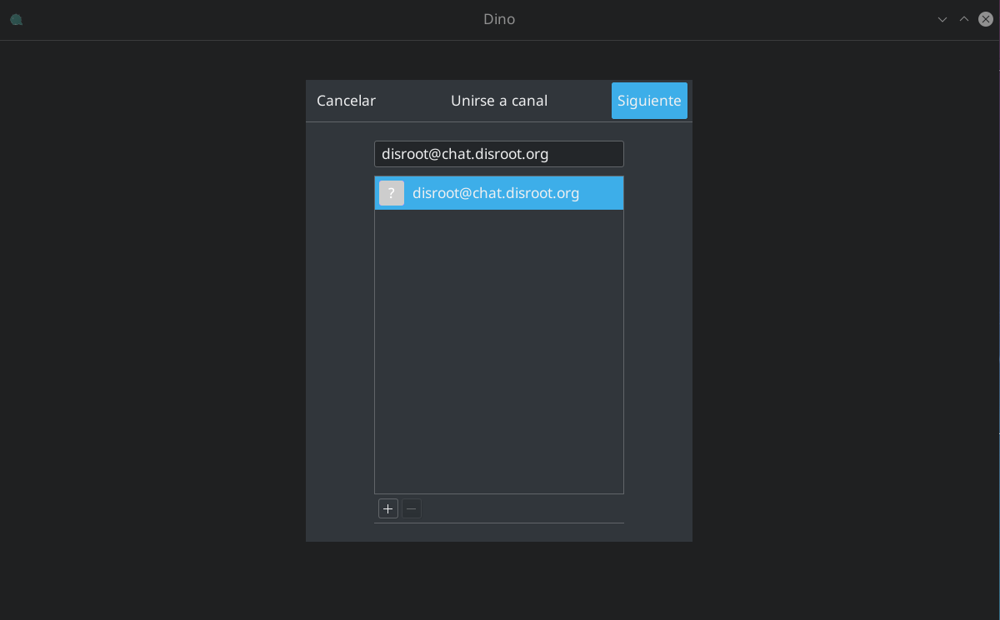
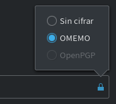

<br>

Dino es un cliente de chat de código abierto para el escritorio. Tiene soporte para [OMEMO](https://securityhacklabs.net/articulo/que-es-omemo-el-protocolo-de-cifrado-de-ultima-generacion) y [OpenPGP](https://es.wikipedia.org/wiki/Pretty_Good_Privacy#OpenPGP), por lo que una vez habilitado alguno de los protocolos de cifrado, tus mensajes solo pueden ser leídos por las personas con las que elijas comunicarte y nadie más.

1. **Instalar Dino**<br>
**Dino** está disponible solo para usuarios de GNU/Linux. Puedes verificar si hay una versión compilada (un paquete) para tu distribución haciendo click [aquí](https://github.com/dino/dino/wiki/Distribution-Packages).

2. **Iniciar Dino**<br>
Al iniciar Dino serás recibido por una pantalla como esta:


Para continuar, selecciona **Gestionar cuentas** y luego **Añadir una cuenta**.


3. **Configurar una cuenta**<br>
En el siguiente cuadro ingresamos nuestros datos de usuario de **Disroot**...<br>
```
JID: tu_usuario@disroot.org
Contraseña: tu contraseña de Disroot
Alias local: el nombre con el que quieras ser identificado
```
... y luego **Guardar**


Una vez completado el paso anterior, aparecerá el siguiente cuadro:


Conectate haciendo click en el botón a la derecha del nombre de usuario.


Para cambiar el avatar, haz click en la imagen del usuario, navega por el sistema de archivos local y selecciona el que quieras utilizar.


4. **Iniciar una conversación**<br>
Para comenzar a comunicarte con otro usuario, debes hacer click en **Iniciar conversación**. En cambio si deseas ingresar a una sala de chat, debes hacer click en **Unirse a canal**.



En ambos casos, el procedimiento será el mismo. Debes ingresar el nombre de usuario o de la sala y hacer click en **Siguiente**...



... y aparecerá el cuadro de confirmación.


Haciendo click en **Unirse** ingresarás a la sala o comenzarás una conversación con otro usuario.


En las salas de chat es muy poco común, pero para las conversaciones uno a uno con otro usuario, es recomendable habilitar el cifrado. Para ello, solo haz click en el ícono del candado, a la derecha del cuadro de texto.




5. **Ajustes y Preferencias**<br>
Si quieres agregar más cuentas, iniciar conversaciones con otros usuarios, unirte a otras salas o ajustar algunas preferencias, simplemente haz click en el ícono de la izquierda en la barra superior...


... y eso es todo.
