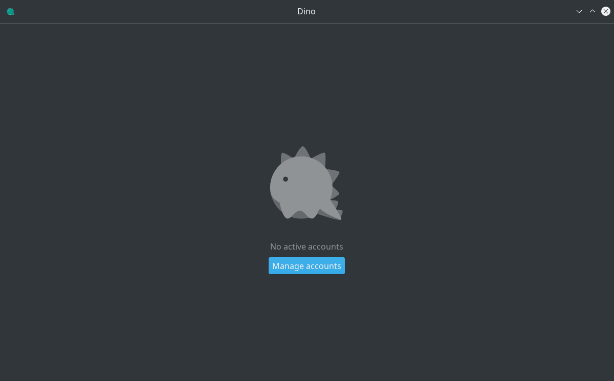
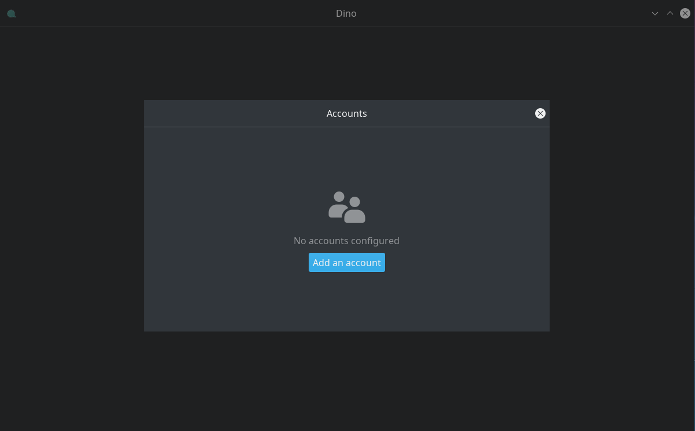
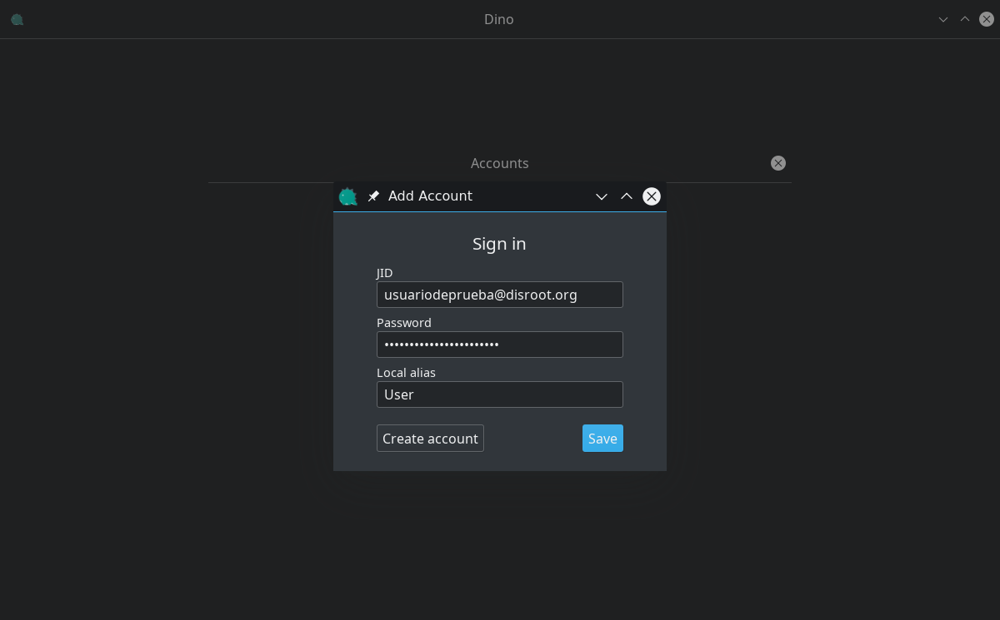
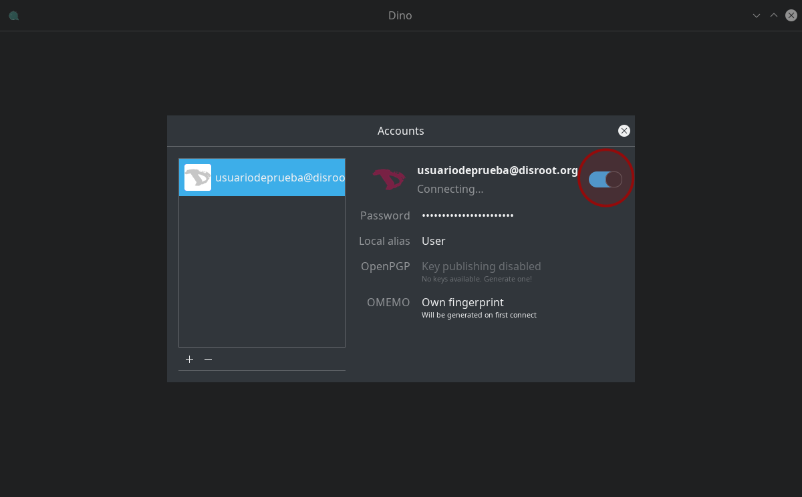
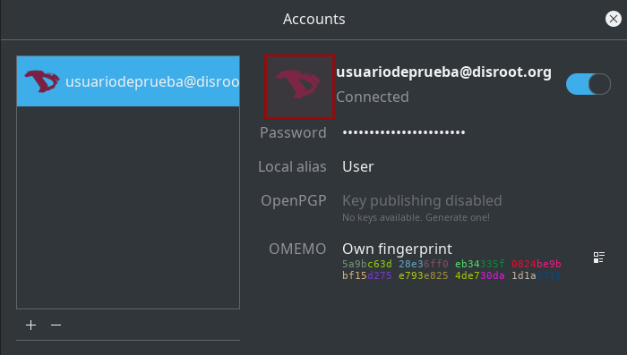
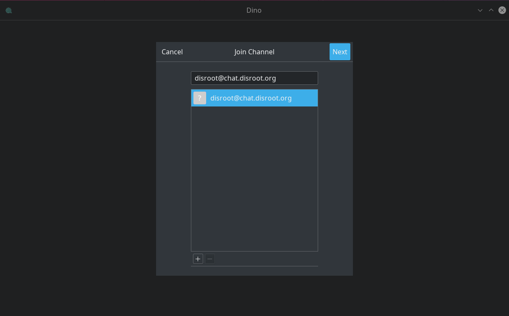
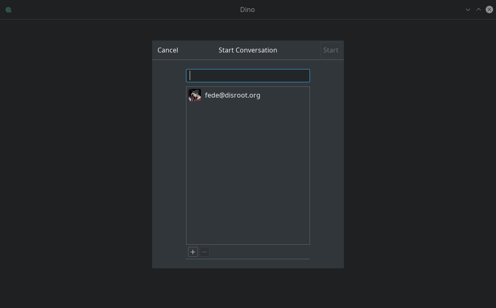
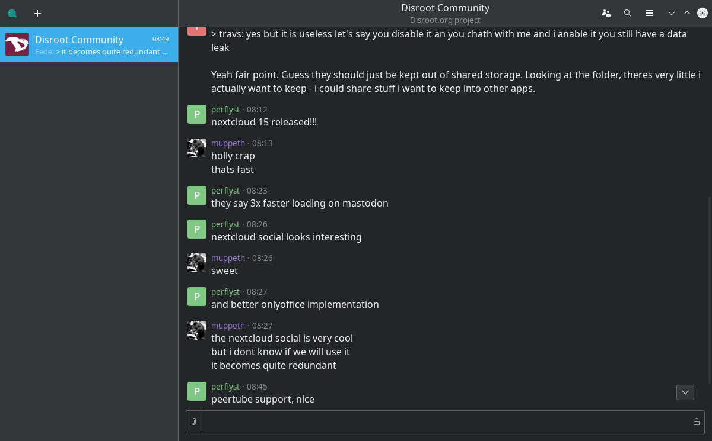
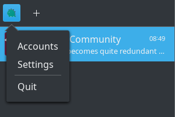
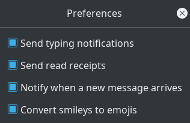

Dino est un client de chat à code source ouvert pour le PC de bureau. Il prend en charge [OMEMO](https://en.wikipedia.org/wiki/OMEMO) et [OpenPGP](https://en.wikipedia.org/wiki/Pretty_Good_Privacy#OpenPGP), ce qui signifie qu'une fois que vous avez activé le cryptage, seuls vous et l'autre personne peuvent lire vos messages et personne d'autre.
<br>

1. **Installation de Dino**<br>
**Dino** est disponible uniquement pour les utilisateurs de GNU/Linux. Vous pouvez vérifier s'il existe une version compilée du paquet pour votre distro en cliquant [ici](https://github.com/dino/dino/wiki/Distribution-Packages). Ou vous pouvez le construire vous-même en téléchargeant le code et en le compilant depuis la ligne de commande :
```
./configure
make
build/dino
```

2. **Démarrer Dino**<br>
La première fois que vous lancez Dino, il apparaîtra un écran comme celui-ci :



Pour continuer, sélectionnez **Gérer les comptes** et ensuite **Ajouter un compte**.



3. **Création d'un compte**<br>
Connectez-vous avec vos informations...:<br>
```
JID: votre-pseudo@disroot.org
Mot de passe: votre mot de passe Disroot
Alias local: le nom que vous voulez utiliser
```
... et ensuite **Enregistrer**



Une fois que vous avez terminé l'étape précédente, la boîte suivante apparaît :


Connectez-vous en cliquant sur le bouton Connexion à côté du nom d'utilisateur.



Pour changer l'avatar, il suffit de cliquer sur l'icône de l'utilisateur, de parcourir votre système local et de sélectionner l'image que vous souhaitez utiliser.




4. **Démarrer une conversation**<br>
Si vous voulez commencer une communication avec un autre utilisateur, il suffit de cliquer sur **Débuter une conversation**. Cependant, si vous voulez rejoindre un salon de discussion, cliquez sur **Joindre un salon**.


La procédure sera la même dans les deux cas : entrez le nom d'utilisateur ou le nom du salon de discussion, puis cliquez sur **Suivant**...



... et une demande de confirmation apparaîtra.



En cliquant sur le bouton **Rejoindre**, vous accédez à la salle ou entamez une conversation avec un autre utilisateur.


Le cryptage est très peu répandu dans les salons de discussion, mais il est recommandé de l'activer pour les conversations entre utilisateurs. Pour ce faire, il suffit de cliquer sur l'icône de verrouillage à droite de la zone de texte.


5. **Paramètres et préférences**<br>
Si vous souhaitez ajouter d'autres comptes, entamer des conversations avec d'autres utilisateurs, rejoindre des salons de discussion ou ajuster certaines préférences, il vous suffit de cliquer sur l'icône de gauche dans la barre supérieure....










... et c'est tout.
