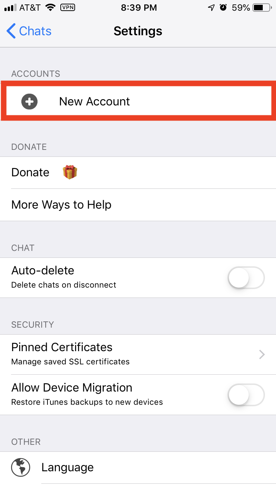
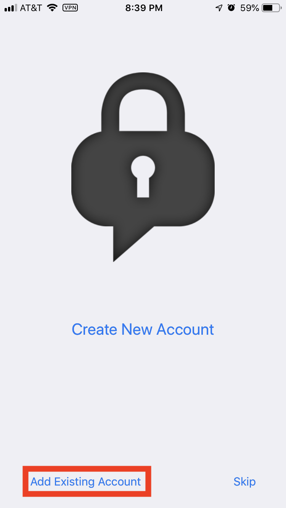
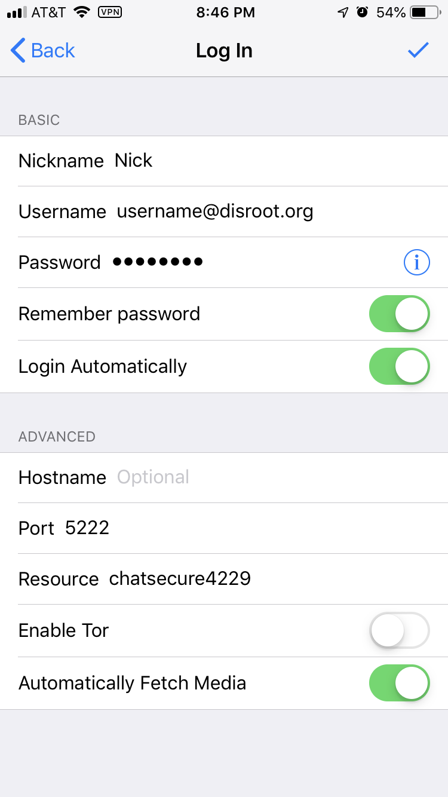

# XMPP sur iOS avec ChatSecure

Extrait du site web de ChatSecure :

> ChatSecure est une application de messagerie gratuite et open source qui propose le chiffrement OMEMO et le chiffrement OTR sur XMPP. Vous pouvez vous connecter à vos comptes Google existants ou créer de nouveaux comptes sur des serveurs XMPP publics (y compris via Tor), ou même vous connecter à votre propre serveur pour plus de sécurité.

Voici ce que vous devez faire pour que tout fonctionne.

1. **Téléchargez l'application ChatSecure depuis la boutique d'applications**.
2. Ouvrez l'application et cliquez sur l'icône de l'engrenage.

3. Cliquez sur **Nouveau compte**.

4. Cliquez sur **Ajouter un compte existant**.

5. Saisissez les éléments suivants :

* Pseudo : Nom que vous souhaitez nous donner dans les conversations.
* Nom d'utilisateur : Votre adresse électronique Disroot complète (**username@disroot.org**)
* Mot de passe : Votre mot de passe Disroot

6. Cliquez sur la coche dans le coin supérieur droit.

7. Vous pouvez maintenant ajouter des contacts et rejoindre des salles !

!! Pensez à rejoindre disroot@chat.disroot.org pour interagir avec la communauté Disroot et howto@chat.disroot.org pour discuter de cette documentation et commencer à contribuer.
