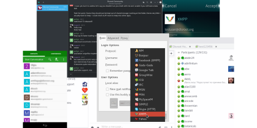

# Desktop Clients

## Multiplatform clients
- [Pidgin](desktop/pidgin)
- [Gajim](desktop/gajim)

## GNU/Linux clients
- [Dino](desktop/dino)

# Mobile Clients

## Android
- [Conversations](mobile/android/conversations)

## SailfishOS
- [Chat app](mobile/sailfishos)

## iOS
- [Chat Secure](mobile/ios)