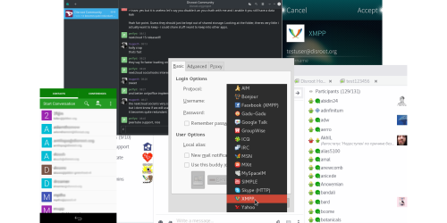

# Clientes de escritorio

## Clientes multiplatforma
- [Pidgin](desktop/pidgin)
- [Gajim](desktop/gajim)

## Clientes para GNU/Linux
- [Dino](desktop/dino)

# Clientes para el móvil

## Android
- [Conversations](mobile/android/conversations)

## SailfishOS
- [Chat app](mobile/sailfishos)

## iOS
- [Chat Secure](mobile/ios)