**Gajim** ist eine Mulitplattform-Kommunikationsapplikation, die auf den meisten Desktop-Betriebssystemen läuft.

Um den **Disroot**-Chat in **Gajim** einzurichten, folge diesen einfachen Schritten:

# Gajim installieren
**Gajim** ist für Linux-Nutzer in den meisten Paket-Archiven der häufig genutzten Distributionen verfügbar. Falls nicht oder falls Du ein **MS Windows**-Nutzer bist, kannst Du auf die [Gajim-Website](https://gajim.org/download/) gehen und die von Dir benötigte Version herunterladen. Die Installation selbst folgt der für Dein Betriebssystem üblichen Verfahrensweise.

# Erster Programmstart
Starte **Gajim**. Du wirst mit einer Willkommensnachricht ähnlich der folgenden begrüßt:

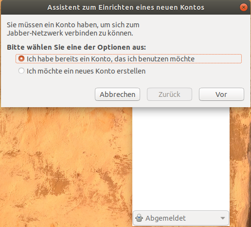

- Wenn Du Deinen **Disroot**-Account nutzen willst, wähle **"Ich habe bereits ein Konto, das ich benutzen möchte"**.
- Wenn Du einen neuen Account erstellen möchtest, wähle **"Ich möchte ein neues Konto erstellen"**.

# Einen Account erstellen oder hinzufügen
Als nächstes gibst Du die benötigten Informationen ein:

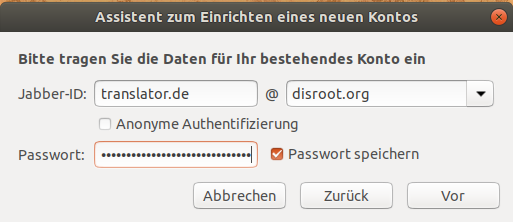

- **Jabber ID**: ersetze **Benutzername** entweder durch Deinen **Disroot**-Benutzernamen oder den Benutzernamen, den Du bereits auf einem anderen XMPP-Server erstellt hast. Für den **@**-Teil nimmst Du den Servernamen: zum Beispiel **disroot.org**, wenn Du Deinen **Disroot**-Account nutzt. Du kannst Dich daran orientieren, dass Dein XMPP-Account folgendermaßen aussehen wird: 'benutzername@disroot.org'.
- **Passwort**: entweder Dein **Disroot**-Passwort oder das Passwort Deines Accounts auf einem anderen XMPP-Server.
- Klicke auf **Vor**.

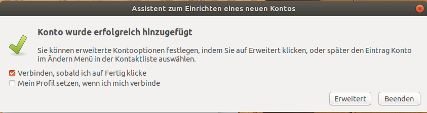

- Klicke auf **Beenden**.

**Alle Deine Kontakte und Räume werden zwischen allen Clients synchronisiert, sodass Du den** 'Disroot'**-Chat gleichzeitig auf all Deinen verschiedenen Geräten nutzen kannst.**

# Organisiere Gajim in einem einzigen Fenster
Anstatt verschiedener Fenster (für Kontakte, Konversationen, usw.) kannst Du auch alles in einem einzigen Fenster haben.

Gehe zu den *Einstellungen*. Du findest sie in der oberen Menüleiste oder machst einen Rechtsklick auf das **Gajim**-Icon in der App-Liste.

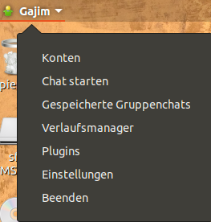

Im Fenster *Einstellungen* gehst Du unter *Allgemein* in *Erscheinungsbild des Chats* und änderst das *Fensterverhalten* auf *Ein Fenster für alles*.

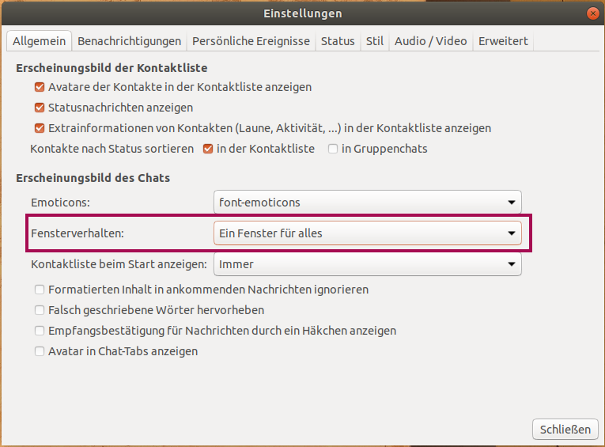

# Plugins
Du musst auch noch einige wenige Plugins installieren. Je nach Betriebssystem musst Du die Plugins als allererstes installieren. Sieh Dir dazu auch [diese Seite](https://dev.gajim.org/gajim/gajim-plugins) an.

An der selben Stelle, an der Du die *Einstellungen* gefunden hast, findest Du auch die *Plugins*.

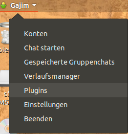

Du benötigst zwei Plugins:
    - OMEMO
    - URL image preview
(Evtl. benötigst Du, z.B. unter Ubuntu, noch den Plugin Installer, den Du [hier](https://dev.gajim.org/gajim/gajim-plugins/wikis/plugininstallerplugin) herunterladen und dann mit dem Button *Aus ZIP Datei installieren* installieren kannst, um den Reiter *Available* zu erhalten)

Gehe in den Reiter *Available* und wähle die beiden genannten Plugins aus. Klicke auf *Install/Upgrade*, wenn Du fertig bist.

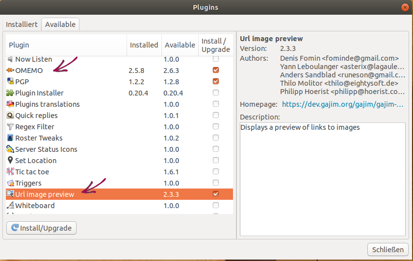

Dann gehst Du auf den Reiter *Installiert*. Wähle die Plugins aus, um sie zu aktivieren, und schließe danach das Fenster.

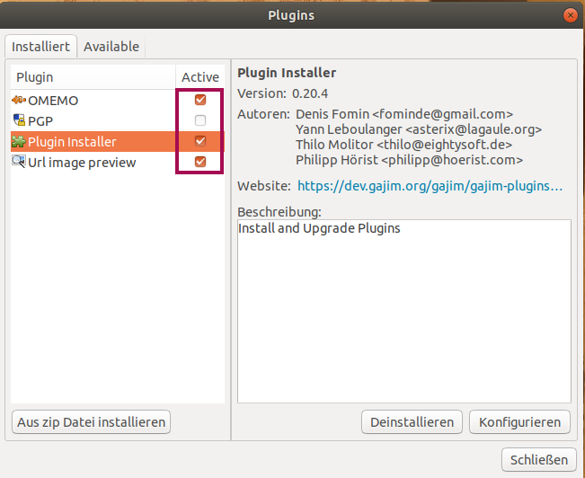

# Benutzeroberfläche
So in etwa sollte Gajim nun aussehen:

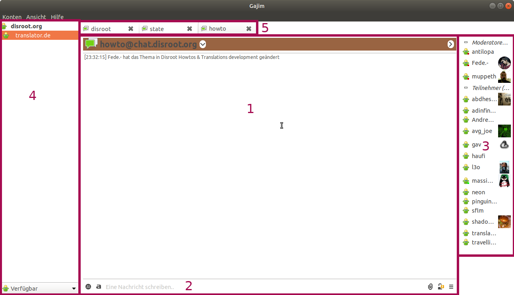

1. Das ist das Diskussions-Paneel des Raums: Dort kannst Du die Nachrichten von jedem im aktuellen Raum sehen. In diesem Bild ist der Nutzer aktuell im Raum *howto@chat.disroot.org*.
2. Hier kannst Du Nachrichten schreiben, Dateien versenden, usw.
3. Dies ist die Liste der Teilnehmer des aktuellen Raums. Nur Teilnehmer, die online sind, werden aufgelistet.
4. Dies ist die Liste der Kontakte und verbundenen Räume (Gruppenchats) des Benutzers.
5. Hier kann der Benutzer zwischen den geöffneten Räumen hin und her wechseln.

# Nachrichten versenden und bearbeiten
Um eine Nachricht an einen Kontakt oder in einen Raum zu schreiben/senden, nutze die *Nachricht schreiben*-Box:

1. Hier schreibst Du Deine Nachricht. **Hinweis:** Shift + Enter ermöglichen Dir einen Zeilenumbruch hinzuzufügen.
2. Hier kannst Du Smileys in Deine Nachricht einfügen.
3. In **Gajim** hast Du einige Formatierungsoptionen. Sie funktionieren allerdings nicht in anderen Clients. Wenn Du also einen Text zum Beispiel fett schreibst, wird dieser Text in anderen Clients in normaler Schrift angezeigt.
4. Du kannst jeden Datei-Typ versenden. Das Upload-Limit über den **Disroot**-XMPP-Server liegt derzeit bei 10 MB.
5. Du kannst die Verschlüsselung von deaktiviert zu OMEMO ändern (nicht in offenen Gruppenchats).

Drücke die *Enter*-Taste, wenn Du Deine Nachricht absenden willst.

Du kannst in **Gajim** nur Deine letzte versendete Nachricht bearbeiten. Um dies zu tun, drücke *Strg* und die Pfeiltaste nach oben.

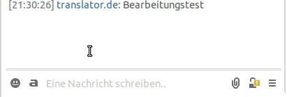

Du wirst bemerken, dass nach dem Bearbeiten ein Stift-Symbol an der bearbeiteten Nachricht erscheint.

# Räume
## Einen Raum betreten oder erstellen
Räume werden auch Gruppenchats oder MUC (**M**`ultiple` **U**`ser` **C**`hats`, Mehrbenutzerchats) genannt.

Um einem solchen beizutreten, klicke auf *Konten* (obere linke Ecke), dann auf *Gruppenchat beitreten*. Dort können einige Gruppenchats erscheinen (diejenigen, denen Du in der Vergangenheit bereits beigetreten bist).

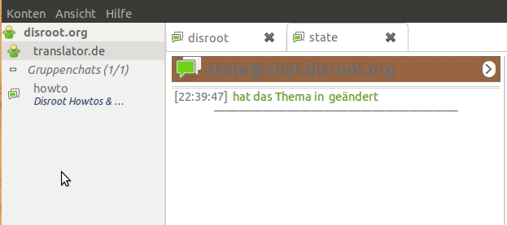

Wenn der Raum, dem Du beitreten möchtest, nicht erscheint, klicke erneut auf *Gruppenchat beitreten*. Klicke auch auf *Gruppenchat beitreten*, wenn Du Deinen eigenen Raum erstellen möchtest. Dieses Fenster wird nun erscheinen:

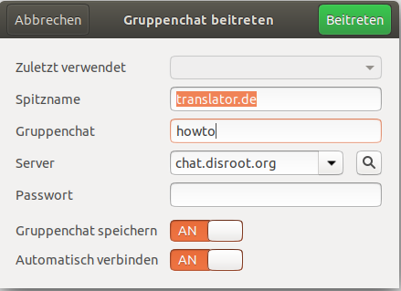

- **Spitzname**: Du kannst hier eintragen, was Du möchtest. Es muss nicht Dein Benutzername sein.
- **Gruppenchat**: Der Name des Raums, den Du betreten möchtest. Wenn der Raum nicht existiert, wird er erstellt und Du wirst sein Administrator / Besitzer.
- **Server**: gib **chat.disroot.org** ein, wenn Du einen Raum auf dem **Disroot**-XMPP-Server erstellen oder betreten möchtest. Du kannst natürlich auch einen anderen XMPP-Server wählen, wenn Du möchtest.
- **Passwort**: Nur notwendig, wenn der Raum, den Du betreten möchtest, passwortgeschützt ist.
- **Gruppenchat speichern**: Dies ermöglicht es Dir, Räume, die Du betreten hast, zu speichern, so dass Du sie später schnell und einfach wiederfindest. Und es ermöglicht Dir, die Räume auf verschiedenen Geräten zu behalten.
- **Automatisch verbinden**: Wenn dies aktiviert ist, wird **Gajim** den Raum beim Programmstart automatisch betreten/öffnen.

### Raumerstellungs-Optionen
Wenn Du einen Raum erstellst, wirst Du ihn wahrscheinlich konfigurieren wollen. Klicke auf die 3 waagerechten Linien in der *Nachricht schreiben*-Box: , wähle *Raum verwalten* und dann *Raum konfigurieren*.

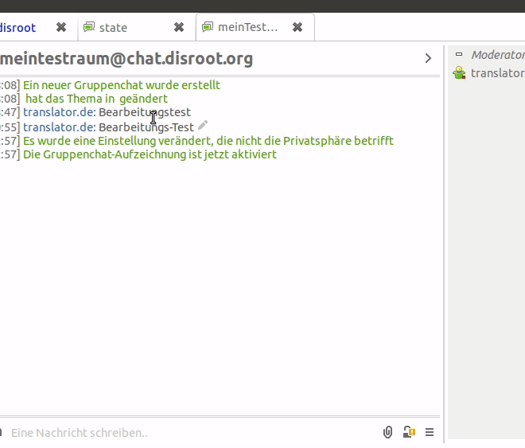

Es gibt eine Menge Funktionen! Ein paar der wichtigsten sind:
- **Persistent**: Wenn der Raum nicht auf persistent gesetzt ist, wird er automatisch gelöscht, wenn der letzte Teilnehmer ihn verlassen hat.
- **Include room information in public lists**: wähle diese Box ab, wenn Du nicht willst, dass Dein Raum öffentlich einsehbar gelistet wird.
- **Only allow members to join**: Wenn Du willst, dass Dein Raum nur für Mitglieder ist. In dem Fall kannst Du einzelne Mitglieder hinzufügen. Wie das geht, erfährst Du im Folgenden: 

Du kannst Kontakte in einen Nur-Mitglieder-Raum einladen: dieser Kontakt wird dann ein Mitglied des Raums. Klicke mit der rechten Maustaste auf den Kontakt, den Du einladen möchtest, gehe auf *Einladen zu* und wähle den Raum aus, in den Du ihn/sie einladen willst.

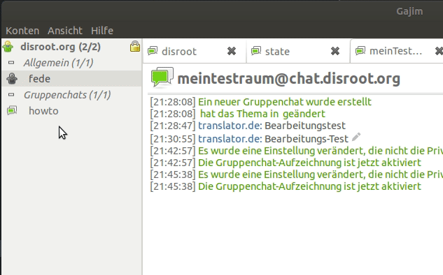

## Einen Raum verlassen
Wenn Du einen Raum verlassen möchtest, musst Du die Verbindung zu dem Raum *trennen*. Um das zu tun gibt es zwei Wege:

1. Wenn der Raum geöffnet ist, klicke auf die drei waagerechten Striche in der *Nachricht-schreiben*-Box  und wähle *Verbindung trennen*.
2. In der Raumliste im linken Paneel klickst Du mit der rechten Maustaste auf den entsprechenden Raum und wählst *Verbindung trennen*.

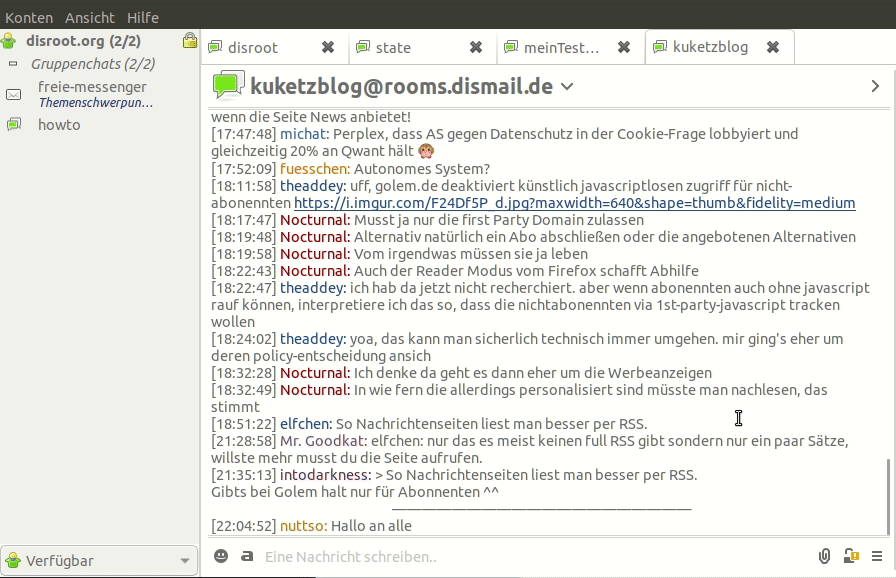

## Einen Raum merken
Du kannst Dir ein Lesezeichen für einen Raum anlegen, um ihm zum Einen später leichter beitreten zu können und ihn zum Anderen auch über mehrere Clients hinweg zu behalten.

Wenn Du einen Raum zum ersten Mal betrittst oder einen Raum erstellst, wird Dir diese Box angezeigt:

hier kannst Du bereits auswählen, ob Du diesen Gruppenchat speichern möchtest.

Wenn Du später ein Lesezeichen für einen Raum anlegen möchtest, klicke auf die drei waagerechten Striche in der *Nachricht-schreiben*-Box:  und wähle *Gruppenchat speichern*.

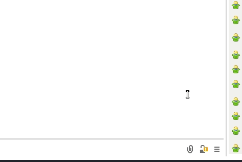

Wenn Du ein Lesezeichen für einen Gruppenchat löschen möchtest, findest Du die Verwaltungsoption *Gespeicherte Gruppenchats* dort, wo Du auch die *Einstellungen* und die *Plugin*-Verwaltung gefunden hast:

In dem nun erscheinenden Fenster kannst Du Gruppenchats zu Deinen Lesezeichen hinzufügen und entfernen.

## Raum-Verlauf
Sobald Du **Gajim** schließt, werden die bereits gelesenen Nachrichten in den Raum-Fenstern entfernt. Dennoch kannst Du weiterhin auf den Verlauf Deines Gruppenchats zugreifen.

Klicke auf die drei waagerechten Striche in der *Nachricht-schreiben*-Box  und wähle *Unterhaltungsverlauf*.
Innerhalb des Verlaufs kannst Du nach Datum navigieren.

## Einen öffentlichen Raum finden
Du hast die Möglichkeit, nach öffentlichen Räumen auf XMPP-Servern zu suchen.
Klicke auf *Konten* und dann auf *Dienste durchsuchen*.

Bei *Adresse* kannst Du jeden öffentlichen XMPP-Server auswählen. Zum Beispiel kannst Du hier **disroot.org** eingeben, um einen öffentlichen Raum auf dem **Disroot-XMPP**-Server zu finden. Klicke auf *Los*.

Sieh Dir dann die Auwahl an, die Du erhältst. Du müsstest einen Bereich *Gruppenchat* sehen, dort wählst Du Du dann den Eintrag aus, der etwas mit *room server* zu tun hat. Klicke auf *Durchsuchen*.

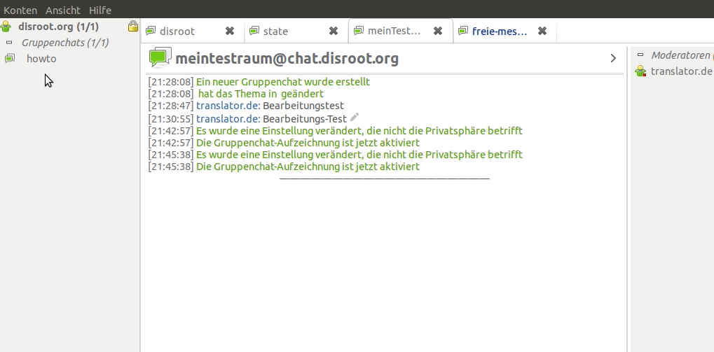

# Direktnachrichten: 1-zu-1-Gespräch
Du kannst auch mit jemandem im Privaten chatten, in einer 1:1-Diskussion, an der nur ihr beide teilnehmt.

## Kontakt hinzufügen
Klicke auf *Konten* und wähle *Kontakt hinzufügen*.

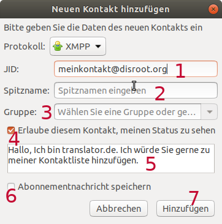

1. **Jabber ID**: Die XMPP-Adresse des Kontakts, den Du hinzufügen möchtest. Wenn dieser Kontakt ein **Disroot**-Nutzer ist, sieht seine/ihre XMPP-Adresse so aus: *benutzername@disroot.org*
2. **Spitzname**: Der Spitzname kann von der Adresse abweichen.
3. **Gruppe**: Du kannst Gruppen erstellen, um Deine Kontakte zu organisieren.
4. **Erlaube diesem Kontakt, meinen Status zu sehen**: Wenn Du dies aktivierst, wird Dein Kontakt sehen, ob Du online oder offline bist.
5. **Abonnementnachricht**: Diese Nachricht erhält Dein Kontakt als Mitteilung zu Deinem Wunsch, ihn zu Deinen Kontakten hinzuzufügen. Du kannst die Nachricht ändern.
6. **Abonnementnachricht speichern**: Wenn Du eine eigene Abonnementnachricht eingegeben hast und diese öfter nutzen möchtest, wähle diese Option aus.
7. **Hinzufügen**

Wenn Du auf *Hinzufügen* klickst, wird Deinem Kontakt eine Nachricht gesendet. Wenn die Person Deine Eintragung akzeptiert, wird er/sie Deiner Kontaktliste hinzugefügt. Bis dahin erscheint der potentielle Kontakt bereits im entsprechenden Paneel, allerdings als *schwebend*, also quasi in Warteposition.

## Mit einem Kontakt reden
Um mit einem Kontakt zu reden und einen 1:1-Chat zu öffnen, mache einfach einen Doppelklick auf den entsprechenden Namen in Deiner Kontaktliste.

## Einen Kontakt entfernen
Um einen Kontakt zu entfernen, mache einen Doppelklick auf seinen Namen in Deiner Kontaktliste. Wähle *Kontakt verwalten* und dann *Entfernen*.

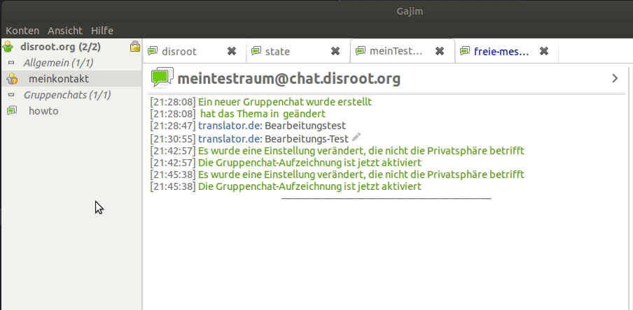

# Persönliche Informationen
Du kannst Deine persönlichen Informationen und Deinen Avatar ändern.
Klicke auf *Konten* und dann auf *Profil und Avatar*. Hier hast Du dann viele Möglichkeiten. Die zwei wichtigsten sind wahrscheinlich:
- **Avatar**: Klicke auf das Feld bzw. den angezeigten Avatar, um eine (andere) Bilddatei für Deinen Avatar auszuwählen.
- **Spitzname**: Wenn Du Deinen Standard-Anzeigename ändern möchtest. Standardmäßig wird Dein **Disroot**-Benutzername als Spitzname angenommen.

Klicke auf *OK*, wenn Du fertig bist.

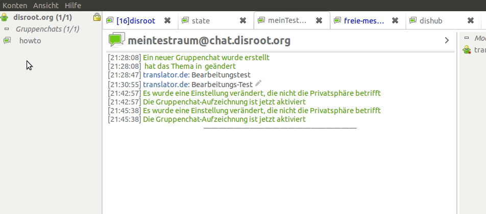

!! ![/home/icons/note.png]
!! **Sei vorsichtig, wie viele persönliche Angaben Du machst**, da sie von wirklich jedem in Deinem Profil gesehen werden können.

# Eine letzte Anmerkung zu Gajim
Wir haben Dir jetzt nur gezeigt, was wir für die wichtigsten Funktionen für den Anfang gehalten haben, um Deinen **XMPP**-Account in **Gajim** zu nutzen. **Gajim** ist jedoch voller Funktionen, also scheue Dich nicht, sie zu entdecken!

Wenn Du Fragen zu **Gajim** hast, kannst Du den XMPP-Raum über **Gajim** besuchen: gajim@conference.gajim.org oder Du siehst Dir das [Gitlab Repo](https://dev.gajim.org/gajim/gajim) an.

Wie Du sicherlich bemerkt hast, ist **Gajim** noch nicht vollständig ins Deutsche übersetzt. Falls Du dabei helfen möchtest, findest DU dazu auch weitere Informationen im Gitlab Repo.
