Gajim est une application de messagerie multiplateforme (fonctionne sur la plupart des systèmes d'exploitation).

Pour configurer le chat **Disroot** sur **Gajim**, suivez ces étapes faciles :

# Installer Gajim
**Gajim** est disponible dans la plupart des dépôts de paquets des distros les plus utilisées. Si ce n'est pas votre cas, ou si vous êtes un utilisateur de **MS Windows**, vous pouvez consulter le [site web de Gajim](https://gajim.org/download/) et télécharger la version que vous recherchez.

# Premier démarrage
Démarrez **Gajim**. Vous serez accueilli par un message de bienvenue comme celui-ci :

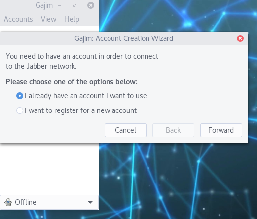

- Si vous voulez utiliser votre compte **Disroot**, choisissez **"J'ai déjà un compte que je veux utiliser "**.
- Si vous voulez créer un nouveau compte, choisissez **"Je veux m'inscrire pour un nouveau compte "**.

# Créer ou ajouter un compte
Ensuite, remplissez les informations nécessaires :

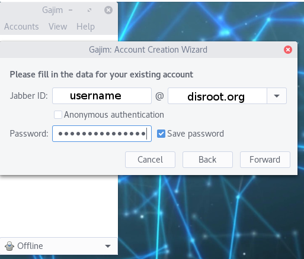

- **Identifiant Jabber** : remplacez **nom d'utilisateur** par votre nom d'utilisateur **Disroot**, ou le nom d'utilisateur que vous avez déjà créé sur un serveur XMPP. Et pour la partie **@**, choisissez le nom de votre serveur : c'est **disroot.org** si vous utilisez votre compte **Disroot**. Rappelez-vous que votre compte XMPP ressemblera à ceci : `username_@_disroot.org`
- **Mot de passe** : soit votre mot de passe **Disroot**, soit le mot de passe que vous avez déjà défini sur un serveur XMPP.
- Cliquez sur **Suite**.

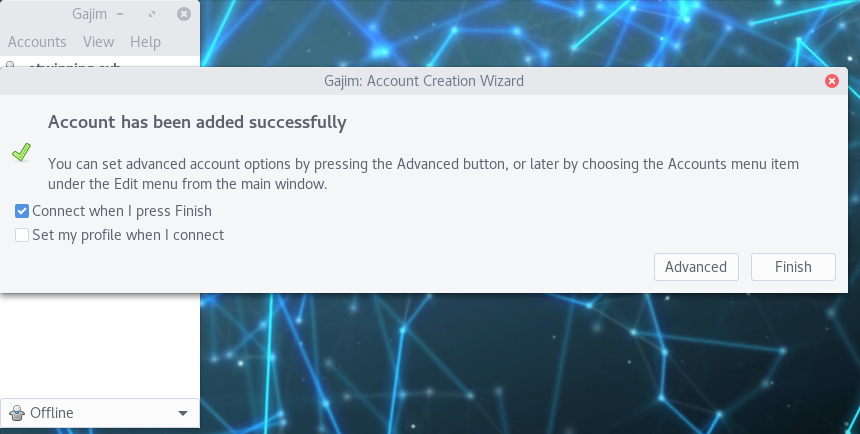

- Cliquez sur **Finish**.

**Tous vos contacts et salles sont synchronisés entre tous les clients, vous pouvez donc utiliser Disroot chat sur tous vos appareils en même temps.**

# Organiser Gajim dans une seule fenêtre
Au lieu d'avoir plusieurs fenêtres (pour les contacts, pour les conversations, etc.), vous pouvez avoir une seule fenêtre pour tout.

Allez dans les **Préférences**. Vous pouvez le trouver dans le menu de la barre supérieure. Ou vous pouvez faire un clic droit sur l'icône **Gajim** dans la liste des applications.

Dans la fenêtre **Préférences**, dans **Général**, puis **Aspect de la conversation**, changez le **Comportement de la fenêtre** en **"Fenêtre unique pour tout "**.

# Plugins
Vous devez également configurer quelques plugins.
En fonction de votre système d'exploitation, vous devrez peut-être les installer d'abord. [Voir cette page](https://dev.gajim.org/gajim/gajim-plugins)

Ensuite, au même endroit que vous avez trouvé les **Préférences**, vous devriez trouver les **Plugins**.

Vous avez besoin de deux plugins :
    - OMEMO
    - Aperçu de l'image URL
(Vous aurez peut-être besoin d'installer d'abord le Plugin Installer, que vous pouvez trouver [ici](https://dev.gajim.org/gajim/gajim-plugins/wikis/plugininstallerplugin) pour le télécharger. Après le téléchargement, vous pouvez l'installer en cliquant sur le bouton *Installer à partir du zip* dans la fenêtre **Plugins**, pour obtenir l'onglet **Disponible**).

Allez donc dans l'onglet **Disponible** et vérifiez ces deux plugins. Cliquez sur **Installation/Mise à jour** lorsque vous avez terminé.

Ensuite, allez dans l'onglet **Installé**. Cochez les plugins pour les rendre actifs. Fermez ensuite les fenêtres.

# Interface utilisateur
Voici à quoi ressemble maintenant **Gajim** :

1. Voici la fenêtre de discussion de la salle : vous pouvez y voir les messages de tout le monde dans la salle actuelle. Ici, l'utilisateur est dans le salon *howto@chat.disroot.org*.
2. C'est là que vous pouvez taper un message, envoyer des fichiers, etc.
3. C'est la liste des participants de cette salle actuelle. Seuls les participants en ligne sont listés.
4. C'est la liste des contacts de l'utilisateur et de la salle connectée (Groupchats).
5. Ici, l'utilisateur peut basculer entre les salles ouvertes.

# Envoi et modification de messages
Pour écrire/envoyer un message à un contact ou dans une salle, utilisez la boîte d'envoi de messages :

1. Vous écrivez votre message à cet endroit. **Note:** Shift + Enter vous permettra d'ajouter un saut de ligne.
2. Vous pouvez ajouter un smiley.
3. Dans **Gajim** vous avez quelques options de format. Mais elles ne fonctionnent pas dans d'autres clients. Donc si vous mettez un texte en gras, il ne sera pas vu comme gras dans les autres clients.
4. Vous pouvez joindre/envoyer tout type de fichiers. La limite de téléchargement est actuellement de 10MB avec le serveur XMPP **Disroot**.
5. Vous pouvez changer le cryptage du message de Disable à OMEMO (pas dans les chats de groupe ouverts).

Appuyez simplement sur la touche *Entrée* lorsque vous voulez envoyer votre message.

Vous ne pouvez modifier votre dernier message envoyé que dans **Gajim**. Pour ce faire, entrez dans la boîte d'édition du message, appuyez sur *ctrl* et la flèche vers le haut de votre clavier.

Notez qu'un crayon apparaît à côté du message modifié.

## Pièces
## Entrer ou créer une salle
Les salons sont également appelés conversations de groupe ou MUC (Multiple User Chats).

Pour en rejoindre une, cliquez sur **Comptes** (coin supérieur gauche), puis sur **Joindre une conversation de groupe**. Là, certaines conversations de groupe peuvent apparaître (celles que vous avez déjà rejointes dans le passé).

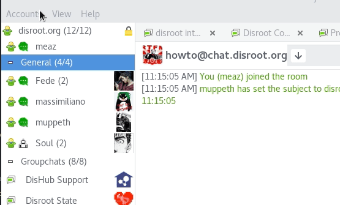

Si la salle que vous souhaitez rejoindre n'apparaît pas, cliquez à nouveau sur **Rejoindre le groupe de discussion**. Cliquez également sur **Rejoindre le groupe de discussion** si vous souhaitez créer votre propre salle. Cette fenêtre apparaîtra :

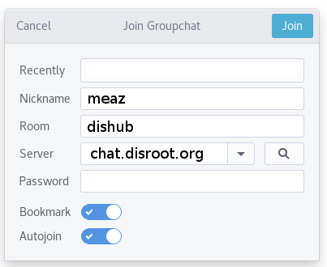

- **Pseudo** : vous pouvez définir ce que vous voulez, ce n'est pas forcément votre nom d'utilisateur.
- **Salle** : le nom de la salle que vous voulez rejoindre. Si la salle n'existe pas, elle sera créée, et vous en serez l'administrateur/propriétaire.
- **Serveur** : entrez **chat.disroot.org** si vous voulez rejoindre ou créer une salle sur le serveur XMPP de **Disroot**. Mais vous pouvez choisir un autre serveur XMPP si vous le souhaitez.
- **Mot de passe** : utile uniquement si la salle que vous essayez de rejoindre est protégée par un mot de passe.
- **Signet** : il permet de mémoriser les salons que vous avez rejoints, afin que vous puissiez les retrouver facilement et rapidement. Et il permet également de les conserver d'un appareil à l'autre.
- **Autojoin** : si activé, alors au démarrage, **Gajim** rejoindra/ouvrira automatiquement la pièce.

### Options de création de pièce
Quand vous créez votre pièce, vous pouvez vouloir la configurer. Cliquez sur les trois points dans la boîte de message d'envoi :  et choisissez **Gérer la salle** puis **Configurer la salle**.

Il y a beaucoup de fonctionnalités ! Voici quelques-unes des plus importantes :
- **Persistant** : si la salle n'est pas paramétrée pour être persistante, elle sera supprimée automatiquement lorsque le dernier participant s'en déconnectera.
- **Inclure les informations de la salle dans la liste publique** : décochez cette case si vous ne voulez pas que votre salle soit listée.
- Autoriser uniquement les membres à se joindre à la salle** : si vous voulez que votre salle soit réservée aux membres. Ensuite, vous pouvez ajouter des membres un peu plus loin, dans cette section : 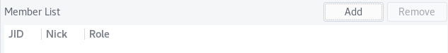

Vous pouvez également inviter un contact dans une salle réservée aux membres : ce contact devient alors membre de cette salle. Faites un clic droit sur le contact que vous voulez inviter, choisissez **Inviter à** et choisissez la salle dans laquelle vous voulez l'inviter.

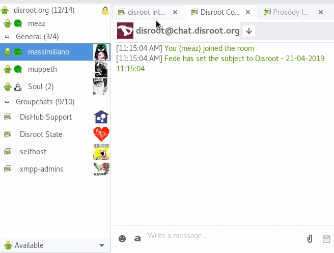

## Quitter une salle
Lorsque vous voulez quitter une salle, vous devez vous *déconnecter*. Pour ce faire, il y a deux façons :
1. Si la salle est ouverte, cliquez sur les trois points dans la boîte de message  et choisissez **Déconnecter**.
2. Dans la liste de vos salles sur le panneau de gauche, faites un clic droit sur la salle désirée, et choisissez **Diconnect**.

## Mise en signet d'une salle
Vous pouvez mettre en signet les salles afin de les rejoindre plus facilement par la suite et de les conserver d'un client à l'autre.

Lorsque vous rejoignez une salle ou que vous en créez une pour la première fois, vous obtenez cette boîte :

Si vous voulez par la suite mettre ou enlever les signets d'une pièce, cliquez sur les trois points dans la boîte d'envoi du message :  et choisissez **Signet**.

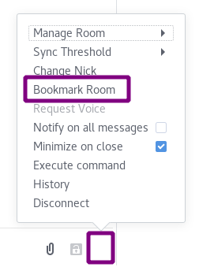

## Historique des salles
Dès que vous fermez **Gajim**, les fenêtres des salles sont nettoyées des messages que vous avez déjà lus. Cependant, vous pouvez toujours accéder à l'historique des conversations de groupe.

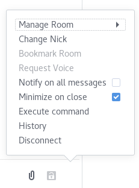

Cliquez sur les trois points verticaux  dans la boîte d'envoi du message et choisissez **Histoire**.
Vous pouvez naviguer dans l'historique par date.

## Recherche d'une salle publique
Vous pouvez rechercher des salles publiques sur les serveurs XMPP.
Cliquez sur **Comptes**, puis sur **Découvrir des services**.

Dans **Adresse**, vous pouvez choisir n'importe quel serveur XMPP public. Par exemple, ajoutez **disroot.org** pour trouver une salle publique sur le serveur XMPP de **Disroot**. Cliquez sur **Go**.

Ensuite, cherchez dans la section **Conférence** et choisissez quelque chose qui ressemble à *serveur de salle*. Cliquez sur **Chercher**.

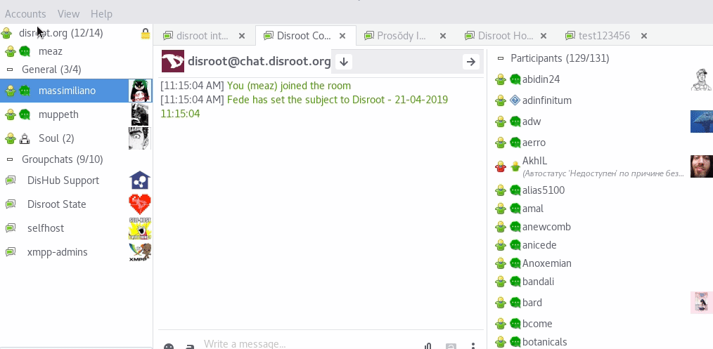

# Chat direct : Conversation 1 à 1
Vous pouvez également chatter avec quelqu'un en privé, dans le cadre d'une discussion 1:1 à laquelle vous ne participez que tous les deux.

## Ajout d'un contact
Cliquez sur **Comptes** et choisissez **Ajouter un contact**.

1. **Jabber ID** : l'adresse XMPP du contact que vous voulez ajouter. Si ce contact est sur **Disroot**, son adresse XMPP est comme ceci : **username@disroot.org**
2. **Pseudo** : il peut être différent de l'adresse.
3. **Groupe** : vous pouvez créer des groupes pour organiser vos contacts.
4. **Autoriser le contact à voir mon statut** : si la case est cochée, cela signifie que votre contact sera averti que vous êtes en ligne/hors ligne.
5. Ceci est le message que votre contact recevra. Vous pouvez le modifier.
6. **Ajouter**

Lorsque vous cliquez sur **Ajouter**, un message est envoyé à la personne. Lorsque la personne accepte votre abonnement, elle est ajoutée à votre liste de contacts.

## Parler à un contact
Il suffit de double-cliquer sur le nom du contact dans votre liste de contacts.

## Suppression d'un contact
Pour supprimer un contact, faites un clic droit sur son nom dans votre liste de contacts. Choisissez **Gérer le contact** puis **Supprimer**.

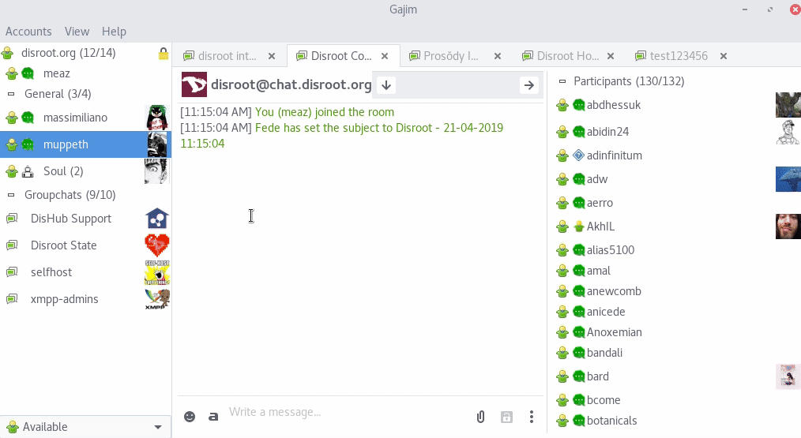

# Données personnelles
Vous pouvez modifier vos données personnelles, votre avatar, etc.
Cliquez sur **Comptes** puis **Profil**. Il y a beaucoup d'options. Les deux plus importantes sont probablement :
- **Avatar** : Cliquez sur l'avatar pour le modifier.
- **Pseudo** : si vous voulez changer votre pseudo par défaut. Par défaut, c'est votre nom d'utilisateur **Disroot**.

Cliquez sur **OK** lorsque vous avez terminé.

**Faites attention** car tout le monde pourra voir ce que vous avez défini dans votre profil.

# Note finale sur Gajim
Nous avons juste présenté ce que nous pensons être les fonctionnalités les plus importantes pour commencer à utiliser votre compte XMPP sur **Gajim**. Mais **Gajim** est plein de fonctionnalités, alors explorez-les !

Si vous avez des questions concernant l'utilisation de **Gajim**, rejoignez la salle XMPP de gajim : gajim@conference.gajim.org ou consultez le [dépôt gitlab].(https://dev.gajim.org/gajim/gajim)
