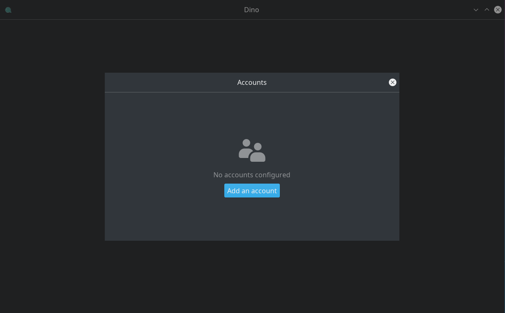

Dino is an open source chat client for the desktop. It has support for [OMEMO](https://en.wikipedia.org/wiki/OMEMO) and [OpenPGP](https://en.wikipedia.org/wiki/Pretty_Good_Privacy#OpenPGP), which means that once you enable encryption, only you and the other person can read your messages and no one else.
<br>

1. **Installing Dino**<br>
**Dino** is available for GNU/Linux users only. You can check if there's a compiled package version for your distro by clicking [here](https://github.com/dino/dino/wiki/Distribution-Packages). Or build it yourself by downloading the code and compiling it from the command line:
```
./configure
make
build/dino
```

2. **Starting Dino**<br>
First time you launch Dino, it'll appear a screen like this:


To continue, select **Manage accounts** and then **Add an account**.



3. **Setting up an account**<br>
Sign in with your information...:<br>
```
JID: your_username@disroot.org
Password: your Disroot password
Local alias: the name you want to use
```
... and then **Save**


Once you've completed the previous step, the next box will appear:


Connect by clicking the Connection button next to the username.


To change the avatar, just click on the user icon, browse your local system and select the image you want to use.


4. **Starting a conversation**<br>
If you want to start a communication with other user, just click on **Start Conversation**. However, if you want to join a chat room then click on **Join a channel**.


The procedure will be the same in both cases: enter the username or the chatroom's name and then click **Next**...


... and a confirmation request will appear.


By clicking on the **Join** button you will access the room or start a conversation with another user.


Encryption is very uncommon at chatrooms, but it is recommended to enable it on one to one user conversations. To do it, just click on the lock icon at the right of the text box.


5. **Settings and Preferences**<br>
If you want to add more accounts, start conversations with other users, join chatrooms or adjust some preferences, just click on the left icon at the top bar...


... and that's it.
