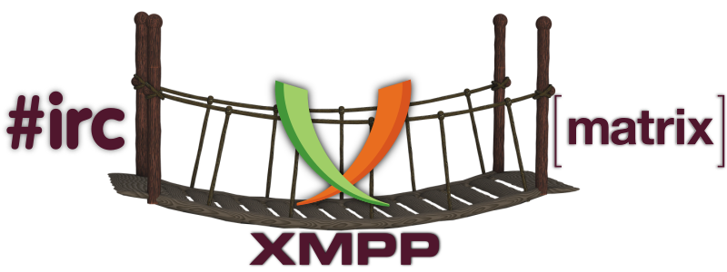

# XMPP: Gateways and bridges

On the internet there are a wide variety of networks co-existing, most of them using different hardware and running different software. One way to enable communication between them is through **gateways** and **bridges**. These allow users on different platforms to communicate with each other regardless of the protocols they use.

Currently, **Disroot Chat** allows interaction with the following protocols:

## [IRC](irc)
Learn how to use the **IRC** gateway

## [Matrix](matrix)
Learn how to use the **Matrix** bridge
