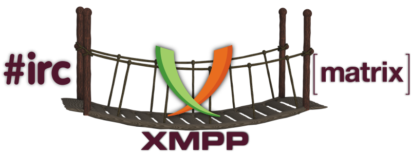

# XMPP: Passerelles et ponts

Sur l'internet, une grande variété de réseaux coexistent, la plupart d'entre eux utilisant un matériel différent et exécutant des logiciels différents. Une façon de permettre la communication entre eux est d'utiliser des **passerelles** et des **ponts**. Ceux-ci permettent aux utilisateurs de différentes plateformes de communiquer entre eux, indépendamment des protocoles qu'ils utilisent.

Actuellement, le **Chat Disroot** permet l'interaction avec les protocoles suivants :

## [IRC](irc)
Apprenez à utiliser la passerelle **IRC**.

## [Matrix](matrix)
Apprenez à utiliser le pont **Matrix**.
