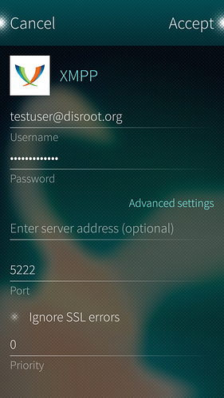

# XMPP on SailfishOS

1. **Open Settings** app and scroll all the way down to "**Accounts**"

2. Add new **XMPP** account.

3. **Setup account**
Fill in details
 - **Username:** *Your disroot username*@disroot.org (you can also specify username and domain separately)
 - **Password:** *your disroot password*
 - **Server address:** (if you specified only your disroot username, here you can add the domain) *disroot.org*
 - **Port:** 5222

4. **Swipe accept, and you're done!**
Now you are ready to start preaching people to ditch corporate evil apps and jump on the federation starship.

SailfishOS integrates all messaging into one app so now you can sms, skype, and chat from one place.
**All your contacts are synced between all the clients, so you can use disroot chat on all the devices at the same time.**
