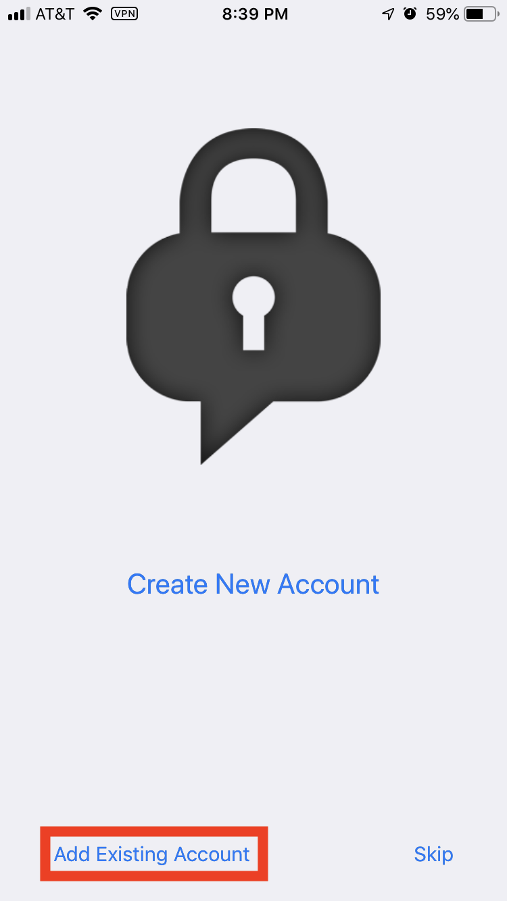

# XMPP on iOS with ChatSecure

From the ChatSecure website:

> ChatSecure is a free and open source messaging app that features OMEMO encryption and OTR encryption over XMPP. You can connect to your existing Google accounts or create new accounts on public XMPP servers (including via Tor), or even connect to your own server for extra security.

Here is what you need to do to get things rolling.

1. **Download the ChatSecure app from app store.**
2. Open the app and click on the gear icon.

3. Click **New Account**

4. Click **Add Existing Account**

5. Enter the following:

* Nickname: Name you wish to us in conversations
* Username: Your full Disroot email address (**username@disroot.org**)
* Password: Your Disroot password

6. Click the checkmark in the top-right corner.

7. You can now add contacts and join rooms!

!! Consider joining disroot@chat.disroot.org to interact with the Disroot community and howto@chat.disroot.org to discuss this documentation and start contributing.
