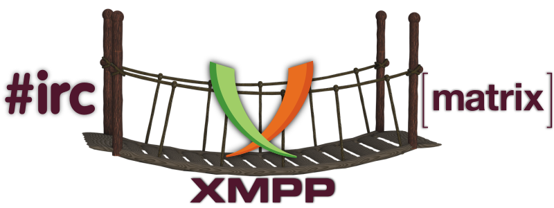

# XMPP: Pasarelas y puentes

En internet hay gran variedad de redes coexistiendo, la mayoría de ellas usan diferente hardware y ejecutan diferente software. Una manera de habilitar las comunicaciones entre ellas es a través de **pasarelas** y **puentes**. Estos permiten a las personas usuarias de diferentes plataformas comunicarse entre sí independientemente de los protocolos que utilicen.

Actualmente, **el chat de Disroot** permite interactuar con los siguientes protocolos:

## [IRC](irc)
Aprende cómo usar la pasarela de **IRC**

## [Matrix](matrix)
Aprender cómo usar el puente de **Matrix**
