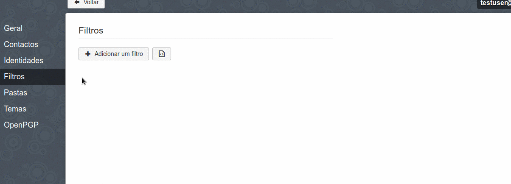
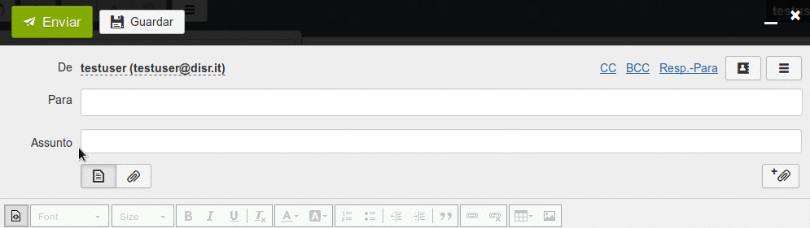

# Configurar
Antes de mais faça login no seu webmail e vá às suas configurações de email no canto inferior esquerdo

Nas configurações, vá a **"Identidades"**, carregue em "**Adicionar Identidade"** e preencha o o formulário. Uma vez que tenha terminado carregue em **"Adicionar"** .
*(Todos os utilizadores do Disroot tem um alias de email: "o_seu_nome_de_utilizador"@disr.it que pode utilizar)*

# Colocar como Predefinido
Pode gerir as identidades arrastando a identidade para cima ou para baixo.

# Enviar email
Para enviar um email com o seu novo alias, basta carregar no campo **"De"** e escolher o alias que quer utilizar para este email
.

