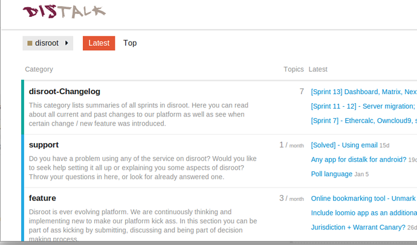
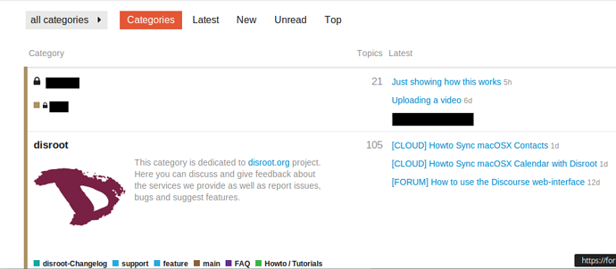
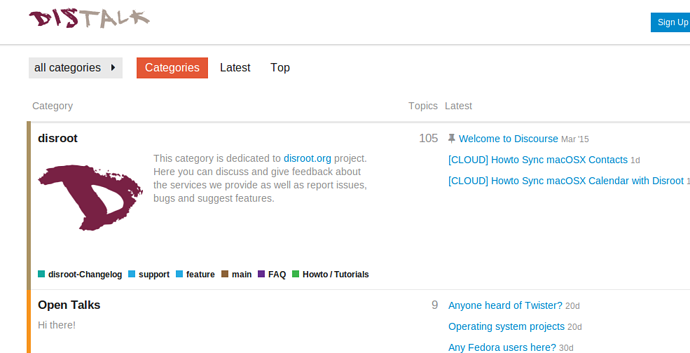

Dans ce tutoriel, nous montrerons comment Discourse peut être utilisé comme liste de diffusion pour les Collectifs/Associations/projets.

Disroot, accueille principalement des groupes de discussion privés. Si vous êtes intéressé, écrivez-nous.

**Remarque:** Pour pouvoir être membre d'un groupe (public ou privé), vous n'avez pas besoin d'avoir un compte Disroot. Vous pouvez créer des comptes forum seulement.

----------
# Comment fonctionne la liste de diffusion dans Discourse

Discourse, le logiciel utilisé par Disroot, est un logiciel de Forum avec des fonctionnalités de liste de diffusion. Il a ce que nous avons appelé pour ce tutoriel des **Groupes**. Et ces Groupes peuvent avoir ou non des **Catégories** (pensez à eux comme sujets ou sujets principaux).
A titre d'exemple, le Groupe Disroot dispose de plusieurs Catégories dédiées à différents sujets pour organiser des discussions et échanger des messages entre utilisateurs:

Ces Groupes et chaque Catégorie qu'ils contiennent peuvent se voir attribuer un alias email qui fonctionne comme adresse pour une liste de diffusion, que vous pouvez utiliser pour créer un sujet via votre email (webmail ou client) dans ce Groupe/ ou cette Catégorie.

Les membres de ce groupe reçoivent une notification à ce sujet dans leur messagerie électronique.

Et sont en mesure de répondre à ce sujet via le forum ou par e-mail, selon leur préférence.

Ceci crée un système qui peut être utilisé à la fois par les fans des listes de diffusion et les fans du Forum.

Vous pouvez avoir un groupe avec une seule catégorie et un seul alias de courriel qui lui est attribué. Ou si c'est un grand collectif, avec des groupes de travail, vous pouvez avoir un groupe avec plusieurs catégories chacune avec un alias d'email différent et travailler comme une liste de diffusion propre, quelque chose comme ceci:

> * **Groupe** (Collective/Project/Association)
>  * **Principal/General/Assemblée**
>email alias: **assembly_group@disroot.org**

>  * **Categorie1**
>email alias: **categorie1_group@disroot.org**
>  * **Categorie2**
>email alias: **categorie2_group@disroot.org**

>  * **Categorie3**
>email alias: **categorie3_group@disroot.org**

 
Le système décrit ci-dessus présente deux avantages principaux:

1. Si vous faites partie d'un collectif/association/projet avec des groupes de travail ou beaucoup de sujets, vous pouvez diviser la discussion des groupes de travail ou des sujets par les différentes catégories au lieu de les regrouper dans une seule liste de diffusion.

2. Etant donné qu'il est possible pour les utilisateurs du Forum (en général) - et dans ce cas précis, les membres du Groupe - de sélectionner les catégories dont ils souhaitent être notifiés et recevoir des e-mails, les membres d'un Groupe peuvent filtrer les Catégories du Groupe qui ne les intéressent pas, au lieu de recevoir un flot de messages dans leur boîte aux lettres.

Ces paramètres peuvent être modifiés à tout moment, et les membres d'un groupe ou d'une liste de diffusion peuvent toujours accéder au contenu complet ou aux messages de toutes les catégories de l'interface Web du forum, même ceux qu'ils ont choisi de ne pas recevoir dans leur courriel.
Pour en savoir plus sur comment suivre ou mettre en sourdine des catégories [ici](https://howto.disroot.org/en/forum/basic-usage) si vous voulez.

Le nom du Groupe et des Catégories, ainsi que les alias de courriel correspondants, peuvent être ce que vous voulez (à moins qu'ils ne soient déjà pris).

----------
# Groupes privés / Listes de diffusion

Les groupes privés/listes de diffusion fonctionnent comme décrit ci-dessus, mais comme leur nom l'indique, ils sont privés et ne peuvent être vus et accessibles que par les membres du groupe. Vous ne pouvez envoyer un courriel à ce groupe que si vous êtes membre.

Les groupes privés peuvent être vus et accessibles seulement par les membres du groupe dans l'interface web du Forum, et ont un symbole de cadenas . Lorsque vous vous connectez au Forum, les catégories des groupes privés dont vous êtes membre apparaissent en haut de la page.

Les personnes qui ne sont pas membres du Groupe ne peuvent même pas voir que le Groupe privé existe.
Maintenant vous me voyer:

Plus maintenant:

## Ajouter des membres au groupe privé

Il y a deux façons d'ajouter des membres à un groupe privé:

1. Le ou les propriétaires du Groupe peuvent ajouter des utilisateurs individuellement. Mais ceci a deux inconvénients, les utilisateurs sont ajoutés un par un, ensuite vous devez faire les réglages de chaque utilisateur manuellement (i. e.: mettre en sourdine d'autres groupes publics dans le Forum Disroot pour que les membres ne reçoivent pas les mails de Disroot qu'ils ne veulent pas).

2. Les administrateurs de Disroot peuvent envoyer des invitations en masse à tous les membres en un seul instant et préconfigurer leurs comptes afin qu'ils ne reçoivent pas d' e-mails des autres groupes publics de Disroot (par exemple: Tutoriels, Support, etc.).

----------
# Groupes publics/liste de diffusion

Les groupes publics travaillent comme décrit ci-dessus. La principale différence par rapport aux Groupes privés est ceci:

Ils sont publics, et n'importe quel utilisateur du Forum peut voir ses discussions, et y poster un message via l'interface Web du Forum (ou par email si une adresse email est attribuée). Ils peuvent également être vus par les gens sur Internet, qui ne sont pas des utilisateurs du Forum et peuvent apparaître dans les résultats des moteurs de recherche comme Google.

----------
# Le cas des Groupes publics de Disroot

Les Catégories publiques du Forum Disroot (i. e. FAQ, Features, Changelog, Main, Howto / Toturials, Open Talks, etc.) n'ont pas d'alias de courriel qui leur sont assignés, vous ne pouvez donc pas créer de sujet dans ces Catégories par courriel.

Vous ne pouvez y répondre par e-mail que lorsque vous recevez un message dans votre boîte aux lettres.

----------
