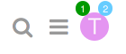
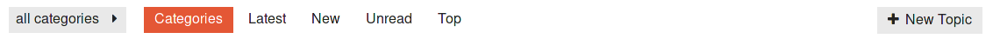
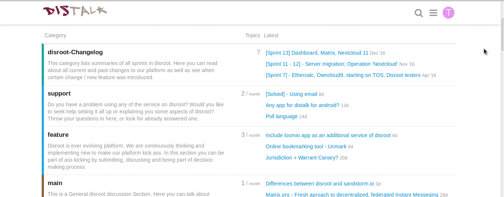
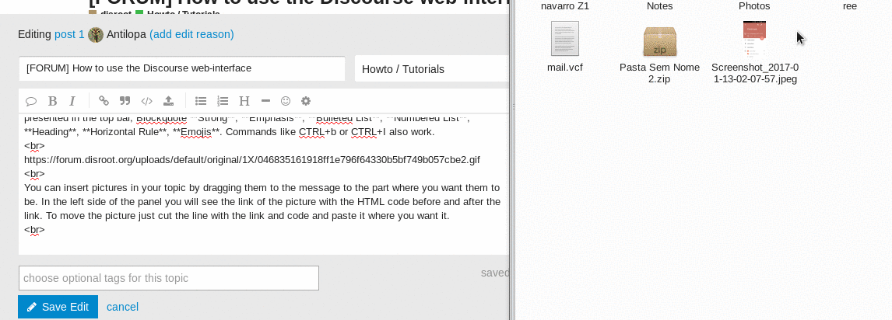
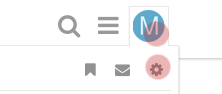

# Discourse Forum

Das Discourse Forum bietet Dir eine einfache und intuitive Benutzeroberfläche. Selbst wenn Du Discourse hauptsächlich als Mailingliste benutzt, schlagen wir Dir vor, dass Du die Weboberfläche ausprobierst, um die hervorragende Nutzerfreundlichkeit zu erleben. Hier ein paar Tipps für einen gelungenen Start:


# Erste Anmeldung
Im Forum kannst Du Dich mit Deinem Discourse-Account oder Deinem All-in-One Disroot-Account anmelden, wenn Du einen hast.
Gehe zu [https://forum.disroot.org](https://forum.disroot.org/) und klicke auf  {.inline} in der oberen rechten Ecke.

!! Wenn Du einen Disroot-Account hast, achte darauf ***Login with disroot account*** auszuwählen, bevor Du Deine Zugangsdaten eingibst.

Wenn Du bis jetzt noch keinen Account hast, empfehlen wir Dir selbstverständlich, Dich auf [https://user.disroot.org](https://user.disroot.org) zu registrieren. Du wirst es nicht bereuen, denn Du erhältst dadurch zusätzlich Zugriff auf einen Cloud-Speicher, ein Email-Konto, XMPP und ein Projekt-Board. Und das alles frei, kostenlos und dezentral. Du kannst Dich natürlich auch dafür entscheiden, einfach einen Account nur für das Forum zu erstellen - den ***Sign up***-Button findest oben rechts auf der Forums-Seite.

Grundsätzlich ist ein Disroot-Account zunächst nicht in Discourse aktiviert. Daher musst Du Deinen Account erstmal aktivieren oder, sagen wir, einen Discourse-Account mit Disroot verbinden, wenn Du Dich zum ersten Mal einloggst. Klicke auf ***Log in with Disroot*** und gib im folgenden Formular Deine Disroot-Anmeldedaten ein. Achte hierbei darauf, Deinen **Account-Namen** und nicht Deine **Email-Adresse** eingibst. Nachdem Dein Disroot-Account verifiziert wurde, wirst Du wieder auf die Login-Seite des Forums weitergeleitet. Dort findest Du allerdings nun Deine Disroot-Emailadresse in dem vorhandenen Feld. Klicke jetzt auf ***Create New Account*** und Du kannst loslegen.

# Das Menü
Oben rechts findest Du die Bedienelemente für die Suche und Deine persönlichen Einstellungen:



Klicke auf Dein Benutzer-Icon (Der erste Buchstabe Deines Namens, solange Du Deinen Avatar nicht geändert hast), um Deine Nachrichten und Benachrichtigungen zu sehen. Hier kannst Du auch auf Deine persönlichen Einstellungen zugreifen und Deine persönliche Benutzerseite sehen.

Die kleinen Zahlen oben auf Deinem Avatar zeigen Dir, wie viele Benachrichtigungen (rechts) und Nachrichten (links) auf Dich warten. Wenn Du auf Deinen Avatar klickst, wird darunter eine Liste mit allen ungelesenen Nachrichten und Benachrichtigungen geöffnet. Du kannst auch über das Icon  {.inline} auf Deine Nachrichten und Benachrichtigungen zugreifen.

Klicke auf Deinen Avatar und dann auf das Icon  {.inline}, um zu Deinen persönlichen Einstellungen zu gelangen. Dort kannst Du Deinen Avatar ändern, die Regeln für Benachrichtigungen anpassen, Deine angezeigten Kategorien einstellen und vieles mehr.

# Navigation
Wenn Du Dich zum ersten Mal im Forum anmeldest (und jedes mal, wenn Du auf das Icon  {.inline} klickst, um auf die Startseite zurückzukommen), wird Dir eine Liste der Kategorien angezeigt, denen Du folgst. Kategorien entsprechen in Discourse Unterforen. Wenn Du Mitglied einer privaten Forengruppe bist, werden die Kategorien dieser Gruppe als erstes aufgeführt. Die öffentlichen Kategorien findest Du darunter. Weitere Informationen, wie Du ausgewählten Kategorien folgen oder sie verstecken kannst, werden in naher Zukunft in einem anderen Tutorial veröffentlicht.



Die Menüleiste am Kopf der Seite ermöglicht es Dir, schnell zu den aktuellsten, neuen, ungelesenen und aktivsten Beiträgen zu navigieren. Außerdem kannst Du mit Hilfe des Buttons  {.inline} filtern, welche Kategorien Du sehen möchtest. Ganz rechts findest Du einen Kartenreiter, mit dem Du eine neue Diskussion (Thread) erstellen kannst.

Die aktuellsten Themen werden Dir auch auf Deiner Startseite, rechts neben den Kategorien, angezeigt. Wenn Du ein Thema öffnest, wirst Du zum nächsten ungelesenen Beitrag weitergeleitet.

# Einfach weiterscrollen

Befindest Du Dich erstmal in einem Thema, kannst Du nach unten scrollen, um Dir alles durchzulesen. Es gibt keine "Nächste Seite"-Buttons oder Seitenzahlen - um weiterzulesen, einfach weiterscrollen!

Wenn neue Beiträge veröffentlicht werden, erscheinen diese automatisch.

# Auf Beiträge antworten

Um allgemein auf eine Diskussion zu antworten, klicke auf den Button  {.inline} ganz unten auf der Seite.

Um auf einen bestimmten Beitrag zu antworten, benutze den Button  {.inline} in diesem Beitrag.

Um ein Zitat einzufügen, markiere den Text, den Du zitieren willst, und klicke auf einen der Antwort-Buttons. Um mehrere Zitate einzufügen, wiederhole das Ganze!

Um einen anderen Benutzer über Deine Antwort zu benachrichtigen, erwähne den Namen des Benutzers in Deinem Beitrag. Tippe @, um die Auswahl des gewünschten Benutzernamens zu starten

Außerdem kannst Du einen Beitrag "liken", teilen, markieren oder mit einem Lesezeichen versehen.


# Ein neues Thema erstellen

Du kannst ein neues Thema in einer Kategorie (Howtos, Support, Changelog, etc.) erstellen, indem Du entweder in die Kategorie gehst und dort auf den ***New Topic***-Button  {.inline} klickst, oder indem Du einfach auf den ***New Topic***-Button klickst und in der **Compose Topic/Message**-Ansicht die Kategorie auswählst, in der Du das neue Thema erstellen willst. Neue Themen müssen mindestens 8 Zeichen in der Bezeichnung und 10 Zeichen im Beitragsinhalt aufweisen, ansonsten werden die Daten nicht gesendet.



# Die Benutzeroberfläche

Die Benutzeroberfläche ist relativ einfach.


Discourse unterstützt Markdown und Html um Themen zu erstellen. Auf der linken Seite der Ansicht schreibst Du Deinen Beitrag, auf der rechten Seite kannst Du in der Vorschau sehen, wie Dein Thema später dargestellt werden wird.


Keine Sorge, Du musst jetzt nicht Markdown und Html lernen, um ein Thema zu erstellen. Du kannst auch einfach die Formatierungsoptionen nutzen, die Du in der oberen Menüleiste findest: **Blockquote** (als Zitat formatieren), **Strong** (fett), **Emphasis** (kursiv), **Bulleted List** (Aufzählungszeichen), **Numbered List** (Nummerierun), **Heading** (Überschrift), **Horizontal Rule** (Horizontale Linie), **Emojis**. Kommandos wie Strg+b oder Strg+i funktionieren selbstverständlich auch.


## Bilder und Videos einfügen

Du kannst Bilder in Deinem Thema einfügen, indem Du sie einfach in die Nachricht ziehst und dort platzierst, wo Du sie haben möchtest.



Ein Video kannst Du auf die selbe Weise einfügen.

## Dateien zu Deinem Thema hochladen

Du kannst Dateien hochladen, indem Du den ***Upload***-Button anklickst und dann in dem sich öffndenden Fenster die gewünschte Datei suchst und auswählst.


## Dateien, Bilder und Videos innerhalb der Nachricht verschieben

Dateien, Bilder und Videos werden auf der linken Seite des Bildschirms (wo der ganze Code steht) folgendermaßen dargestellt:


**Dateien**
```
<a class="attachment" href="/uploads/default/original/1X/ffd8f38b235dbf199a919f0187ae63a183d22ada.odt">hello world.odt</a> (8.0 KB)
```
**Bilder**
```

```
**Videos**
```
https://forum.disroot.org/uploads/default/original/1X/59b17ec97a8daabcb96a787b4900f3d3221083da.mp4
```
Um sie zu verschieben, schneide einfach die entsprechende Code-Zeile aus und füge sie an der gewünschten Stelle wieder ein. Bei Bildern kannst Du zusätzlich noch deren Größe anpassen, indem Du in der entsprechenden Codezeile die Werte für "height" (Höhe) und "width" (Breite) veränderst.

## Schlagworte definieren

Das Hinzufügen von Schlagworten macht es den Beteiligten leichter, nach Themen oder Diskussionen zu suchen. Das Hinzufügen von Schlagworten ist wirklich einfach.


Wenn Du mit der Erstellung Deines Themas fertig bist, klicke einfach auf ***Create Topic*** 

# Kategorien beobachten oder stumm schalten

In Discourse kannst Du den Nachrichtenstrom, den Du über das Forenboard oder per Email erhältst, sehr gut regulieren. Du kannst Kategorien oder Unterkategorien je nach Interesse stumm schalten oder beobachten. So kannst Du sicherstellen, dass Du immer Benachrichtigungen und Emails von jedem Beitrag in den Kategorien und Unterkategorien erhältst, an denen Du interessiert bist, ohne von für Dich uninteressanten Mitteilungen überflutet zu werden.

Wenn Du eine Kategorie stumm schaltest, schaltest Du automatisch auch alle zugehörigen Unterkategorien stumm, es sei denn, Du wählst eine bestimmte Unterkategorie zur Beobachtung aus. Wenn Du eine Kategorie oder Unterkategorie stumm schaltest, kannst Du immer noch ganz normal darauf zugreifen. Du bekommst einfach keine entsprechenden Emails oder Benachrichtigungen.

Die derzeitigen Kategorien und Unterkategorien im Disroot-Forum sind (englisch):

* disroot
 * disroot-Changelog
 * support
 * feature
 * main
 * FAQ
* Open Talks
* TOFU
* Engineering Yuvasamithi

Der beste Weg, um Kategorien zu beobachten/stumm zu schalten führt über Deine Präferenzen. Hier kannst Du von einem einzigen Ort aus all Deine gewünschten Beobachtungen und Stummschaltungen festlegen.



Scroll einfach runter bis zu **Categories**, dort findest Du Felder für **Mute** und **Watched**.Trage die gewünschten Kategorien in das jeweilige Feld und klicke auf ***Save Your Setting***, um die Einstellungen anzuwenden.


Die andere Möglichkeit besteht darin, einzeln zu jeder Kategorie oder Unterkategorie zu navigieren und dort die jeweilige Präferenz festzulegen, indem Du den Button rechts neben ***New Topic*** anklickst 


----------

 Mehr hilfreiche Tipps findest Du im [Discourse Willkommensgruß](https://forum.disroot.org/t/welcome-to-discourse)
