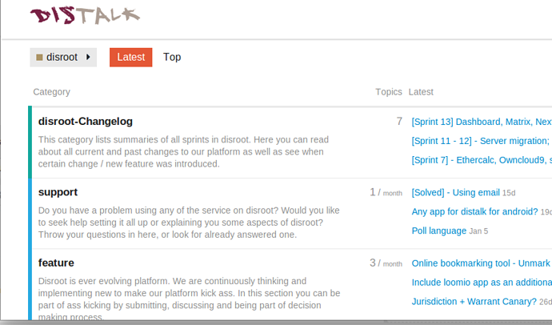
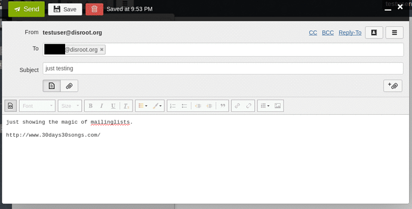
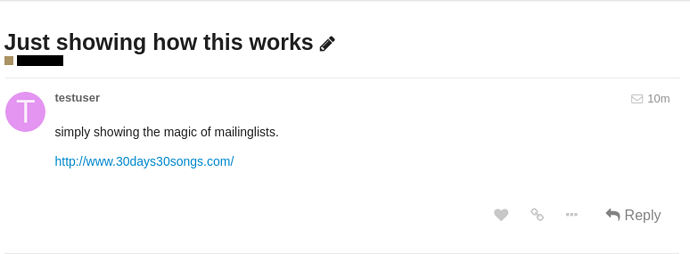
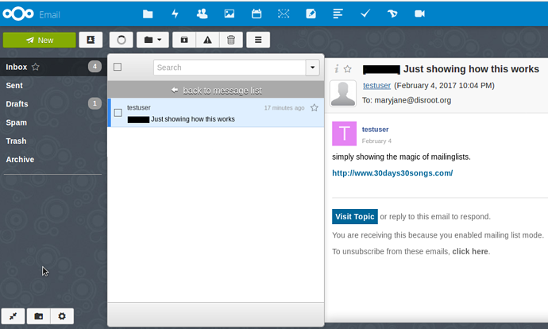
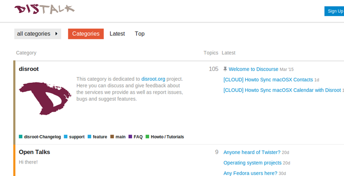

# Discourse Mailingliste

In diesem Tutorial wollen wir Dir zeigen, wie Discourse als Mailingliste für Organisationen/Gemeinschaften/Projekte eingesetzt werden kann.

Disroot hosted hauptsächlich private Forengruppen. Wenn Du an einer interessiert bist, schreib uns einfach eine Nachricht.

!! 
!! WICHTIG: Um ein Mitglied einer Gruppe (öffentlich oder privat) zu werden, benötigst Du nicht zwingend einen Disroot-Account (obwohl dieser Dir natürlich noch viel mehr Vorteile bringt). Es reicht aus, wenn Du Dir einen Account für das Forum erstellst.

# Wie Mailinglisten in Discourse funktionieren

Discourse, die Software, die von Disroot genutzt wird, ist eine Foren-Software mit Mailinglisten-Funktionalitäten. Es gibt dort Einteilungen, die wir für dieses Tutorial **Gruppen** nennen. Diese Gruppen können **Kategorien** haben, oder auch nicht (stell sie Dir als Fachgebiete oder übergeordnete Themen vor).  
Die Disroot-Gruppe zum Beispiel hat mehrere Kategorien, die verschiedenen Themenbereichen gewidmet sind, um Diskussionen zu organisieren und den Nachrichtenaustausch zwischen Benutzern zu ermöglichen:

Jeder Gruppe und jeder Kategorie kann ein Email-Alias zugeordnet werden, das als Adresse für eine Mailingliste steht. Diese Adresse kannst Du nutzen, um ein Thema in dieser Gruppe oder Kategorie per Email (Webmail oder Client) zu erstellen.

Mitglieder dieser Gruppe erhalten eine Benachrichtigung über dieses Thema in ihrem Nachrichteneingang und/oder in ihren Emails

und können auf das Thema über das Forum oder per Email antworten, ganz so wie sie das bevorzugen.

Damit haben wir ein System, das durch Foren-Fans und Fans von Mailinglisten gleichermaßen und, vor allem, gleichzeitig genutzt werden kann.

Du kannst eine Gruppe erstellen mit nur einer Kategorie und einem zugeordneten Email-Alias. Oder, wenn es sich um eine größere Zusammenarbeit handelt, mit Arbeits- und Projektgruppen, kannst Du Dir auch eine Gruppe anlegen mit verschiedenen Kategorien, jede einzelne mit einem eigenen Email-Alias, die als eigene Mailingliste arbeitet. Zum Beispiel so etwas wie das hier:

 * **Group** (Organisation/Projekt/Gemeinschaft)
   * **Main/General/Assembly**
Email Alias: **assembly_group@disroot.org**
  * **Category1**
Email Alias: **category1_group@disroot.org**
  * **Category2**
Email Alias: **category2_group@disroot.org**
  * **Category3**
Email Alias: **category3_group@disroot.org**

 
Das oben beschriebene System hat zwei hauptsächliche Vorteile:

1. Wenn Du Teil eine(r/s) Organisation/Gemeinschaft/Projekts mit Arbeitsgruppen und vielen Themengebieten bist, kannst Du die Diskussionen der Arbeitsgruppen oder Themengebiete voneinander trennen anstatt sie alle in einer einzigen Mailingliste zu vermischen.

2. Indem es Nutzern des Forums (allgemein) - und in diesem speziellen Fall Mitgliedern der Gruppe - möglich ist, die Kategorien auszuwählen, von denen sie Benachrichtigungen und Emails erhalten wollen, können die Gruppenmitglieder Kategorien, an denen sie nicht interessiert sind, filtern, anstatt von einem Strom an Mitteilungen in ihrer Mailbox überrollt zu werden.

Diese Einstellungen können jederzeit geändert werden und die Mitglieder einer Gruppe/Mailingliste können jederzeit über die Web-Benutzeroberfläche vollen Zugriff nehmen auf den vollständigen Inhalt aller Kategorien, selbst wenn sie diese nicht für Email-Benachrichtigungen ausgewählt haben.
Mehr über das Beobachten und Stumm schalten von Kategorien findest Du [hier](https://howto.disroot.org/en/forum/basic-usage), wenn Du möchtest.

Die Namen der Gruppe und der Kategorien sowie der zugeordneten EMail-Aliase kannst Du frei wählen (solange sie nicht bereits vergeben sind).

# Private Gruppen/Mailinglisten

Private Gruppen/Mailinglisten funktionieren genauso wie oben beschrieben mit dem Unterschied, dass sie, wie der Name sagt, **privat** sind und nur durch die Gruppenmitglieder gesehen und bearbeitet werden können. Du kannst auch nur dann eine Email an diese Gruppe senden, wenn Du ein Mitglied bist.
Um das zu darzustellen haben Private Gruppen ein Vorhängeschloss als Symbol  {.inline}. Wenn Du Dich im Forum anmeldest, findest Du die Privaten Gruppen, in denen Du Mitglied bist, ganz oben in der Gruppenliste.

Benutzer, die kein Mitglied in einer Privaten Gruppe sind, sehen nicht mal, dass diese private Gruppe existiert.
Jetzt siehst Du mich:

Jetzt siehst Du mich nicht:

## Mitglieder zu einer privaten Gruppe hinzufügen

Es gibt zwei Möglichkeiten, Mitglieder zu einer Privaten Gruppe hinzuzufügen:

1. Der/die Besitzer der Gruppe können Benutzer individuell hinzufügen. DIeser Weg hat zwei Nachteile: Erstens müssen die Benutzer einzeln hinzugefügt werden. Zweitens müssen die Einstellungen jedes Benutzers einzeln manuell festgelegt werden (z.B. Stummschaltung anderer, Öffentlicher Gruppen im Disroot-Forum, damit die Mitglieder keine Nachrichten bekommen, die sie nicht haben wollen oder sollen).

2. Die Disroot-Administratoren können Masseneinladungen an alle Mitglieder versenden und dabei deren Account vorkonfigurieren, damit sie keine Emails von anderen, öffentlichen Disroot-Gruppen erhalten (z.B. Tutorials, Support, etc.).

# Öffentliche Gruppen/Mailinglisten

Öffentliche Gruppen funktionieren im Großen und Ganzen wie oben beschrieben. Der hauptsächliche Unterschied zu privaten Gruppen ist folgender:

Sie sind öffentlich. Das bedeutet, dass jeder Benutzer des Forums ihre Diskussionen lesen und über die Web-Benutzeroberfläche Beiträge schreiben kann (oder sogar per Email, wenn eine Email-Adresse zugeordnet ist). Die Gruppe kann außerdem von Menschen im Internet gesehen werden, die keine Nutzer des Forums sind. Die Gruppen können sogar in Ergebnissen von Suchmaschinen wie Google auftauchen.

# Die Öffentlichen Disroot-Gruppen

Den Öffentlichen Kategorien des Disroot-Forums (das heißt: FAQ, Features, Changelog, Main, Howto / Toturials, Open Talks, etc.) sind keine Email-Aliase zugeordnet. Es ist also nicht möglich, ein Thema in diesen Kategorien per Email zu erstellen.

Du kannst lediglich per Email antworten, wenn Du eine Nachricht in Deine Mailbox bekommst.
