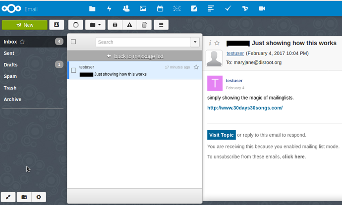
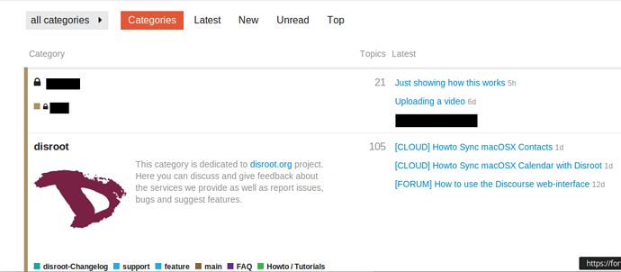
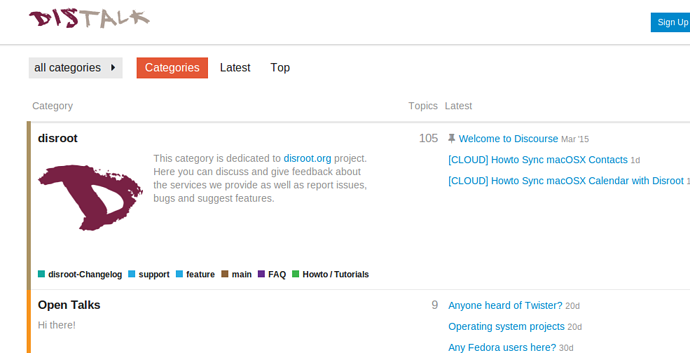

In this tutorial we will show how Discourse can be used as a mailinglist for Collectives/Associations/Projects.

Disroot, mainly hosts private forum groups. If you are interested in one, drop us a line.

**NOTE:** To be able to be a member of a Group (Public or Private) you don't need to have a Disroot account. You can create forum only accounts.

----------
# How mailinglist works in Discourse

Discourse, the software used by Disroot, is a Forum software with mailinglist functionalities. It has what we for this tutorial call **Groups**. And those Groups can have or not **Categories** in them (think of them as subjects or main topics).
As an example, the Disroot Group has several Categories dedicated to different subjects to organize discussions and exchange messages between users:

These Groups and each Category in them can be assigned an email alias that works as an address for a mailinglist, that you can use to create a topic via your email (webmail or client) in that Group/ or Category.

Members of that Group receive a notification of that topic in their message board in their emails.

And are able to reply to that topic via the message board or by email, as they prefer.

This creates a system that can be used both by mailinglist fans and Forum fans.

You can have a Group with only one category and one email alias assigned to it. Or if it's a large collective, with workgroups, you can have a Group with several categories each one with a different email alias and working as a mailinglist of it's own, something like this:

> * **Group** (Collective/Project/Association)
>  * **Main/General/Assembly**
>email alias: **assembly_group@disroot.org**

>  * **Category1**
>email alias: **category1_group@disroot.org**
>  * **Category2**
>email alias: **category2_group@disroot.org**

>  * **Category3**
>email alias: **category3_group@disroot.org**

 
The system described above has two main advantages:

1. If you are a part of a collective/association/project with workgroups or lots of subjects, you can divide the discussion of the workgroups or subjects by the different categories instead of having them all mashed together in one single mailinglist.

2. Since it's possible for users of the Forum (in general) - and in this specific case, members of the Group - to select the categories of which they want to be notified and receive emails from, members of a Group can filter the Group's Categories they are not interested in, instead of being hit by a stream of messages in their mailbox.

Those settings can be changed at any time, and members of a Group/Mailinglist can always access the full content/messages of all Categories in the Forum's web interface, even those they have selected not to receive in their email.
You can read more about watching and muting categories [here](https://howto.disroot.org/en/forum/basic-usage) if you want.

The name of the Group and of the Categories, and corresponding email aliases, can be whatever you like (unless their already taken).

----------
# Private Groups/Mailinglist

Private Groups/Mailinglists work as described above, but like the name says they are private and can only be seen and accessed by the group's members. You can only send an email to this group if you are a member.

Private Groups can be seen and accessed only by group members in the Forum's web-interface, and have a padlock symbol . When you log in to the in the Forum, the categories of the private groups that you are a member of show up at the top.

People that are not members of the Group cannot even see that the private Group exists.
Now you see me:

Now you don't:

## Adding members to the private group

There are two ways to add members to a Private Group:

1. The owner(s) of the Group can add users individually. But this has two inconveniences, the users are added one by one, second you need do the settings of each user manually (i.e: mutting other public groups in the Disroot Forum so that the members don't receive mails from Disroot that they don't want.

2. The Disroot admins can send bulk invitations to all the members in one single moment and preconfigure their accounts so that they don't receive emails from other Disroot public Groups (e.g: Tutorials, Support, etc.)

----------
# Public Groups/Mailinglist

Public Groups work as described in above so far. The main difference from private Groups is that:

They are public, and any of the Forum users can see it's discussions, and make a post there via the Forum Web-interface (or by email if an email address is assigned). They can also be seen by people on the internet, that are not users of the Forum and can show up in results from search engines like google.

----------
# The case of Disroot's public Groups

The Disroot Forum public Categories (i.e, FAQ, Features, Changelog, Main, Howto / Toturials, Open Talks, etc.) don't have email aliases assigned to them so you cannot create a topic in those Categories via email.

You can only reply to them via email when you receive a post in your mailbox.

----------
