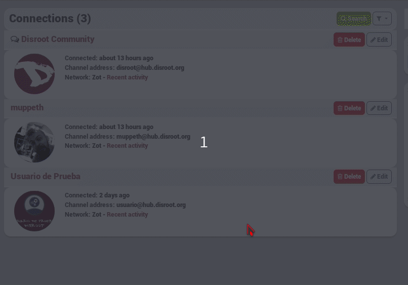

## What does ignore a channel do?
When you ignore a channel, this channel can see your posts if it has permission (and if the post you write is also accessible for that channel, for example if you make it public).

But you won't see anything that this channel will post in your network stream, and it won't be allowed to write on your channel (wall or @mention)

## How do I ignore a channel?
To ignore a channel you visit [your connection page](https://hub.disroot.org/connections), from here you select the **edit** button of the channel you want to ignore. Then **Connections tools** and from the drop-down menu **Ignore**.

You can undo the ignore in the same way you ignored a channel.

