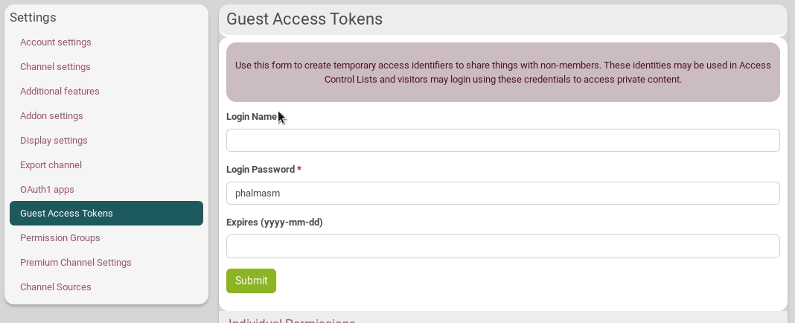

### What is it?
Guest access tokens (sometimes called "Zot access tokens") allow you to share a file, folder, photo, channel, etc., with a specific person or group of people **who are not Hubzilla members**.

These tokens allow you to share individual items by sending a link that includes the token in the URL; alternatively, people can actually log in using the token credentials, after which they can seamlessly view whatever content has been shared with that token.

[More details can be found here...](https://hub.disroot.org/help/en/feature/access_tokens)

### How to create a guest access token?
To create and manage guest tokens, go to **Settings** page and open the **Guest Access Tokens** tab.

Enter a **Login Name**. You can change the **Login Password** if don't want the one automatically attributed (**warning: it is the access token, it will be included in the URL you will later share**). You can set an **expiration date** in the form of "YYYY-MM-DD" but that's optionnal. When you're done, click on *Submit*

### Set or change permissions
Additional permissions may be granted to the guest token by expanding the **Individual Permissions** options when you create the guest access token. Check or uncheck the permissions you want to grant, then click on *Submit*.

Some can't be changed: they are inherited from the chanel role you chose.

Existing tokens are listed below the dialog and can be edited by selecting them. The form is automatically filled in. Click on the **Individual Permissions** options and check or uncheck the permissions you want to grant/ungrant.

You can also change its login name, password and expiration date.

### How to delete it?
You can delete an existing token by pressing the trash icon next to its name at the bottom of the page.

### How to use a guest access token?
Any tokens you have created are added to the Access Control List selector and may be used anywhere that **Access Control Lists** are provided.

Imagine you want a visitor (named "test") to be able to write to your wiki pages.
1. You set this permission in the **Guest Access Tokens** tab as previously explained. 
2. You go on your wiki. Fill in the needed information in order to create a wiki. Click on the lock icon to open the Access Control List.
3. Choose **Custom selection** and click on *Show* for the "test" user. You can now close the Access Control List.
4. Your visitor can now login to your channel, go to wifi page and edit the created wifi.

Alternatively, you may share a **direct link** to the wiki (for this example, but that can be with files, photos, etc.) by **adding a parameter "?f=&zat=abc123" (or "&zat=abc123" which is the same but with less compatibility) to the URL**, where the string "abc123" is the access token or password for the temporary login. In our wiki example that could be something like: https://hub.disroot.org/wiki/meaz&zat=tertonti

No further negotiation is required, and the wiki is presented. You can see an example at the bottom of the **Guest Access Tokens** page:

