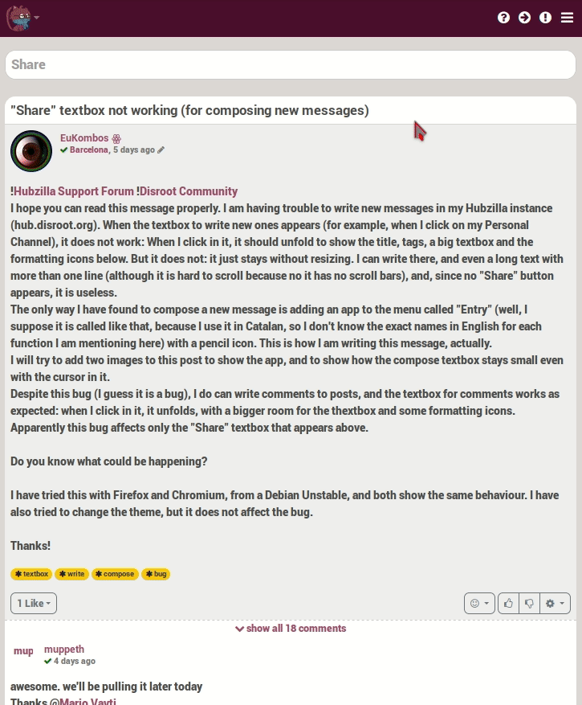

# User Interface Overview

After logging in, filled out your profile and created a channel, this is, almost for sure, how your channel will look like:

Yes, it doesn’t look much pretty, huh? But, don’t get into a daze, by the end of this overview, you should be able to make your channel looks more like this...

…(or even better) and know where are the most important tools and features, what are they for and what the possibilities of each one of them. And that would be just the beginning.

Let’s start by knowing the spaces our new home first. Later you could decorated whatever you want.

For the purpose of this tutorial we will name the parts, or blocks, of the User Interface (UI) in order to identify them later.

 

01. **Navigation bar**: From here you access to your personal settings, the menu, the network and public streams, apps, the directory, wikis, the chat, etc. It is very customizable, and it functions like a shortcut and launch applications bar. [To know more about it...](../Navigation_bar)

02. **Profile section**: Here there’s some basic information about your channel, like your name and hub address. You can add more info if you want. [To know more about it...](../../02.Channels/02.Profiles)

03. **Share box**: The place where you write and share your thoughts, things you like, your photos, compose articles, etc. By clicking on it the post compositor opens. It’s a very well-suited editor to compose and edit your post or shares. [To know more about it...](../../05.Posts)

04. **Activity Notifications**: It informs you about what is happening in the network stream, in the public stream and if you received a connection request, a mail, if someone commented a post you’ve created or a post that you’ve been following. We’ll see about it later.

05. **Connections**: Here you can see some of your connections (those you interact the most) and the common connections you may have with other users while visiting a channel. [To know more about it...](../../03.Connections)

06. **Channel stream**: It works like the “wall” of most social networks, it’s the place where you see your posts, the comments on them (if they’re enable), the posts you’ve re-shared, and those from the people you’ve give permissions to write on it, the posts of your connections. [To know more about it...](../../05.Posts)

07. **Right side widgets**: This space can be used not only as a widget section, but almost anything you want to have accessible (information, apps, notes, sites, shortcuts, etc, as we’ll see later) can be setted to appear in this place.

!! 
!! NOTE: On the mobile version, the sidebars are hidden. If you want to show the left sidebar you have to click on the arrow icon. 

 

The right bar is limited to activity notifications only. If you want to see the notifications, click on the exclamation point icon. 

 
