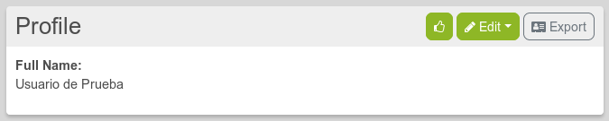

# Navigation bar

Here is the navigation bar:

Here are some of the important icons you need to understand:
1. Profile: 
2. Home Channel: 
3. Network stream: 
4. Public stream: 
5. Connections: 
6. Directory: 

**Note:** On mobile pinned apps are hidden and only accessible through the hamburger menu on the right 

 **Profile**: By clicking on it, you access to view and edit your profile, your channel manager, the general settings and to log out.

## 1. Profile: 
A profile is a collection of information about yourself so you can have different profiles depending on the data you want to share with different users or groups. For example: your public or default profile (which is always available to the general public and can’t be hidden) is GNU/Linux and FOSS related. You set the permissions and establish connections with those who may share those interests. But if you have your group of friends that don’t care about that much, and you don’t want to bore them with it, you can create a new profile with a new set of permissions called “friends”, that allow its members access only to another kind of information.

When you click on the profile icon, you have access to different options.

### View Profiles
Clicking on “View profile” you’ll see your public profile with the information you has submited, such as your name and tags. You can edit this public profile by clicking on the Edit option at the right of the profile title bar.
(See Profiles Settings for more information about configuration)

[To know more about profiles and the available options...]((../../02.Channels/02.Profiles))

### Edit Profiles
Here you can see your default and created profiles if there any or create new ones.
(See Profiles Settings for more information about creating and managing profiles)
[To know more about profiles and the available options...]((../../02.Channels/02.Profiles))

### Channel Manager
From here you can manage your channels and create new ones. 
**Note: Channels are different from profiles.** 
**A profile** is a collection of information about yourself so you can have different profiles depending on the data you want to share with different users or groups. For example: your public or default profile (which is always available to the general public and can’t be hidden) is GNU/Linux and FOSS related. You set the permissions and establish connections with those who may share those interests. But if you have your group of friends that don’t care about that much, and you don’t want to bore them with it, you can create a new profile with a new set of permissions called “friends”, that allow its members access only to another kind of information. 
**A channel**, on the other hand, it’s the space on the web that contains collections of content stored in one place, that’s the stream (will see that later). What kind of content? Well, that’s exactly the point of it. You can create different channels for different kinds of content and specifies whose of your contacts or public can see it. In other words, a profile is information about you and a channel is the space where specific information it’s gathered and showed up.

Click on the **Channel Manager** to access its options.

From here you can create and switch between channels. The process to create a channel it’s the same as when you create your first one.

[To know more about channels and the available options...](../../02.Channels)

### Settings
By clicking on it, you will access to the Account, Channel, Features settings and other configurations.

!!! The settings options are on the left sidebar. So if you want to show the options on mobile you have to clikc on the arrow icon in the nav bar. 

##### Account settings
In the **Account settings** you can change your email address, your password and set Your **technical skill level**. Every level sets different user features according to what you expect or want to do. By default, DisHub skill level is **4. Expert**, in orden to provide most of the features available.

There are five levels. From level 1 on, each one of them progressively enables Additional features.
0. Beginner/Basic
1. Novice - not skilled but willing to learn
2. Intermediate - somewhat comfortable
3. Advanced - very comfortable
4. Expert - I can write computer code
5. Wizard - I probably know more than you do

##### Channel settings:
This is one of the most important settings. These howtos will refer to it a lot.

## 2. Home Channel: 
It works like the “wall” of most social networks, it’s the place where you see your posts, the comments on them (if they’re enable), the posts you’ve re-shared, and those from the people you’ve give permissions to write on it.
Everything is already pretty well explained [here](../01.Basics)

## 3. Network stream: 
It looks a lot like the **Home Channel**. Except that here, you see not only your posts and comments, but also the posts and comments of your connections, if you allowed them to.

You can filter those posts in different ways.
1. You can use the Affinity tool bar  [More info about it](../../07.Features/01.Connection_filtering)
2. You can click on the different tabs.

## 4. Public stream: 
Here, you can see ANYONE posts and comments published in the fediverse, so any Hubzilla, Mastodon, Diaspora, etc., servers.

You can filter those posts by clicking on the cloudwords in **Trending**.

You can also use the **search box** to look for a tag, an user, etc. 

## 5. Connections: 
It allows to see your connections and to edit them [Informations here](../../03.Connections)

## 6. Directory: 
It allows to see and search any channel on hubzilla (not just Dishub). To search a specific channel use the search engine on the upper left side of the directory page

