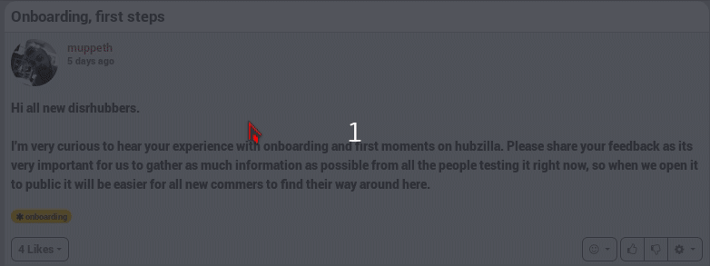

## What does block a channel do?
Well, lets say you don't want any contact with somebody, for example because this somebody spams you or because their comments just disturb you, or because you don't want hi/her to read your post. You can simply block that contact.

There are two way of blocking:
* Block a channel
 * This means that the channel will not be able to read any of your items, and he will also not be able to write to your channel. Good to know is that it doesn't matter with what permission you post something, that channel will still be unable to see your activities.  
* Block completely a channel
 * It's like blocking a channel but it also make that you won't even see that channel (not only in your stream, but even you would go on the channel page). It's like the channel doesn't exist anymore. Except if that channel post something for example on a forum and you are also connected to that forum. You won't see his posts on your channel but you will see them if you are visiting the forum page. **TO BE CHECKED: I'm almost sure you don't see it even in a forum!**

## How do I block a channel?  
### Block a channel
This means that the channel will not be able to read any of your items, and he will also not be able to write to your channel. Good to know is that it doesn't matter with what permission you post something, that channel will still be unable to see your activities.  

To block a channel you visit [your connection page](https://hub.disroot.org/connections), from here you select the **edit** button of the channel you want to block. Then **Connections tools** and from the dropdown menu **Block**.

You can undo the block in the same way you blocked a channel.

  

### Completely block a channel ("superblock")
It's like blocking a channel but it also make that you won't even see that channel (not only in your stream, but even you would go on the channel page). It's like the channel doesn't exist anymore. Except if that channel post something for example on a forum and you are also connected to that forum. You won't see his posts on your channel but you will see them if you are visiting the forum page. **TO BE CHECKED: I'm almost sure you don't see it even in a forum!**

If you want to completely block a channel you have to do it from a post or comment from within your channel.
For example from your activity page or public stream.  
There you click on the avatar of the channel you want to block an select **Completely Block**.
  

If you want to undo the completely block, you are not able anymore to see it anymore. So you need to use the superblock addon.  Go on your [settings page](https://hub.disroot.org/settings), select **Addon settings** and then click on **Superblock settings**. Now you click on the trash bin icon of the channel you want to unblock.

!!! on moblie the settings panel is hidden. To show the settings panel you gave to click on the arrow icon on the nav bar. 
