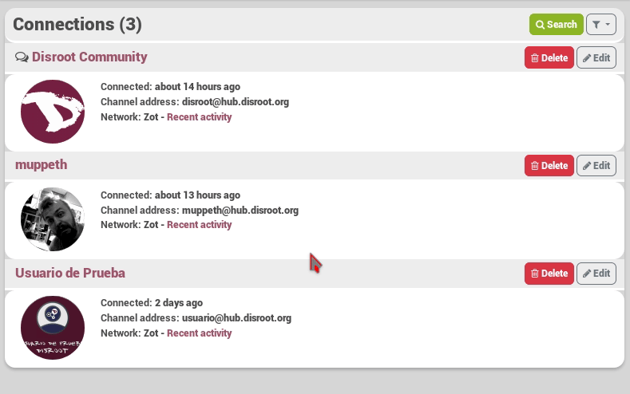
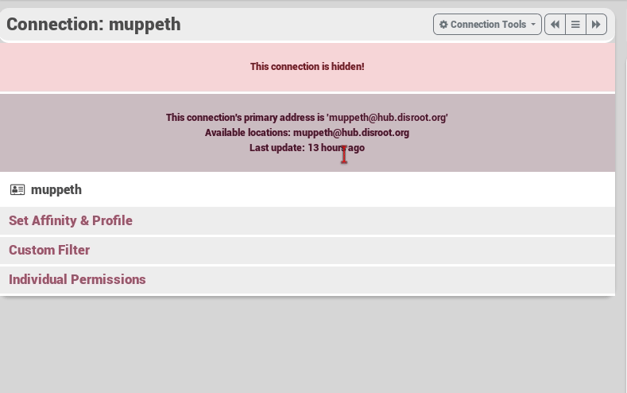

## What does hide a channel do?
If you don't want to show you are connected to a channel, you can choose to hide this connection to others. No one can see you're connected (the channel does not show up in your profile's connections list). But beware people may still show up to your other connections, for example if you get a comment on a post from that channel.  

See it like this. You hide someone in your closet, people who comes by don't see him/her. But if you say something and that person who is hidden reacts, others in the room will hear it. Otherwise, if you say something on a public place. Like for example while waiting in a waiting room, and you try to hide the fact that you are in contact with someone, even if that person comments something you said people can't now if it is a stranger for you or if you know him.

## So how do I hide a channel?
To hide a channel you visit [your connection page](https://hub.disroot.org/connections), from here you select the **edit** button of the channel you want to unarchive. Then **Connections tools** and from the dropdown menu **hide**.

You can unhide in the same way you've hidden the channel.

