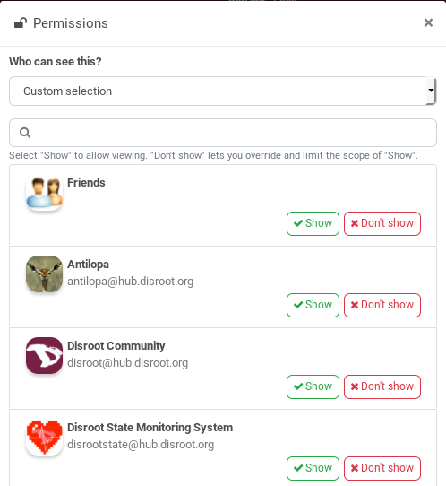

# Access Control List

## What is it?
Access Control List is the preferred method of managing privacy in most cases, rather than using permission limits. It is a set of additional permission that you may want to set for very specific items. Unlike permission limits, if you change the ACL on a single photo (for example), it doesn't affect any of your other photos.

An ACL is attached to everything you publish.

!!  
!! Important: Permission limits are more important than ACL. For example, Hubzilla checks "can someone see your files/photos" before it checks "can someone see *this* photo". And if the first check fails you'll never get to the second.
!!
!! If your permission limits for Peter grant Peter permission to view your photos, but you set an ACL on a photo that excludes Peter, then Peter can't see that photo.
!!
!! If the connection with Peter doesn't allow him to see your pictures, even if you use ACL to give him this permission, it won't work.
!!
!! Hubzilla will take the most restrictive approach.**

## How to use it?
When you open the ACL (usually by clicking on a lock icon  {.inline} next to *Submit*) this open a popup with a list of possible scope of permissions.

You have different choices:
1. **Public**: anyone can see / modify
2. **Friends**: only connections that are in your Friends privacy group can see / modify
3. **Only me**
4. **Custom selection**: you can choose on a per-connection basis who can see or modify.
5. **Guest Access Token**: This allows you to share a file, folder, photo, album, or channel with a specific person or group of people. They don't need to be Hubzilla members. You can set an expiration for the Access Token.
[See here for more information...](../guest_access_tokens)

!! 
!! NOTE: This list can be slightly different, depending of where you use the ACL.

If you choose **Friends** or **Custom selection**, you then have a list of your connection.

Just click on **Show** o **Don't show** for each connection to which to want to show or not show.
