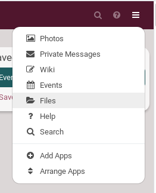
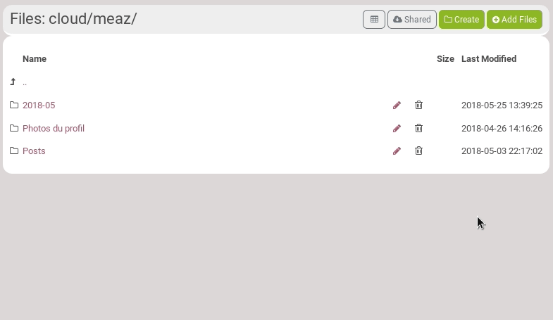
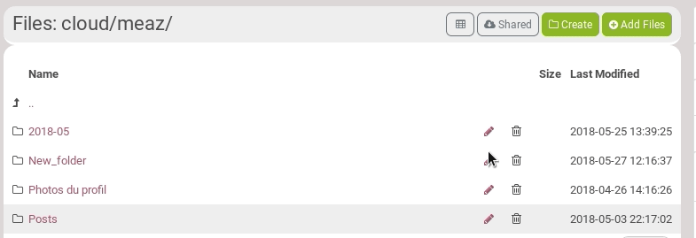
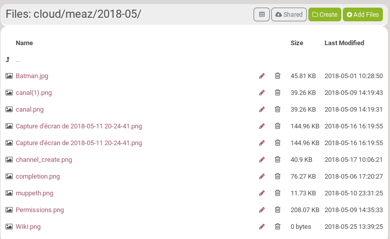
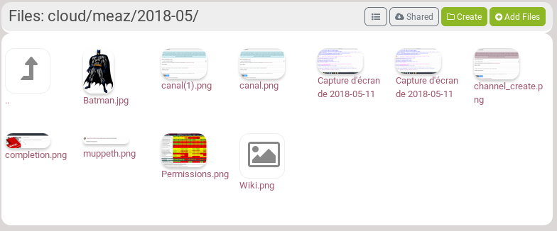
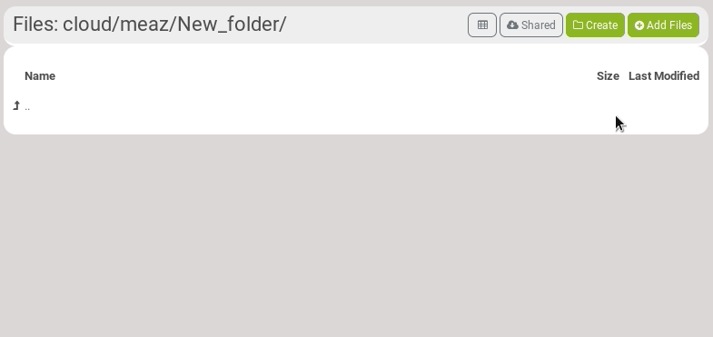
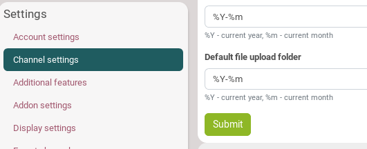

# Personal Cloud Storage

## What is it?
Hubzilla provides an ability to store privately and/or share arbitrary files with friends. You may either upload files from your computer into your storage area, or copy them directly from the operating system using the WebDAV protocol.

On DisHub, there is limit on disk usage. **TO BE COMPLETED**

Your files are visible to anybody who is allowed to view them.

# Web Access
To access you personal cloud storage, either go to https://hub.disroot.org/cloud/your_username  or click on the top_right hamburger menu and choose **Files**.

# Folders
## Create a folder
You can create as many folders as you want in order to organize your storage.
Just click on **Create**, give your folder a name and click on the **Create** button next to the lock icon.

You may want to change the viewing permissions of this folder by clicking on the lock icon. [To know more about permissions...](../../04.Permissions)

## Edit or delete a folder
You can delete a folder at anytime. Just click on the trash can icon:

You can also edit its permissions. Click on the pencil icon, then on the lock icon. Don't forget to *Submit*.

The **Include all files and sub folders** is important if you want to apply your permissions changes to all files and sub folders of the folder you just change permissions of.

**Important**: You can not change its name.

## Navigate through folders
If you want to go in a folder, just click on its name. If you want to go the parent folder, click on this icon

## Change the storage view
In the top-bar of the cloud page, you can change the storage view from **List** to **Grid**.

**The list view**:

**The grid view**:

# Files
## Add files
To add a file, go to the folder you want the file into and click on **Add files**. Click on the lock icon if you want to change the viewing permission. Then click on **Upload** to choose the file(s) you want to upload.

## Edit and delete files
You can delete a file at anytime. Just click on the trash can icon:

You can also edit its permissions. Click on the pencil icon, then on the lock icon. Don't forget to *Submit*.

The **Show in your contacts shared folder** will allow your shared file to appear in your contacts shared folder (according to the set permissions). You can access your own contact shared folder by clicking on **Shared** in the cloud page top-bar.

**Important**: You can not change your files name.

## Share a file
When you click on the pencil icon to edit a file, you have two sharing icons that appear: 
The first on is to share the file, the second one is to show the URL of this file.

# Upload permission
You may want to grand upload permission to some connections. They wil then have the ability to create new files and folders/directories.

The permission is called **Can upload/modify my file storage and photos**. To grand it, go on your connections settings. [To know how to set it, read the permissions section](../../04.Permissions)

!! 
!! NOTE: This should only be used for smaller files and photos (up to a few megabytes) as it uses internal memory. For larger files (videos, music, etc.), please upload using WebDAV. These files may still be retrieved via web access.

# File Attachments
## What is it?
There is a quickest and easiest way to share files: it is done through file attachments, when you write a post.

## How to attach files?
In the row of icons below the status post editor is a tool to upload attachments: 

Click the tool, select a file. After the file is uploaded, you will see an **attachment code** placed inside the text region. Do not edit this line or it may break the ability for your friends to see the attachment.

You can use the post **permissions dialogue box** or **privacy hashtags** to restrict the visibility of the file, which will be set to match the permissions of the post your are sending.

Click on **Submit** when you're done.

## The attached files default folder
An attached file is automatically added to a folder in your cloud. By default, the **default folder** in which so attached files are added is named according to the year and month when you post, so for example **2018_05**. But you can change that by going int your **Channel settings**, in the **Basic settings** tab. IN **Default file upload folder** change **%Y-%m** to whatever you want.

To delete attachments or change the permissions on the stored files, go to your cloud page, in this default folder.
