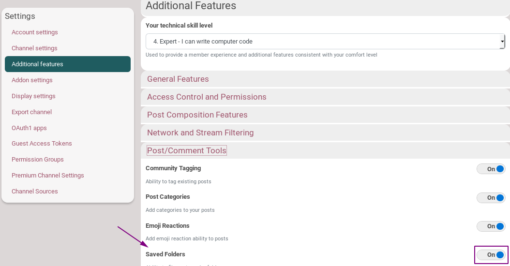
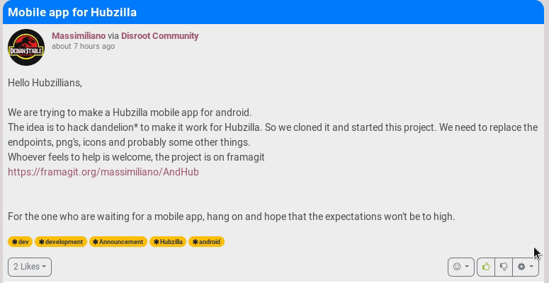
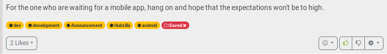
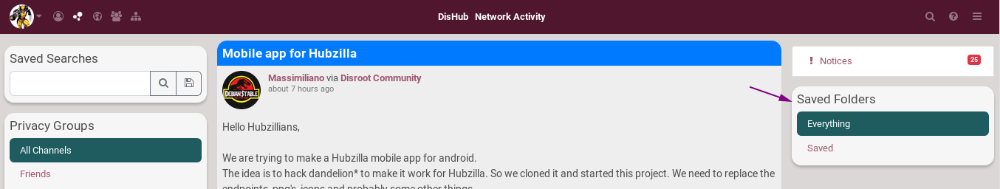

# Bookmarks

## What is it?
If you want to save a post because you want to read later or because you think you will need it later, you can **bookmark** it.

# How to activate the bookmark option?
Go to your **Channel settings**, in the **Additionnal features** section and in the **Post/Comment Tools** tab. Make sure that **Saved Folders** i set to **On**.

# How to bookmark a post?
It is pretty easy. Click on the post wheel, choose **Save to Folder**. You can create a new folder by simply writing its name. Or you can choose an existing folder by double-clicking the white space and selecting the folder you want to save to. Click on *Save*.

You now can see the word **Saved** at the bottom of the post, indicating that it is now part of your bookmarks.

# Where to see my bookmarks?
In your **Network activity** page, there is the **"Saved Folders" widget** on the right. There, you can see the folders of bookmarks you created. Just click on one of them to its bookmarks.

# How to remove a bookmark?
Next to the word **Saved** at the bottom of the bookmarked post you want to un-bookmark, there is a white cross. Simply click on it.

