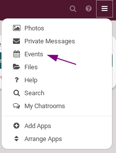
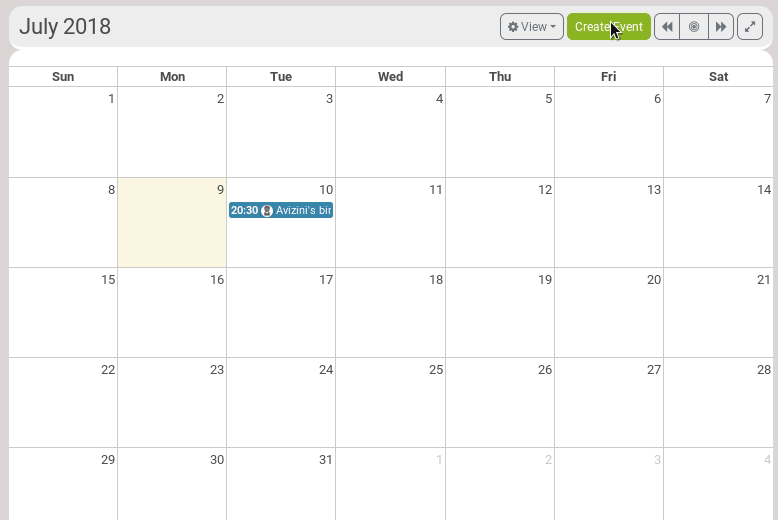
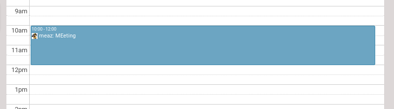
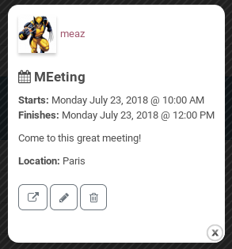
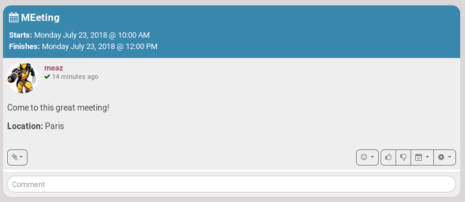
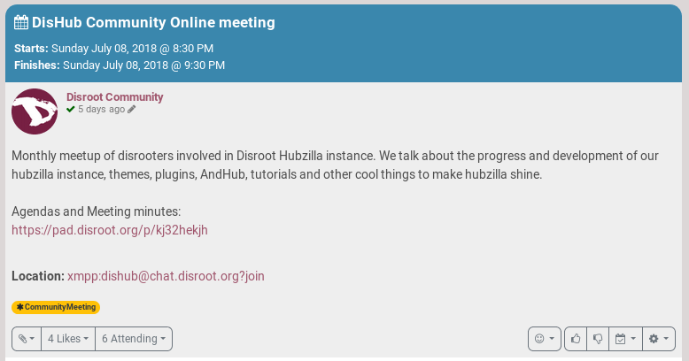
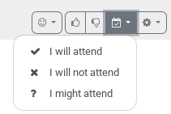

# What is it?
Well, it's pretty obvious what a Calendar is!

# How to see a calendar?
Click on the hamburger menu, and choose **Events** (or **Calendar**).

There, you have different options:

- **View:** how is the calendar displayed. It can be by month, by week or by day
- **Export Calendar:** you get a .ics file that you can save and import in an app or website that allows .ics file importation.
- **Import Calendar:** you can import a .ics file.
- **Arrows:** use them to move from month to month, day to day, etc.

# How to create an event?

Click on **Create Event**.

You then have several options. At the very least, you need to provide:
- An Event title
- A Start date and time

But you have several other options, and even more if you click on **Advanced options**.

You can also, like always with Hubzilla, decide who is going to see your event by clicking on the **locker**.

**Submit** when you're done.

Your event now appears in you calendar:

If you click on the even, a window pops-up. You then get more details if provided by the event creator.
You can also edit (click on the **pencil**) or delete (click on the **trash**) your event if you're its creator.

Automatically, a post is created to inform your audience of the event. You can see it on your channel.

You can give a lot of information about your event, for example:

# How to inform that I want to attend an event?
People may want to inform you that they will participate into your meeting. To do so, they just click on the **calendar icon** in your event post, and then click on the right answer.

As you can see in the Disroot event post above, 6 people indicated that they would attend the event.
