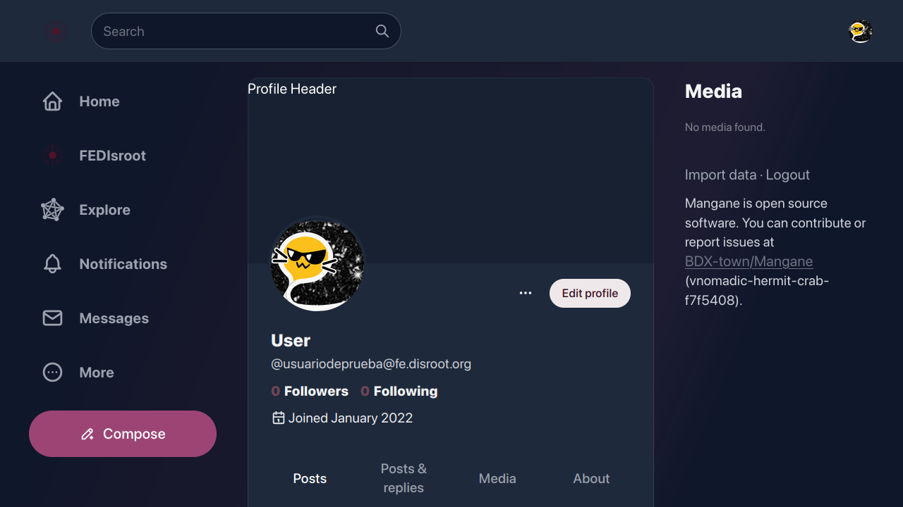

# FEDisroot: Interface

To access to **FEDisroot** we just need to enter our **Disroot** credentials.

The first time we access **FEDisroot** we will find it quite empty.

Light theme is set by default. We can change it right away by clicking on our user icon and selecting one of the theme options.

OK. Let's start by getting familiar with the different parts of the interface so we will know how and where to move and what we can do.

The interface sections or panels are:

- [1. The top bar](#topbar)
- [2. The left panel](#left)
- [3. The right panel](#right)
- [4. The home timeline](#timeline)
  
Let's see them in detail.
 

# 1. The top bar

At the left we will see:

- a) the **FEDisroot logo** which acts like a "back to home" button from wherever we are;

- b) the **Search** box from where we can, of course, search for **People** (users from the same or other instances), **Posts** (in other services these are called "toots") and **Hashtags**;

- c) and at the right, the **Profile** button to see our profile page, switch the theme from light to dark; add another **Disroot** account or log out;

  * the fisrt time we access our profile page it will most likely empty

    

  clicking on the three dots button we access the profile and settings options (we will see them in detail later).

[**Back to the top**](#top)
 

# 2. The left panel

In this panel we have:
- the **Home** button: which works just like the **FEDisroot** logo we saw before;

- the **FEDisroot** shortcut to our local timeline, the one that contains all posts and activities from our instance users;

- the **Explore** shortcut to the Federated timeline, which shows the public posts from all the instances known by ours;

(_In the Akkoma, Pleroma and Mastodon context, a timeline is the stream of posts either from the same instance we are or other instances which ours is federating with._)

- the **Notifications** button, where we will receive an alert every time someone interacts with us, either by reacting to one of our post or by mentioning us;

- the **Messages** shortcut to our inbox, where we can find the messages we send to and receive from other people;

- the **More** button, to access to:

  

  - our **Direct messages**,
  - the **Bookmarks**, all the posts we have bookmarked;
  - the **Lists**, our users list (_we will see these features in the_ [**Interacting** chapter](../03.interacting/));
  - the **Profile directory**, where we can explore other users profiles;
  - and to our profile **Settings**;

- and finally the **Compose** button to open the post editor and write some content.

    

In the [**Settings**](../02.settings/) chapter we will see how to edit our profile and general settings.

[**Back to the top**](#top)
 

# 2.1 The post editor

To post something, we can just start writing here. We can attach files, insert emojis, add polls, adjust the post privacy, to schedule a post, add a content warning and enable/disable the Markdown format (we will see this in detail in the [**Interacting** chapter](../03.interacting/)).

[**Back to the top**](#top)
 

# 3. The right panel

In this panel we have shortcuts to:

- the **Service health status** where we can check if the services are working fine or there is some problem with some of them;
- the **Disroot tutorials (RTFM)** where we can find tutorials, guides and settings of the different services;
- **Your Disroot account** to access your **Disroot** account settings.

We will also find the **Import data** option here. It allows us to export or import a list of people we follow and block. We cannot import or export content (our posts).

Finally, the **Logout** option to close the current session.

[**Back to the top**](#top)

 

# 4. The Home timeline
This is the timeline where the posts and activities of the people we follow will appear.

Since we did not have any activity yet, it will look empty at the beginning. After a few interactions it will start to be populated of content from people we follow.  
_More in the [**Interacting** chapter](../03.interacting/)_.

[**Back to the top**](#top)

---

Ok, now that we took a general look at FEDisroot's interface, we can start setting it up, customize some things and use it.
