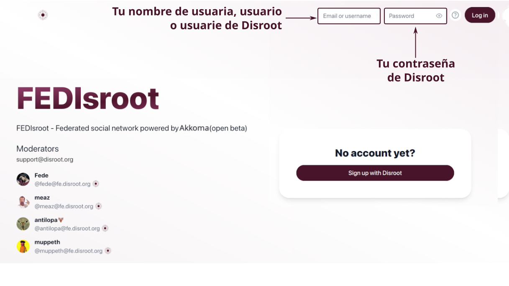
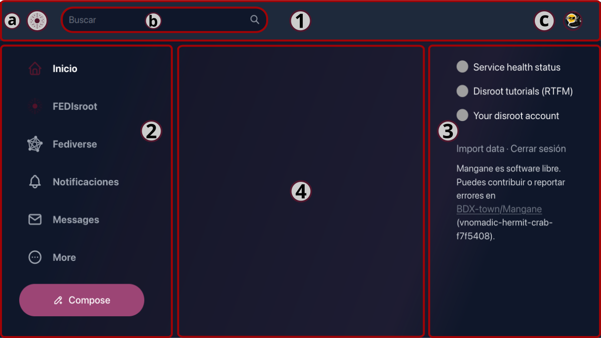
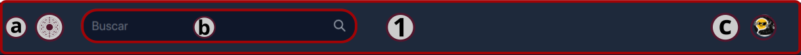
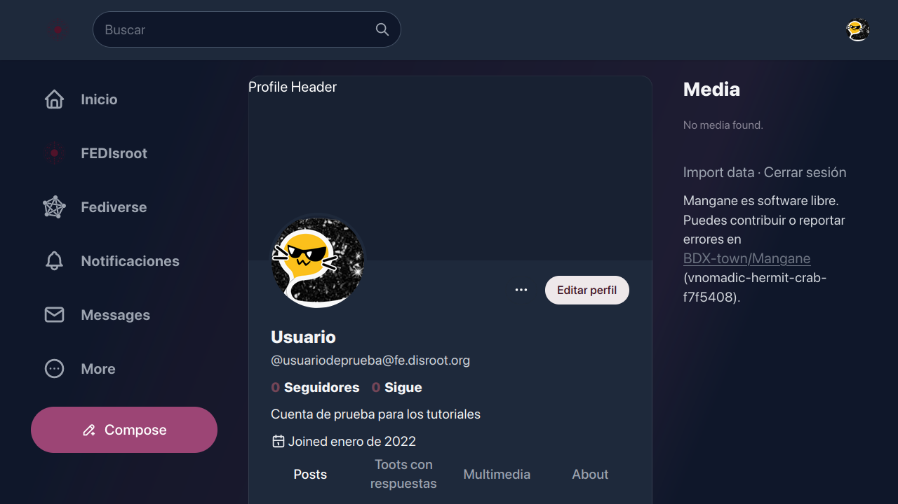
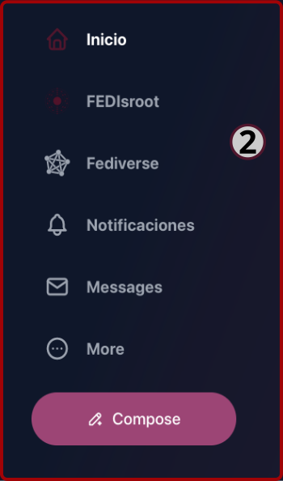
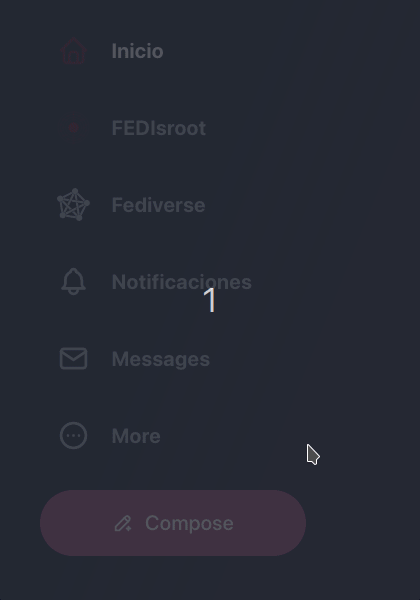
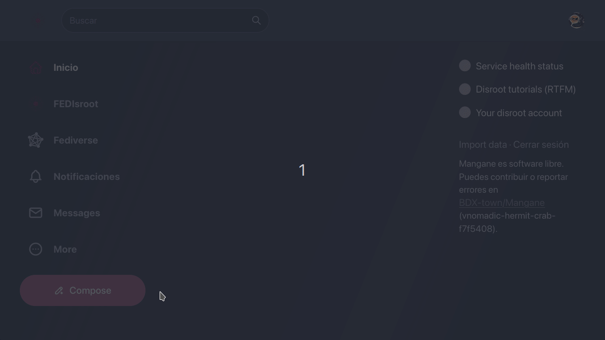
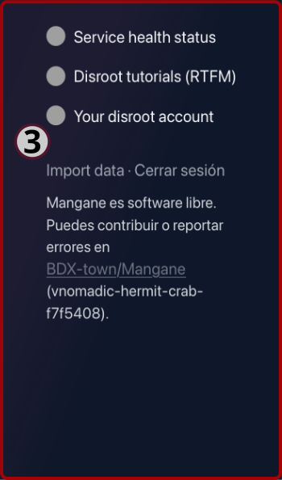

# FEDisroot: Interfaz
Para acceder a **FEDisroot** solo necesitamos ingresar nuestras credenciales de **Disroot**.

La primera vez que accedamos a **FEDisroot** lo encontraremos bastante vacío.

El tema claro está establecido por defecto. Podemos cambiarlo de inmediato haciendo clic en nuestra imagen de perfil y seleccionar una de las opciones de tema.

Para cambiar el idioma de la interfaz a español hacemos clic en el botón "**··· More**" en el panel izquierdo, seleccionamos **Settings**, buscamos la opción **Display language** y seleccionamos nuestro idioma. Veremos que el cambio es inmediato.

!!! _Algunas partes de la interfaz no están completamente traducidas aún_

Ahora sí, empecemos por familiarizarnos con las distintas partes de su interfaz así sabremos cómo y por dónde movernos y qué podemos hacer.

Las secciones o partes de la interfaz son:

- [1. La barra superior](#topbar)
- [2. El panel izquierdo](#left)
- [3. El panel derecho](#right)
- [4. La línea temporal inicial](#timeline)
  
Veámoslas en detalle.
 

1. La **barra superior**

A la izquierda veremos:

- a) el **logo de FEDisroot** que actúa como un botón de "vuelta al inicio" desde cualquier lugar en el que estemos;
- b) la caja de **Búsqueda** desde donde podemos, claro, buscar **Posts** (publicaciones, que en otros servicios se llaman "toots"), **Gente** (personas usuarias de la misma u otras instancias), y **Etiquetas**;

- c) y a la derecha la imagen de **Perfil** para acceder a las opciones de nuestro perfil, cambiar el tema, agregar otra cuenta de **Disroot** o cerrar sesión;

  * la primera vez que accedamos a nuestro perfil se verá también bastante vacío

    

  haciendo clic en botón de tres puntos accedemos a las opciones del perfil y las configuraciones (las veremos en detalle más adelante).

[**Volver al inicio**](#top)
 

# 2. El panel izquierdo

En este panel tenemos:
- el botón de **Inicio**, que funciona igual que el logo de **FEDisroot** que acabamos de ver;

- el atajo **FEDisroot**, que muestra nuestra línea de tiempo local, la que contiene todas las publicaciones y actividades de las personas usuarias de nuestra instancia;

- el atajo **Fediverse**, que lleva a la línea de tiempo federada, la que muestra las publicaciones públicas de todas las instancias conocidas por la nuestra;

(_En el contexto de Akkoma, Pleroma y Mastodon, una línea de tiempo es el flujo de publicaciones, ya sea de la misma instancia en la que estamos u otras instancias con las que federa la nuestra._)

- el botón de las **Notificaciones**, donde recibiremos una alerta cada vez que alguien interactúe con nosotres, ya sea reaccionando a uno de nuestros posts o mencionándonos;

- el atajo **Mensajes (Messages)** a nuestro buzón, donde podemos encontrar los mensajes que enviamos y recibimos de otras personas;

- el botón **Más (More)** para acceder a:

  

  - nuestros **Mensajes directos**,
  - los **Marcadores (Bookmarks)**, todas las publicaciones que hayamos guardado;
  - las **Listas**, nuestras listas de personas usuarias (_veremos esta característica en el capítulo_ [**Interactuando**](../03.interacting/));
  - el **Directorio de perfiles (Profile directory)**, donde podemos explorar los perfiles de otras personas;
  - y a las **Configuraciones (Settings)** de nuestro perfil;

- y finalmente el botón **Redactar (Compose)** para abrir el editor de post y escribir algún contenido.

    

En el capítulo [**Configuraciones**](../02.settings/) veremos cómo editar nuestro perfil y las configuraciones generales.

[*Volver al inicio](#top)
 

# 2.1 El editor de entradas

Para publicar algo, podemos empezar a escribir aquí. Podemos adjuntar archivos, insertar [emojis](https://es.wikipedia.org/wiki/Emoji), encuestas, ajustar la privacidad de una publicación, programarla, agregar un aviso de contenido y habilitar/deshabilitar el formato Markdown (veremos esto en detalle en el [capítulo **Interactuando**](../03.interacting/)).

[**Volver al inicio**](#top)

# 3. El panel derecho

En este panel tenemos atajos:

- al **Estado de salud del Servicio (Service health status)** donde podemos verificar si los servicios están funcionando bien o si hay algún problema con alguno de ellos;
- a los **Tutoriales de Disroot (Disroot tutorials (RTFM))** donde podemos encontrar tutoriales, guías y configuraciones de los diferentes servicios;
- **Tu cuenta de Disroot (Your Disroot account)** para acceder a las configuraciones de tu cuenta de **Disroot**.

También encontraremos aquí la opción **Importar datos (Import data)**. Esta nos permite exportar o importar una lista de personas que seguimos y bloqueamos. No podemos exportar o importar contenido (nuestros posts).

Finalmente, la opción **Cerrar sesión** para cerrar la sesión actual.

[**Volver al inicio**](#top)

#4. La línea temporal inicial
Esta es la línea de tiempo donde aparecerán las publicaciones y actividades de las personas que seguimos.

Como no hemos tenido ninguna actividad todavía, al principio se verá vacía. Después de algunas interacciones comenzará a llenarse de contenido de las personas que seguimos.  
_Más en el [capítulo **Interacuando**](../03.interacting/)_.

[**Volver al inicio**](#top)

---

Muy bien, ahora que hemos dado un vistazo general a la interfaz de FEDisroot, podemos comenzar a configurarla, personalizar algunas cosas y a usarla.
