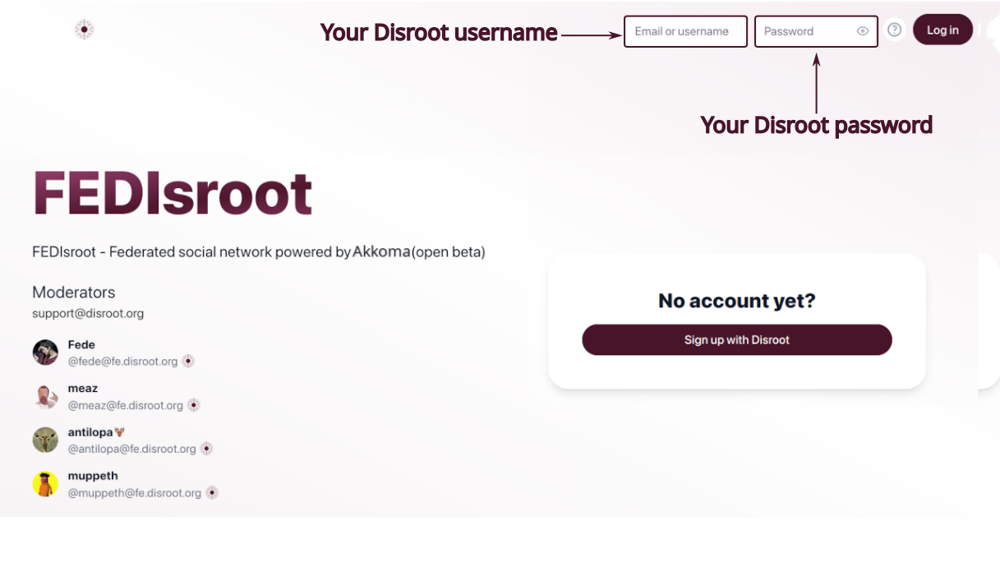
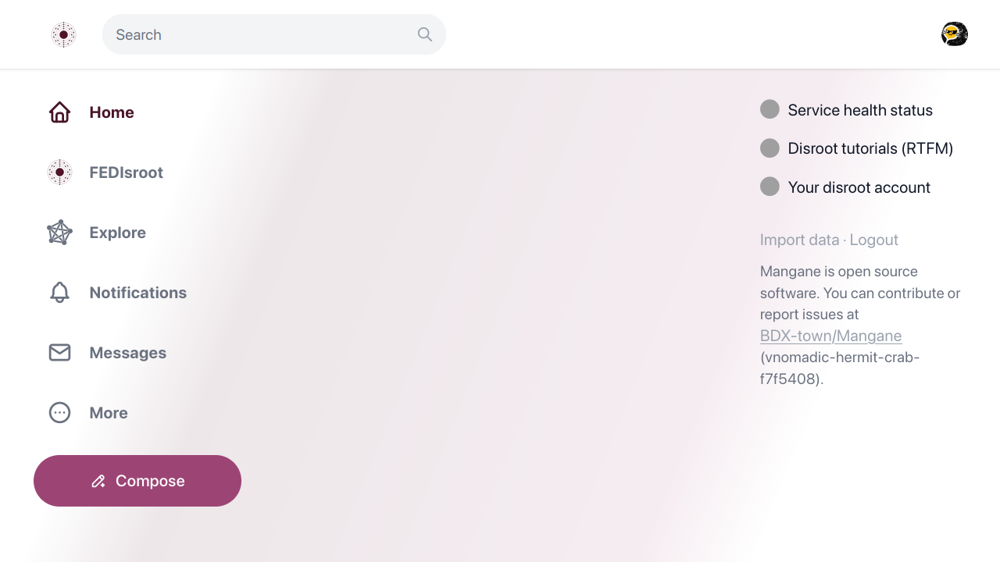
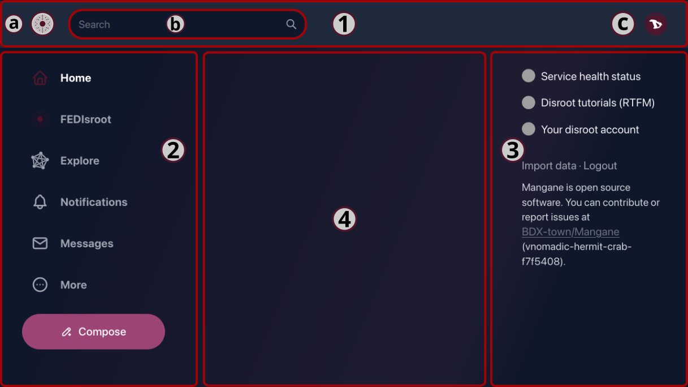
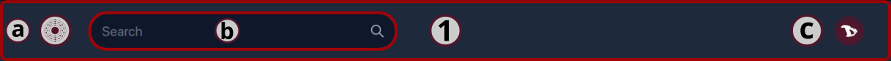
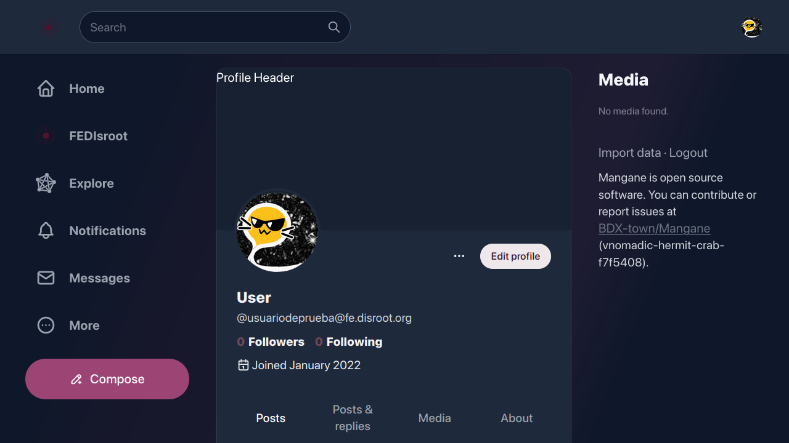
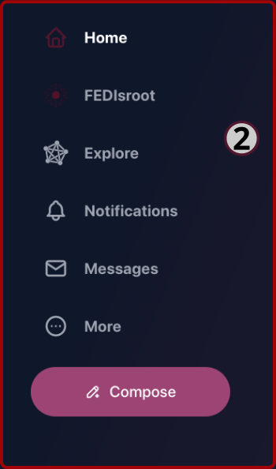
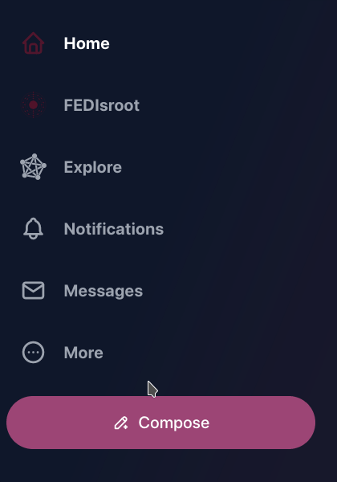
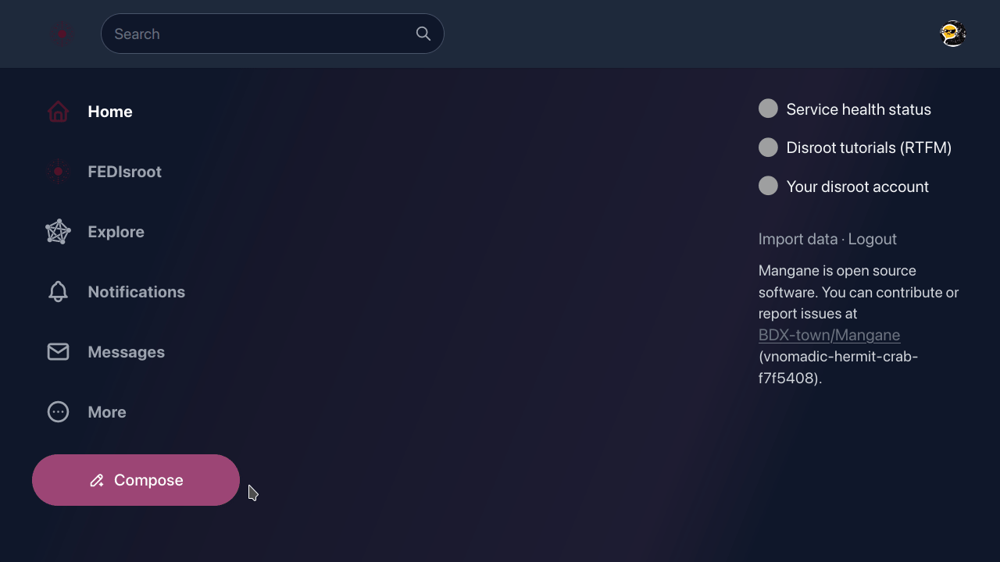
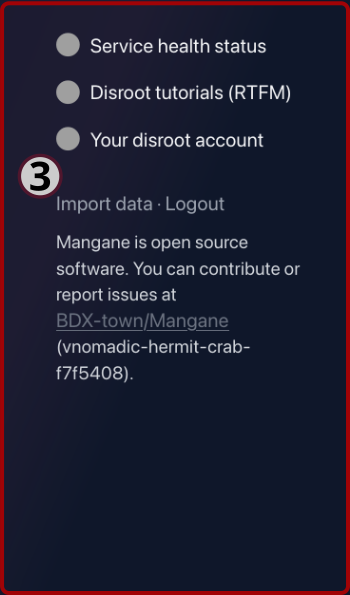

# FEDisroot: Interface

Pour accéder à **FEDisroot**, il suffit d'entrer nos informations d'identification **Disroot**.

La première fois que nous accédons à **FEDisroot**, nous le trouvons assez vide.

Le thème Clair est défini par défaut. Nous pouvons le changer immédiatement en cliquant sur l'icône de notre utilisateur et en sélectionnant l'une des options du thème.

OK. Commençons par nous familiariser avec les différentes parties de l'interface afin de savoir comment et où nous déplacer et ce que nous pouvons faire.

Les sections ou panneaux de l'interface sont les suivants :

- [1. La barre du haut](#topbar)
- [2. Le panneau de gauche](#left)
- [3. Le panneau de droite](#right)
- [4. La chronologie de l'accueil](#timeline)
  
Voyons-les en détail.
 

# 1. La barre du haut

A gauche, nous voyons :

- a) le **logo FEDisroot** qui agit comme un bouton de "retour à l'accueil" d'où que nous soyons ;

- b) la boîte **Recherche** à partir de laquelle nous pouvons, bien sûr, rechercher des **Personnes** (utilisateurs de la même instance ou d'autres instances), des **Publications** (dans d'autres services, ils sont appelés "toots") et des **Hashtags** ;

- c) et à droite, le bouton **Profil** pour voir notre page de profil, changer le thème de Clair à Foncé ; ajouter un autre compte **Désinstaller** ou se déconnecter ;

  * La première fois que nous accédons à notre page de profil, elle est probablement vide.

    

 En cliquant sur le bouton à trois points, nous accédons aux options de profil et de paramètres (nous les verrons en détail plus tard).

[**Retour en haut**](#top)
 

# 2. Le panneau de gauche

Dans ce panneau, nous avons :
- le bouton **Home** : qui fonctionne exactement comme le logo **FEDisroot** que nous avons vu précédemment ;

- le raccourci **FEDisroot** vers notre chronologie locale, celle qui contient tous les messages et activités de nos utilisateurs d'instance ;

- le raccourci **Explore** vers la chronologie fédérée, qui montre les messages publics de toutes les instances connues par la nôtre ;

(_Dans le contexte d'Akkoma, Pleroma et Mastodon, une chronologie est le flux de messages provenant soit de la même instance que nous, soit d'autres instances avec lesquelles la nôtre se fédère._)

- le bouton **Notifications**, où nous recevrons une alerte chaque fois que quelqu'un interagit avec nous, soit en réagissant à l'un de nos messages, soit en nous mentionnant ;

- le raccourci **Messages** vers notre boîte de réception, où nous pouvons trouver les messages que nous envoyons et recevons d'autres personnes ;

- le bouton **Plus**, pour accéder à :

  

- nos **Messages directs**,
- les **Signets**, tous les messages que nous avons mis en signets ;
  - les **Listes**, notre liste d'utilisateurs (_nous verrons ces fonctionnalités dans le chapitre [**Interaction**](../03.interacting/)) ;
  - le **Répertoire des profils**, où nous pouvons explorer les profils des autres utilisateurs ;
  - et les **Paramètres** de notre profil ;

- et enfin le bouton **Composer** pour ouvrir l'éditeur de messages et écrire du contenu.

    

Dans le chapitre [**Paramètres**](../02.paramètres/), nous verrons comment modifier notre profil et nos paramètres généraux.

[**Retour en haut**](#top)
 

# 2.1 L'éditeur de publication

Pour publier quelque chose, il suffit de commencer à écrire ici. Il est possible de joindre des fichiers, d'insérer des émojis, d'ajouter des sondages, d'ajuster la confidentialité des messages, de planifier un message, d'ajouter un avertissement sur le contenu et d'activer/désactiver le format Markdown (nous verrons cela en détail dans le [**chapitre Interaction**](../03.interacting/).

[**Retour en haut**](#top)
 

# 3. Le panneau de droite

Dans ce panneau, nous avons des raccourcis vers :

- l'**État de santé du service** où nous pouvons vérifier si les services fonctionnent bien ou s'il y a un problème avec certains d'entre eux ;
- les **Tutoriels Disroot (RTFM)** où nous pouvons trouver des tutoriels, des guides et les paramètres des différents services ;
- **Votre compte Disroot** pour accéder aux paramètres de votre compte **Disroot**.

Nous trouverons également ici l'option **Importer des données**. Elle nous permet d'exporter ou d'importer une liste de personnes que nous suivons et bloquons. Nous ne pouvons pas importer ou exporter du contenu (nos messages).

Enfin, l'option **Déconnexion** permet de fermer la session en cours.

[**Retour en haut**](#top)

 

# 4. La chronologie de l'accueil
Il s'agit de la chronologie où apparaissent les messages et les activités des personnes que nous suivons.

Comme nous n'avons pas encore eu d'activité, il semblera vide au début. Après quelques interactions, il commencera à être peuplé du contenu des personnes que nous suivons.  
Plus d'informations dans le [**chapitre Interaction**].(../03.interacting/)_.

[**Retour en haut**](#top)

---

Ok, maintenant que nous avons jeté un coup d'oeil général à l'interface de FEDisroot, nous pouvons commencer à le configurer, à personnaliser certaines choses et à l'utiliser.
