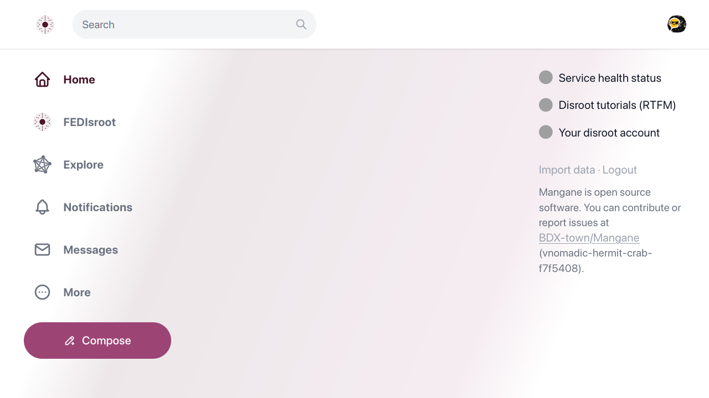
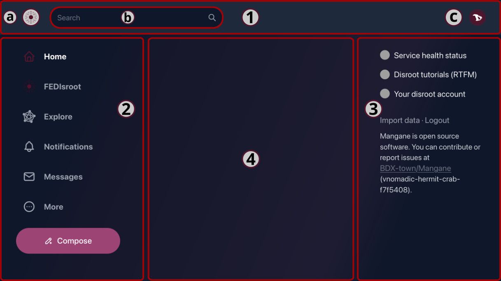
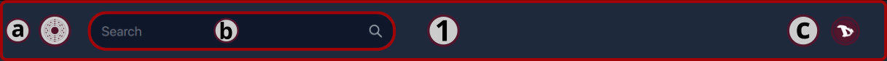
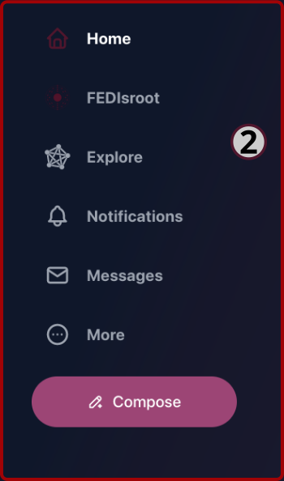

# FEDisroot: Interfaccia

Per accedere a **FEDisroot** è sufficiente inserire le credenziali di **Disroot**.

La prima volta che accediamo a **FEDisroot** lo troveremo piuttosto vuoto.

Il tema Light è impostato di default. Possiamo cambiarlo subito facendo clic sulla nostra icona utente e selezionando una delle opzioni del tema.

OK. Cominciamo a familiarizzare con le diverse parti dell'interfaccia, in modo da sapere come e dove muoverci e cosa possiamo fare.

Le sezioni dell'interfaccia sono:

- [1. La top bar](#topbar)
- [2. Il pannello a sinistra](#left)
- [3. Il pannello a destra](#right)
- [4. La home della timeline](#timeline)
  
Guardiamo i dettagli.
 

# 1. La top bar

A sinistra vedremo:

- a) il logo **FEDisroot** che agisce come un pulsante di "ritorno alla home" da qualsiasi punto ci si trovi;

- b) il riquadro **Ricerca** da cui possiamo, ovviamente, cercare **Persone** (utenti della stessa o di altre istanze), **Post** (in altri servizi sono chiamati "toots") e **Hashtag**;

- c) e a destra, il pulsante **Profilo** per vedere la nostra pagina di profilo, cambiare il tema da chiaro a scuro; aggiungere un altro account **Disroot** o fare il logout;

  * La prima volta che si accede alla pagina del profilo, molto probabilmente sarà vuota.

    

  Cliccando sul pulsante con i tre puntini si accede alle opzioni del profilo e delle impostazioni (che vedremo in dettaglio più avanti).

[**Torna all'inizio**](#top)
 

# 2. Il pannello a sinistra

In questo pannello abbiamo:
- il pulsante **Home**: che funziona proprio come il logo **FEDisroot** che abbiamo visto prima;

- il collegamento **FEDisroot** alla nostra timeline locale, quella che contiene tutti i post e le attività degli utenti della nostra istanza;

- il collegamento **Explore** alla timeline federata, che mostra i post pubblici di tutte le istanze conosciute dalla nostra;

(_Nel contesto di Akkoma, Pleroma e Mastodon, una timeline è il flusso di post provenienti dalla nostra stessa istanza o da altre istanze con cui la nostra è federata._)

- il pulsante **Notifiche**, dove riceveremo un avviso ogni volta che qualcuno interagisce con noi, reagendo a un nostro post o menzionandoci;

- il collegamento **Messaggi** alla nostra casella di posta, dove possiamo trovare i messaggi che inviamo e riceviamo da altre persone;

- il pulsante **More**, per accedere a:
  

  - i nostri **messaggi diretti**,
  - i **Segnalibri**, tutti i post che abbiamo inserito nei segnalibri;
  - le **Liste**, l'elenco dei nostri utenti (vedremo queste funzionalità nel capitolo [**Interagire**](../03.interacting/));
  - la **Rubrica dei profili**, dove possiamo esplorare i profili degli altri utenti;
  - e alle **Impostazioni** del nostro profilo;

- e infine il pulsante **Componi** per aprire l'editor di post e scrivere un contenuto.

    

Nel capitolo [**Impostazioni**](../02.settings/) vedremo come modificare il nostro profilo e le impostazioni generali.

[**Torna all'inizio**](#top) 

# 2.1 The post editor

Per postare qualcosa, possiamo semplicemente iniziare a scrivere qui. Possiamo allegare file, inserire emoji, aggiungere sondaggi, regolare la privacy dei post, programmare un post, aggiungere un avviso sui contenuti e attivare/disattivare il formato Markdown (lo vedremo in dettaglio nel capitolo [**Interagire**](../03.interacting/)).

[**Torna in cima**](#top)
 

# 3. Il pannello destro

In questo pannello sono presenti scorciatoie per:

- lo **Stato di salute dei servizi** dove possiamo controllare se i servizi funzionano bene o se c'è qualche problema con alcuni di essi;
- i **Tutorial di Disroot (RTFM)** dove possiamo trovare tutorial, guide e impostazioni dei diversi servizi;
- Il **Tuo account Disroot** per accedere alle impostazioni del tuo account **Disroot**.

Qui si trova anche l'opzione **Importa dati**. Ci permette di esportare o importare un elenco di persone che seguiamo e blocchiamo. Non è possibile importare o esportare contenuti (i nostri post).

Infine, l'opzione **Logout** per chiudere la sessione corrente.

[**Torna all'inizio**](#top)
 

# 4. La timeline della Home
Questa è la timeline in cui appaiono i post e le attività delle persone che seguiamo.

Poiché non abbiamo ancora avuto alcuna attività, all'inizio sembrerà vuota. Dopo alcune interazioni inizierà a popolarsi di contenuti delle persone che seguiamo.  
Maggiori informazioni nel capitolo [**Interagire**](../03.interacting/)_.

[**Torna all'inizio**](#top)

---

Ok, ora che abbiamo dato uno sguardo generale all'interfaccia di FEDisroot, possiamo iniziare a configurarlo, personalizzarlo e usarlo.
